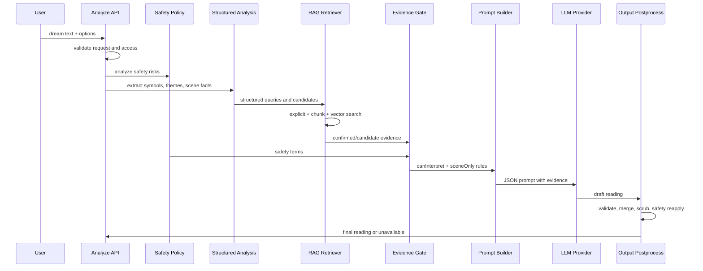

# Dream RAG Operation Flow

이 문서는 Manyang 꿈해몽 요청이 실제로 어떻게 처리되는지 설명한다.

1번 문서인 `docs/dream-rag-system-overview.md`가 전체 개요라면, 이 문서는 운영 흐름과 판단 기준에 집중한다. 2번 문서인 `docs/dream-encyclopedia-guide.md`는 백과사전 항목을 어떻게 작성하는지 다룬다.

## 1. 한 줄 요약

Manyang의 RAG 운영 흐름은 다음 원칙으로 움직인다.

> 먼저 꿈에서 상징 후보를 찾고, 백과사전과 RAG 검색으로 근거를 검증한 뒤, 확인된 상징만 LLM이 해석하게 한다.

LLM은 꿈을 직접 읽는 최종 문장 생성기이지만, 해석 가능한 상징의 범위는 RAG와 evidence gate가 먼저 정한다.

## 2. 요청 시작점

꿈해몽 API는 프론트엔드의 Next.js route에서 시작한다.

```text
frontend/src/app/api/dreams/analyze/route.ts
```

이 route는 다음 일을 한다.

- 요청 body 검증
- locale 검증
- 고양이/테마 타입 검증
- guest 또는 로그인 사용자 access rule 확인
- provider 설정 확인
- vector index와 embedding provider 준비
- LLM 해몽 생성 함수 호출
- 성공 시 기록 저장
- 실패 시 unavailable 응답 반환

실제 해몽 생성의 중심은 백엔드 서비스에 있다.

```text
backend/src/services/llm-dream-analysis.ts
```

사용자-facing 실서비스 경로에서는 `generateDreamReadingForUser`를 사용한다.

## 3. 운영 파이프라인

전체 흐름은 다음과 같다.

```text
1. Request validation
2. Baseline generation
3. Safety policy analysis
4. Lemmatization
5. Structured dream analysis
6. RAG evidence retrieval
7. Evidence gate build
8. Prompt build
9. LLM JSON generation
10. Draft validation
11. Merge into response
12. Scene-only scrub
13. Safety reapply
14. Persist completed reading
```



## 4. Step 1: Request Validation

요청 검증은 API route에서 먼저 처리한다.

검증의 목적은 다음과 같다.

- 너무 긴 꿈 텍스트로 인한 비용 폭주 방지
- 잘못된 locale, cat type, 날짜 형식 차단
- 프롬프트 인젝션 표면 축소
- guest 사용량 제한 적용
- 로그인 사용자 기록 저장 정책 적용

중요한 정책:

- 비로그인 사용자도 기본 꿈해몽은 받을 수 있다.
- 비로그인 사용자는 영구 기록/달력 저장은 제한된다.
- 로그인 사용자는 완료된 해몽이 기록으로 저장된다.
- admin은 실험을 위해 일부 사용량 제한을 우회할 수 있지만, 안전 정책과 provider availability는 우회하지 않는다.

## 5. Step 2: Baseline Generation

LLM 호출 전에도 deterministic baseline을 만든다.

baseline은 사용자에게 보여주기 위한 “가짜 해몽 fallback”이 아니다. 현재 실서비스 LLM 경로에서는 provider가 없거나 실패하면 가짜 baseline을 그대로 반환하지 않고 `unavailable`을 반환한다.

baseline의 역할은 내부 보조다.

- 기본 응답 구조를 만든다.
- LLM merge의 뼈대로 사용한다.
- 안전 고지와 기본 필드를 안정적으로 유지한다.
- 테스트와 품질 평가에서 기준점으로 사용한다.

관련 파일:

```text
backend/src/services/mock-analysis.ts
```

## 6. Step 3: Safety Policy Analysis

안전 정책은 LLM 호출 전과 후에 모두 중요하다.

관련 파일:

```text
backend/src/services/dream-safety-policy.ts
```

안전 정책은 다음을 감지한다.

- 자해 또는 위기 신호
- 의료/질병 관련 신호
- 죽음, 사고, 위험에 대한 민감 표현
- 재정/투자처럼 현실 행동을 유도할 수 있는 표현
- 확정 예언처럼 들릴 수 있는 주장

안전 정책 결과는 프롬프트에 들어가며, 최종 응답에도 다시 적용된다.

중요한 운영 원칙:

- 꿈 상징을 의료 증거처럼 다루지 않는다.
- 꿈 하나로 현실 사건을 확정하지 않는다.
- 위기 신호가 있으면 LLM 실패 시에도 안전 고지는 유지한다.
- 안전 정책은 페르소나나 문체보다 우선한다.

## 7. Step 4: Lemmatization

사용자 입력은 한국어와 영어 모두 형태 변화가 많다.

예:

```text
뱀이 나왔다
뱀들이 가득했다
snake appeared
snakes were chasing me
```

이런 변형을 더 잘 잡기 위해 lemmatizer를 사용할 수 있다.

현재 구조:

- 영어는 내장 lemmatizer 사용 가능
- 한국어는 환경변수 기반 HTTP lemmatizer를 붙일 수 있음
- lemmatizer가 없어도 기본 alias/matcher는 동작함

관련 파일:

```text
backend/src/services/english-lemmatizer.ts
backend/src/services/http-korean-lemmatizer.ts
backend/src/services/korean-lemmatizer.ts
```

운영 기준:

- lemmatizer는 검색 recall을 높이는 보조 장치다.
- lemmatizer 실패가 전체 해몽 실패로 이어지면 안 된다.
- 원문 매칭이 항상 더 우선이다.

## 8. Step 5: Structured Dream Analysis

구조 분석은 사용자 꿈에서 해몽에 필요한 신호를 추출한다.

관련 파일:

```text
backend/src/services/structured-dream-analysis.ts
```

추출하는 정보:

- 장면 요약
- scene facts
- literal queries
- scene queries
- theme queries
- modifier queries
- 감정 신호
- 테마 신호
- 상징 후보
- fortune reading 후보
- reading tone
- reading certainty

이 단계는 예전처럼 특정 꿈에만 맞춘 if-chain이 아니라, 백과사전의 alias, searchText, sceneModifiers를 기반으로 동적으로 동작한다.

예:

```text
입력:
  엘리베이터가 갑자기 떨어졌고 이빨이 흔들렸어요.

구조 분석 후보:
  elevator
  falling
  teeth

장면 신호:
  갑자기
  떨어짐
  흔들림
```

구조 분석의 결과는 바로 최종 해석이 아니다. 이후 RAG와 evidence gate를 통과해야 LLM이 상징적으로 해석할 수 있다.

## 9. Step 6: Symbol Matching

상징 매칭은 백과사전의 runtime entry를 기준으로 동작한다.

관련 파일:

```text
backend/src/services/symbol-matcher.ts
backend/src/services/korean-text-matching.ts
```

매칭 기준:

- label
- aliases
- searchText
- sceneModifier triggerTerms
- lemmas
- 한국어 조사/어미 변형
- 영어 단수/복수 또는 기본형

매칭 결과는 confidence와 matchType을 가진다.

matchType 예:

```text
exact
alias
modifier
semantic
vector
inferred
```

운영 원칙:

- explicit/alias 매칭은 강한 근거다.
- modifier는 장면 보정에 중요하지만, 단독 중심 상징으로 과대평가하지 않는다.
- inferred 또는 semantic 후보는 confirmed로 바로 올리지 않는다.

## 10. Step 7: RAG Evidence Retrieval

RAG 검색은 `retrieveDreamEvidenceSet`에서 처리한다.

관련 파일:

```text
backend/src/services/dream-rag-retriever.ts
```

출력은 두 그룹이다.

```ts
type DreamEvidenceSet = {
  confirmedEvidence: RuntimeSymbolMatch[];
  candidateEvidence: RuntimeSymbolMatch[];
  retrievalPolicy: DreamEvidenceRetrievalPolicy;
};
```

### 10.1 Explicit Matches

사용자 원문에서 직접 잡힌 상징이다.

예:

```text
꿈에 뱀이 나왔어요.
```

이 경우 `snake`는 명시 매칭으로 confirmed evidence가 될 가능성이 높다.

### 10.2 Supporting Chunk Matches

백과사전 청크는 다음 필드에서 만들어진다.

- searchText
- sceneModifier
- safeReading
- metaphorHook

explicit으로 이미 잡힌 상징이 chunk에서도 다시 지지되면, 해당 상징의 confidence와 rankReason을 보강한다.

### 10.3 Candidate Chunk Matches

명시 매칭은 없지만 의미 청크가 관련 있어 보이는 상징이다.

candidate chunk match는 곧바로 confirmed가 되지 않는다.

조건:

- 충분히 강한 semantic chunk match여야 한다.
- 너무 넓은 단어 몇 개만으로는 승격되지 않는다.
- 민감 상징은 특히 보수적으로 다룬다.

### 10.4 Vector Matches

embedding provider와 vector index가 있을 때만 사용한다.

관련 파일:

```text
backend/src/services/dream-vector-index.ts
backend/src/services/dream-rag-index-builder.ts
backend/src/services/dream-rag-ingestion.ts
backend/src/services/openai-embeddings-provider.ts
```

운영 방식:

- 꿈 원문과 구조 분석 query를 합쳐 검색 query를 만든다.
- query embedding을 생성한다.
- vector index에서 가까운 상징 chunk를 찾는다.
- vector-only 결과는 바로 confirmed가 되지 않는다.

## 11. Confirmed Evidence와 Candidate Evidence

### Confirmed Evidence

LLM이 상징적으로 해석해도 되는 근거다.

confirmed가 되는 대표 조건:

- 사용자 원문에 직접 등장한 alias가 있다.
- explicit match를 chunk/vector가 보조한다.
- semantic chunk와 vector match가 같은 safe symbol을 강하게 지지한다.
- safetyLevel이 safe이고 confidence 기준을 넘는다.

confirmed evidence는 prompt의 `retrievedSymbolEvidence`에 들어간다.

### Candidate Evidence

참고는 가능하지만 아직 해석 근거로 확정하지 않은 후보다.

candidate가 되는 대표 조건:

- semantic chunk는 잡혔지만 명시 근거가 약하다.
- vector 검색만으로 발견되었다.
- 같은 상징을 지지하는 두 번째 신호가 부족하다.
- 민감 상징이라 승격 조건을 더 보수적으로 봐야 한다.

candidate evidence는 prompt의 `candidateSymbolEvidence`에 들어가지만, LLM은 이것을 `symbolReadings`에 올리면 안 된다.

## 12. Semantic/Vector Agreement Promotion

candidate가 confirmed로 승격될 수 있는 경우가 있다.

핵심 조건:

```text
strong semantic chunk match
+ strong vector match
+ same symbol id
+ safe symbol
+ confidence threshold passed
= promoted confirmed evidence
```

이 정책의 목적은 두 가지다.

- alias에 없는 표현도 의미적으로 찾아낼 수 있게 한다.
- vector 검색 하나만 믿고 엉뚱한 상징을 해석하지 않게 한다.

예:

```text
입력:
  정해진 시간표를 따라 같은 길만 계속 달리는 꿈

명시 alias:
  train이라는 단어는 없음

semantic/vector:
  train, route, schedule과 강하게 연결

결과:
  train이 safe symbol이고 두 신호가 모두 강하면 confirmed로 승격 가능
```

반대로 병원, 피, 죽음 같은 민감 상징은 더 조심스럽게 다룬다.

## 13. Evidence Gate

RAG 검색이 끝나면 evidence gate를 만든다.

관련 파일:

```text
backend/src/services/evidence-gate.ts
```

evidence gate는 두 목록을 만든다.

```text
canInterpretSymbolically
sceneOnly
```

### canInterpretSymbolically

LLM이 상징적으로 해석할 수 있는 항목이다.

confirmed evidence에서 온다.

예:

```text
["뱀", "땅", "많음"]
```

### sceneOnly

장면으로는 언급할 수 있지만 의미를 붙이면 안 되는 항목이다.

출처:

- structured analysis에서 잡혔지만 verified되지 않은 후보
- candidate evidence
- safety policy에서 민감하게 감지된 표현

예:

```text
["파란 가방", "피", "낯선 숫자"]
```

sceneOnly는 LLM이 해석하지 못하게 막는 안전장치다.

## 14. Prompt Build

프롬프트 생성은 다음 파일에서 처리한다.

```text
backend/src/services/dream-reading-prompt.ts
```

프롬프트에 들어가는 주요 정보:

- locale
- 사용자 꿈 원문
- dreamDate
- wakeMood / dreamMood
- nightContext
- safetyPolicy
- evidenceBoundaries
- structuredAnalysis
- selected feeling
- fortuneReadings
- readingTone
- readingCertainty
- retrievedSymbolEvidence
- candidateSymbolEvidence
- retrievalPolicy
- deterministicBaseline
- outputContract

프롬프트의 핵심 규칙:

- 제공된 근거만 사용한다.
- confirmed evidence만 상징적으로 해석한다.
- candidate evidence는 맥락 참고용으로만 쓴다.
- sceneOnly 요소에는 의미를 붙이지 않는다.
- 내부 구현 용어를 사용자에게 노출하지 않는다.
- 문화권 라벨을 사용자에게 직접 드러내지 않는다.
- 질병, 죽음, 자해, 금전 결과를 확정하지 않는다.
- 꿈 원문을 요약하는 데 시간을 쓰지 말고 의미를 먼저 말한다.

## 15. LLM JSON 응답

LLM은 자유 텍스트가 아니라 JSON 스키마에 맞춰 응답해야 한다.

관련 구조:

```text
DREAM_READING_DRAFT_JSON_SCHEMA
```

LLM draft에는 보통 다음 필드가 들어간다.

- summary
- interpretation
- symbolReadings
- smallPrescription
- card

JSON으로 받는 이유:

- UI에 안정적으로 매핑하기 위해
- 잘못된 응답을 검증하기 위해
- symbolReadings를 evidence gate와 다시 대조하기 위해
- 카드/영수증/기록 저장 구조를 유지하기 위해

## 16. Draft Validation

LLM 응답은 바로 사용자에게 나가지 않는다.

검증 단계:

- JSON 파싱 가능 여부 확인
- 필수 필드 확인
- symbolReadings가 verified symbol인지 확인
- sceneOnly 요소에 의미를 붙였는지 확인
- safety policy 위반 여부 확인

응답이 잘못되면 사용자-facing 실서비스 경로에서는 `unavailable`로 처리된다.

## 17. Merge and Postprocess

LLM draft는 baseline에 병합된다.

관련 파일:

```text
backend/src/services/llm-dream-analysis.ts
```

병합에서 하는 일:

- baseline의 안정적인 구조 유지
- LLM이 만든 해몽 문장 반영
- verified symbolReadings만 남김
- card와 smallPrescription 반영
- readingBasis 등 내부 구조 유지
- safetyNotice 재적용

이 방식은 LLM이 일부 필드를 빠뜨리거나 흔들려도 응답 구조가 무너지지 않게 한다.

## 18. Scene-only Scrub

sceneOnly 요소에 LLM이 의미를 붙이면 후처리에서 제거한다.

예:

```text
sceneOnly:
  파란 가방

나쁜 LLM 문장:
  파란 가방은 숨겨진 재물의 신호입니다.

허용되는 문장:
  꿈에는 파란 가방 같은 세부 장면도 함께 남아 있었습니다.
```

현재 방향은 전체 해석을 통째로 덮어쓰는 것이 아니라, sceneOnly 의미 부여가 발견된 문장을 제한적으로 정리하는 것이다.

운영 목적:

- LLM이 미등록 상징을 과도하게 해석하지 않게 한다.
- 좋은 해석 전체를 망가뜨리지 않는다.
- 내부 id나 modifier key가 사용자에게 새지 않게 한다.

## 19. Unavailable 처리

실서비스 경로에서는 LLM이 실패했다고 해서 가짜 해몽을 보여주지 않는다.

`generateDreamReadingForUser`는 다음 형태로 결과를 반환한다.

```ts
type DreamReadingResult =
  | { status: "ok"; response: DreamAnalysisResponse }
  | {
      status: "unavailable";
      reason: "provider_missing" | "timeout" | "invalid_response" | "provider_error";
      retryable: boolean;
      safetyNotice?: string;
    };
```

실패 이유:

- `provider_missing`: API key 또는 provider 설정 없음
- `timeout`: LLM 응답 시간 초과
- `invalid_response`: LLM이 스키마에 맞지 않는 JSON 반환
- `provider_error`: 기타 provider 오류

중요한 UX 원칙:

- 사용자의 꿈 입력을 잃지 않는다.
- 첫 해몽을 못 받은 실패는 retry 가능하다.
- 이미 완료된 해몽을 계속 재분석하게 만들지는 않는다.
- 안전 고지가 필요한 경우 unavailable에도 safetyNotice를 포함한다.

## 20. Persistence

해몽이 성공하면 기록 저장 단계로 넘어간다.

저장 대상:

- 로그인 사용자 완료 해몽
- 꿈 영수증/카드 정보
- 사용된 상징
- 감정/테마
- 날짜
- 선택한 옵션

비로그인 사용자는 해몽과 영수증 체험은 가능하지만, 영구 기록/달력 저장은 로그인 후 가능하다.

현재 persistence 관련 코드는 프론트엔드 lib와 API route에 걸쳐 있다.

```text
frontend/src/lib/manyang-dream-records.ts
frontend/src/app/api/dreams/analyze/route.ts
```

## 21. Vector Index 운영

현재 구조는 파일 기반 vector index와 embedding provider를 사용할 수 있게 되어 있다.

환경변수 예:

```text
MANYANG_RAG_VECTOR_INDEX_PATH
MANYANG_RAG_VECTOR_INDEX_PATH_KO
MANYANG_RAG_VECTOR_INDEX_PATH_EN
MANYANG_RAG_EMBEDDINGS_MODE
OPENAI_API_KEY
```

운영 원칙:

- vector index가 없어도 alias/chunk 기반 RAG는 동작한다.
- vector index가 있으면 candidate 발견과 promotion이 좋아진다.
- vector-only 결과는 확정 근거가 아니다.
- 백과사전이 더 커지면 pgvector로 옮기는 것이 자연스럽다.

향후 pgvector 이전 시 권장 흐름:

```text
symbol_entries
symbol_localizations
symbol_scene_modifiers
symbol_embeddings
```

그리고 검색은 다음 순서의 hybrid search로 바꿀 수 있다.

```text
explicit alias
keyword / full-text
vector similarity
rerank
evidence gate
```

## 22. 품질 평가

RAG 운영 품질은 단순히 “응답이 생성됐는가”로 판단하면 안 된다.

평가 기준:

- 기대 상징이 confirmed evidence에 들어갔는가?
- 금지 상징이 symbolReadings에 새지 않았는가?
- candidate-only 상징을 확정처럼 말하지 않았는가?
- sceneOnly 요소에 의미를 붙이지 않았는가?
- 해몽이 너무 짧거나 generic하지 않은가?
- safetyNotice가 필요한 경우 유지되는가?
- timeout이나 provider 오류가 빈 결과로 떨어지지 않는가?

관련 파일:

```text
backend/src/services/dream-reading-quality-eval.ts
backend/tests/dream-reading-quality-eval.test.ts
```

## 23. 대표 예시

### 입력

```text
오늘 새벽에 꿈을 꾸었는데 우리 땅에 큰 구렁이들하고 뱀들이 수십 마리가 나왔어.
```

### 구조 분석

```text
literal:
  구렁이
  뱀
  땅

modifiers:
  큰
  수십 마리
  우리 땅
  새벽
```

### RAG 결과

```text
confirmedEvidence:
  snake
  owned_land
  many
  dawn

candidateEvidence:
  상황에 따라 없음 또는 낮은 후보

sceneOnly:
  confirmed되지 않은 세부 표현
```

### LLM이 할 수 있는 것

```text
뱀:
  본능, 조용히 커지는 힘, 변화의 감각

우리 땅:
  내가 지키고 있는 기반, 생활권, 소유감

수십 마리:
  여러 신호가 한꺼번에 올라오는 장면

새벽:
  의식이 완전히 깨어나기 전의 경계 시간
```

### LLM이 하면 안 되는 것

```text
반드시 큰돈이 들어옵니다.
태몽입니다.
땅값이 오릅니다.
위험한 일이 생깁니다.
```

## 24. 운영상 자주 생기는 문제

### 24.1 Alias가 부족해서 상징을 못 찾음

해결:

- 사용자 입력 로그에서 누락 표현을 수집한다.
- alias 또는 sceneModifier triggerTerms에 추가한다.
- 너무 넓은 표현은 피한다.

### 24.2 Alias가 너무 넓어서 오탐이 생김

해결:

- 단독 alias를 줄인다.
- 더 구체적인 phrase alias로 바꾼다.
- modifier로 옮긴다.
- 충돌 테스트를 추가한다.

### 24.3 Vector 검색이 엉뚱한 후보를 찾음

해결:

- vector-only는 confirmed로 올리지 않는다.
- semantic/vector agreement 조건을 유지한다.
- 민감 상징은 promotion에서 제외하거나 기준을 높인다.

### 24.4 LLM이 내부 용어를 노출함

해결:

- prompt 금지어를 유지한다.
- 후처리 scrub을 강화한다.
- 테스트에 내부 용어 leakage 검사를 추가한다.

### 24.5 해몽이 너무 짧거나 일반적임

해결:

- prompt의 length contract를 조정한다.
- scene detail을 의미와 연결하라는 규칙을 강화한다.
- 백과사전의 metaphorHooks와 sceneModifiers를 보강한다.

## 25. 구현 파일 요약

| 단계 | 파일 |
| --- | --- |
| API route | `frontend/src/app/api/dreams/analyze/route.ts` |
| LLM 오케스트레이션 | `backend/src/services/llm-dream-analysis.ts` |
| baseline | `backend/src/services/mock-analysis.ts` |
| 안전 정책 | `backend/src/services/dream-safety-policy.ts` |
| 구조 분석 | `backend/src/services/structured-dream-analysis.ts` |
| 상징 매칭 | `backend/src/services/symbol-matcher.ts` |
| 텍스트 매칭 | `backend/src/services/korean-text-matching.ts` |
| RAG 청크 | `backend/src/services/dream-rag-chunks.ts` |
| RAG 검색 | `backend/src/services/dream-rag-retriever.ts` |
| 벡터 인덱스 | `backend/src/services/dream-vector-index.ts` |
| evidence gate | `backend/src/services/evidence-gate.ts` |
| 프롬프트 | `backend/src/services/dream-reading-prompt.ts` |
| 품질 평가 | `backend/src/services/dream-reading-quality-eval.ts` |
| 백과사전 데이터 | `backend/src/data/symbol-encyclopedia.ts` |
| 백과사전 타입 | `backend/src/contracts/symbol-encyclopedia.ts` |

## 26. 요약

Manyang의 RAG 운영 흐름은 세 가지 방어선을 가진다.

1. 백과사전 기반 검색으로 해석 가능한 상징을 제한한다.
2. confirmed/candidate evidence를 나눠 근거 강도를 구분한다.
3. evidence gate와 후처리로 LLM이 미등록 상징에 의미를 붙이지 못하게 한다.

이 구조 덕분에 Manyang은 LLM의 표현력은 사용하면서도, 해몽의 기준과 안전 범위는 서비스가 통제할 수 있다.

