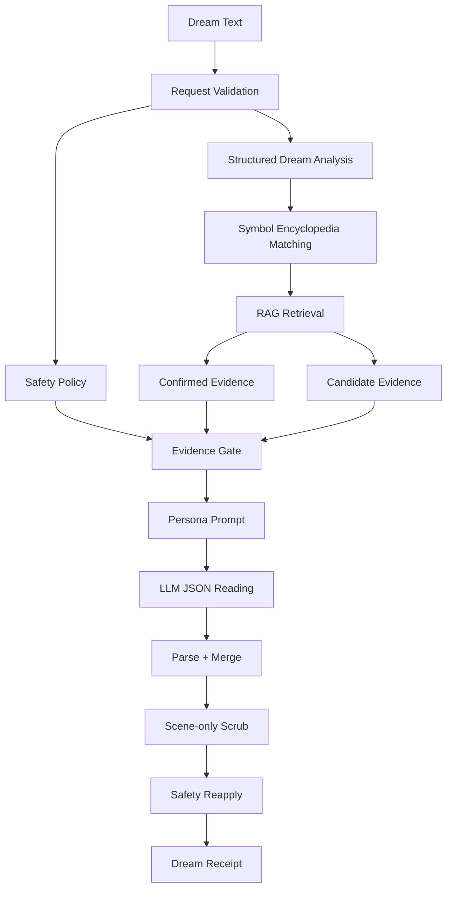

# Dream RAG System Overview

Manyang의 꿈해몽 시스템은 LLM이 단독으로 해몽을 지어내지 않도록, 자체 꿈 상징 백과사전과 RAG 검색 레이어를 함께 사용한다.

이 문서는 협업자에게 현재 꿈해몽 RAG 구조를 설명하기 위한 개요 문서다. 세부 데이터 작성 규칙이나 DB 이전 계획은 별도 문서로 분리한다.

## 1. 핵심 목적

꿈해몽은 재미와 몰입이 중요하지만, LLM이 근거 없이 단어를 연결하거나 과도하게 예언처럼 말하면 서비스 신뢰가 떨어진다.

Manyang의 RAG 시스템은 다음 목적을 가진다.

- 사용자의 꿈에서 중요한 상징을 찾는다.
- 자체 백과사전에 등록된 상징만 적극적으로 해석한다.
- 등록되지 않았거나 근거가 약한 요소는 장면 묘사로만 다룬다.
- LLM에게 해석 가능한 근거와 금지해야 할 표현을 함께 전달한다.
- 고양이 페르소나별 말투와 관점은 다르게 하되, 해석의 근거는 같은 백과사전에서 가져온다.

즉, 백과사전은 “해몽의 기준점”이고, RAG는 “그 기준점을 사용자 꿈에 맞게 찾아오는 장치”다.

## 2. 전체 흐름

현재 꿈해몽은 아래 흐름으로 생성된다.

```text
사용자 꿈 입력
-> 요청 검증
-> 안전 정책 분석
-> 구조 분석
-> 백과사전 기반 상징 매칭
-> RAG 검색
-> confirmed / candidate evidence 분리
-> evidence gate 생성
-> 고양이 페르소나별 프롬프트 생성
-> LLM JSON 응답 생성
-> 응답 파싱 및 후처리
-> scene-only 추론 제거
-> 안전 고지 재적용
-> 꿈 영수증 결과 반환
```



## 3. 주요 구성요소

### Symbol Encyclopedia

꿈 상징 백과사전이다. 현재 코드 기준으로 121개 상징이 등록되어 있으며, 한국어와 영어 입력을 모두 고려한다.

백과사전 항목은 단순히 “뱀 = 재물” 같은 한 줄 뜻이 아니다. 각 상징은 다음 정보를 가진다.

- 안정적인 `id`
- 한국어/영어 label
- alias와 검색어
- 대분류와 소분류
- 보편적 해석 렌즈
- 동양권/서양권 해석 렌즈
- 밝은 해석과 그림자 해석
- 장면 modifier
- 피해야 할 표현
- safe reading
- 카드 제목 seed
- 작은 처방 문구
- 관련 상징
- 안전 등급

현재 런타임 소스는 `backend/src/data/symbol-encyclopedia.ts`다.

### Structured Dream Analysis

사용자 꿈에서 구조적 신호를 뽑는 단계다.

이전에는 특정 데모 꿈에 가까운 if-chain 방식이었지만, 현재는 백과사전의 alias와 modifier를 기반으로 상징 후보를 동적으로 추출한다.

예를 들어 “엘리베이터가 떨어지는 꿈”은 다음처럼 나뉜다.

- `elevator`: 해석 가능한 상징 후보
- `falling`: 등록된 상징이거나 장면 modifier 후보
- 감정 단서: 불안, 긴장, 통제감 등
- 장면 단서: 이동, 높이, 추락, 닫힌 공간 등

### RAG Retrieval

RAG는 백과사전에서 사용자 꿈과 관련 있는 상징 근거를 찾는다.

현재 검색은 크게 세 층으로 나뉜다.

- 명시 매칭: 사용자가 실제로 쓴 단어, alias, 변형 표현
- 의미 청크 매칭: 백과사전의 search text, safe reading, scene modifier와의 관련성
- 벡터 검색: 임베딩 인덱스가 있을 때 의미적으로 가까운 상징 후보 검색

중요한 점은 “검색되었다”가 곧 “해석 가능하다”가 아니라는 것이다.

### Confirmed Evidence

confirmed evidence는 LLM이 상징적으로 해석해도 되는 근거다.

보통 다음 조건을 만족한다.

- 사용자가 직접 쓴 표현이 alias 또는 명시 상징으로 잡힘
- scene modifier가 입력 장면과 충분히 맞음
- 의미 검색과 벡터 검색이 같은 안전한 상징을 함께 지지함
- 민감한 상징이 아니거나, 안전 정책상 해석 가능 범위 안에 있음

LLM은 confirmed evidence에 있는 상징만 `symbolReadings`에서 적극적으로 해석할 수 있다.

### Candidate Evidence

candidate evidence는 참고는 가능하지만 아직 상징 해석으로 확정하지 않은 후보이다.

예를 들어 벡터 검색이 어떤 상징을 찾아냈지만, 사용자의 원문이나 의미 청크가 충분히 지지하지 않으면 candidate로 남는다.

candidate evidence는 다음 용도로만 쓴다.

- 꿈 장면을 더 잘 이해하기 위한 보조 신호
- confirmed evidence 승격 여부 판단
- 나중에 백과사전 alias 개선 또는 신규 상징 추가 검토

LLM은 candidate evidence를 사용자에게 확정 상징처럼 말하면 안 된다.

### Evidence Gate

evidence gate는 최종적으로 “무엇을 해석해도 되는지”와 “무엇은 장면으로만 남겨야 하는지”를 구분한다.

구분은 크게 두 가지다.

```text
canInterpretSymbolically:
  LLM이 상징적으로 해석해도 되는 항목

sceneOnly:
  꿈 장면으로 언급할 수는 있지만 의미를 붙이면 안 되는 항목
```

이 장치가 없으면 LLM은 사용자가 쓴 작은 디테일에도 임의의 의미를 붙이기 쉽다. Manyang은 이 부분을 코드 레벨에서 막는다.

### LLM Prompt

LLM은 백과사전 전체를 받지 않는다. 검색과 검증을 통과한 일부 정보만 받는다.

프롬프트에는 다음 정보가 들어간다.

- 사용자 꿈 원문
- 구조 분석 결과
- confirmed symbol evidence
- candidate symbol evidence
- evidence gate
- 안전 정책 결과
- 선택한 고양이 페르소나
- 출력 JSON 스키마

또한 프롬프트는 내부 구현 용어를 사용자에게 노출하지 않도록 제한한다. 예를 들어 `RAG`, `evidence`, `candidate`, `sceneModifier` 같은 표현은 사용자-facing 해몽에 나오면 안 된다.

## 4. 고양이 페르소나와 RAG의 관계

RAG는 “무엇을 근거로 해석할지”를 정하고, 고양이 페르소나는 “어떤 관점과 목소리로 말할지”를 정한다.

같은 꿈이라도 confirmed evidence는 같을 수 있다. 하지만 고양이별 출력은 달라진다.

- 검은냥: 강한 상징과 장면 이미지를 중심으로 읽는다.
- 하얀냥: 사용자의 감정과 마음의 부담을 먼저 정리한다.
- 치즈냥: 오늘 해볼 수 있는 작고 현실적인 힌트로 바꾼다.
- 잿빛냥: 길몽/흉몽으로 단정하지 않고 여러 가능성을 함께 보여준다.

중요한 원칙은 페르소나가 달라도 백과사전 근거를 벗어나 예언이나 진단처럼 말하지 않는다는 점이다.

## 5. 안전 정책

꿈해몽은 사용자가 불안하거나 민감한 내용을 적을 수 있기 때문에 안전 정책이 별도로 존재한다.

안전 정책은 다음 표현을 제한한다.

- 질병 진단처럼 들리는 표현
- 자해 또는 위기 상황을 가볍게 넘기는 표현
- 재물, 임신, 사고 등을 확정적으로 예언하는 표현
- 사용자의 결정을 강하게 지시하는 표현
- 꿈 하나로 현실 결과를 보장하는 표현

LLM 호출이 실패하더라도 안전 고지는 별도로 유지된다. 현재 프로덕션 LLM 경로에서는 provider가 없거나 timeout이 발생하면 가짜 해몽을 반환하지 않고 `unavailable` 상태를 반환한다.

## 6. 등록되지 않은 상징 처리

Manyang은 꿈에 등장한 모든 단어를 해석하지 않는다.

백과사전에 없거나 근거가 약한 요소는 다음처럼 처리한다.

- 꿈 장면의 일부로는 언급 가능
- 상징적 의미, 예언, 진단은 붙이지 않음
- candidate evidence로 저장하거나 품질 개선 자료로 활용 가능
- 필요하면 추후 백과사전 신규 항목 후보로 검토

이 정책은 해몽을 조금 더 보수적으로 만들 수 있지만, LLM이 아무 말이나 그럴듯하게 만드는 문제를 줄인다.

## 7. 현재 구현 파일

주요 구현 위치는 다음과 같다.

| 영역 | 파일 |
| --- | --- |
| 백과사전 데이터 | `backend/src/data/symbol-encyclopedia.ts` |
| 구조 분석 | `backend/src/services/structured-dream-analysis.ts` |
| 상징 매칭 | `backend/src/services/symbol-matcher.ts` |
| RAG 청크 생성 | `backend/src/services/dream-rag-chunks.ts` |
| RAG 검색 | `backend/src/services/dream-rag-retriever.ts` |
| 벡터 인덱스 | `backend/src/services/dream-vector-index.ts` |
| evidence gate | `backend/src/services/evidence-gate.ts` |
| LLM 프롬프트 | `backend/src/services/dream-reading-prompt.ts` |
| LLM 오케스트레이션 | `backend/src/services/llm-dream-analysis.ts` |
| 안전 정책 | `backend/src/services/dream-safety-policy.ts` |
| API route | `frontend/src/app/api/dreams/analyze/route.ts` |

## 8. 현재 장점

- LLM 단독 생성보다 환각 위험이 낮다.
- 서비스가 직접 관리하는 백과사전을 해몽 기준으로 쓴다.
- confirmed/candidate evidence를 나눠 안전하게 해석 범위를 제한한다.
- 등록되지 않은 상징은 scene-only로 처리할 수 있다.
- 고양이 페르소나별 차별화가 가능하다.
- 한국어와 영어 입력을 함께 고려한다.
- 향후 Supabase/Postgres와 pgvector로 이전하기 좋은 구조다.

## 9. 현재 한계

- 백과사전 커버리지는 계속 확장해야 한다.
- alias 품질이 검색 품질에 직접 영향을 준다.
- alias 충돌이 생기면 잘못된 상징이 함께 매칭될 수 있다.
- 벡터 인덱스가 없으면 candidate promotion 효과가 제한된다.
- 백과사전이 커질수록 파일 기반 검색보다 DB/pgvector 구조가 필요해진다.
- LLM 품질과 timeout은 여전히 사용자 경험에 영향을 준다.

## 10. 앞으로의 개선 방향

단기 개선:

- 백과사전 상징 수와 alias 품질 확장
- alias 충돌 검사 테스트 강화
- quality eval 테스트 시간과 케이스 정리
- missing symbol 로그를 기반으로 신규 상징 후보 수집

중기 개선:

- Supabase/Postgres로 백과사전 테이블 분리
- pgvector 기반 hybrid search 도입
- 사용자 꿈 기록 기반 반복 상징 분석
- 관리자용 백과사전 편집/검수 플로우

장기 개선:

- 개인 기록 기반 월간 꿈 정산
- Moon Pass용 깊은 해석 레이어
- 반복 상징과 감정 흐름을 연결한 개인화 리포트
- 한국어/영어 외 다국어 확장

## 11. 요약

Manyang의 꿈해몽 RAG 시스템은 “LLM이 재미있게 말하게 하되, 무엇을 근거로 말할지는 서비스가 관리한다”는 원칙으로 설계되어 있다.

백과사전은 꿈 상징의 기준 지식이고, RAG는 그 지식을 사용자 꿈에 맞게 찾아오는 검색 계층이다. evidence gate는 LLM이 해석해도 되는 범위를 제한하고, 고양이 페르소나는 같은 근거를 각기 다른 목소리와 관점으로 전달한다.

이 구조 덕분에 Manyang은 단순한 챗봇식 꿈해몽보다 더 일관되고, 확장 가능하며, 안전한 해몽 경험을 만들 수 있다.

