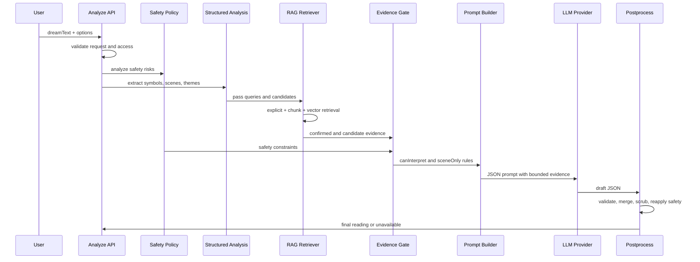

# Manyang AI Engineering Report

이 문서는 **마냥 꿈해몽(Manyang)** 프로젝트를 AI 엔지니어링 관점에서 정리한 보고서다. 제품 전체 소개는 [`manyang-project-report.md`](./manyang-project-report.md)에 정리되어 있고, 이 문서는 그중에서도 LLM, RAG, 상징 백과사전, safety, evaluation, failure handling에 집중한다.

Manyang은 사용자가 입력한 꿈을 AI가 해석하고, 그 결과를 고양이 해몽사와 꿈 영수증 형태로 제공하는 감성 웹 서비스다. 하지만 AI 엔지니어링 관점에서 이 프로젝트의 핵심은 “LLM으로 그럴듯한 해몽 문장을 만든 것”이 아니다.

핵심은 다음이다.

> LLM이 무엇을 말할 수 있고, 무엇을 말하면 안 되는지를 백과사전, RAG, evidence gate, safety policy, schema validation으로 제어한 것.

즉, Manyang의 AI 시스템은 단순한 prompt wrapper가 아니라, **근거 기반 생성과 안전한 후처리를 결합한 도메인 특화 해몽 파이프라인**이다.

- Live site: [https://manyang.vercel.app/](https://manyang.vercel.app/)
- AI/RAG 개요: [`dream-rag-system-overview.md`](./dream-rag-system-overview.md)
- RAG 운영 흐름: [`dream-rag-operation-flow.md`](./dream-rag-operation-flow.md)
- 상징 백과사전 가이드: [`dream-encyclopedia-guide.md`](./dream-encyclopedia-guide.md)

## 목차

1. [AI 시스템 개요](#1-ai-시스템-개요)
2. [핵심 문제 정의](#2-핵심-문제-정의)
3. [전체 파이프라인](#3-전체-파이프라인)
4. [RAG 설계](#4-rag-설계)
5. [Symbol Encyclopedia 설계](#5-symbol-encyclopedia-설계)
6. [Evidence Gate 설계](#6-evidence-gate-설계)
7. [Prompt Engineering 전략](#7-prompt-engineering-전략)
8. [Safety 설계](#8-safety-설계)
9. [한국어/NLP 처리](#9-한국어nlp-처리)
10. [LLM Failure Handling](#10-llm-failure-handling)
11. [평가와 테스트](#11-평가와-테스트)
12. [대표 기술 의사결정](#12-대표-기술-의사결정)
13. [현재 한계](#13-현재-한계)
14. [개선 방향](#14-개선-방향)
15. [AI 엔지니어링 관점 회고](#15-ai-엔지니어링-관점-회고)
16. [참고 구현 파일](#16-참고-구현-파일)

## 1. AI 시스템 개요

### 1.1 Manyang에서 AI가 담당하는 역할

Manyang에서 AI는 사용자의 꿈 원문을 받아 다음 결과를 만든다.

- 꿈 요약
- 꿈속 주요 상징
- 백과사전 기반 상징 해석
- 고양이 해몽사 톤의 종합 해몽
- 오늘의 작은 처방
- 꿈 카드 / 꿈 영수증에 들어갈 구조화된 결과

이때 AI는 “상징의 의미를 처음부터 새로 만들어내는 존재”가 아니다. 상징 해석의 기준은 자체 백과사전과 RAG 검색 결과에서 온다. LLM은 검색과 검증을 통과한 근거를 바탕으로, 사용자가 읽기 좋은 문장과 JSON 구조를 생성한다.

### 1.2 단순 챗봇이 아닌 해몽 생성 파이프라인

꿈해몽은 일반적인 Q&A와 다르다. 사용자는 정답을 찾는 것이 아니라, 모호한 꿈을 자기 경험과 연결해보고 싶어 한다. 그런데 LLM은 모호한 입력일수록 그럴듯한 의미를 과하게 붙이기 쉽다.

그래서 Manyang은 “사용자 꿈 -> LLM 답변”의 단순 구조를 피했다.

대신 다음과 같은 파이프라인을 사용한다.

```text
request validation
-> safety policy analysis
-> lemmatization
-> structured dream analysis
-> symbol matching
-> RAG retrieval
-> confirmed/candidate evidence split
-> evidence gate
-> prompt build
-> LLM JSON draft
-> draft validation
-> merge and postprocess
-> scene-only scrub
-> safety reapply
-> final dream reading
```

이 구조는 LLM을 자유 생성 엔진으로 쓰기보다, 통제된 생성 단계로 배치한다.

### 1.3 AI 엔지니어링 관점의 핵심 어필 포인트

이 프로젝트에서 AI 엔지니어링 관점으로 강조할 수 있는 지점은 다음이다.

| 어필 포인트 | 설명 |
| --- | --- |
| RAG를 권한 제어 장치로 사용 | 검색된 정보를 단순 context로 넣는 것이 아니라, LLM이 해석해도 되는 범위를 제한한다. |
| evidence status 분리 | confirmed, candidate, sceneOnly를 나누어 근거 강도별 사용 범위를 다르게 둔다. |
| schema-first LLM output | LLM 응답을 자유 텍스트가 아니라 JSON schema로 받아 UI와 후처리에 안정적으로 연결한다. |
| safety-first generation | 해몽 도메인의 예언/진단/공포 조장 위험을 사전/사후 정책으로 제어한다. |
| fallback 대신 unavailable | LLM 실패 시 가짜 해몽을 반환하지 않고 명시적 실패 상태를 반환한다. |
| Korean NLP 보강 | 한국어 어미 변화와 자연어 표현을 보완하기 위해 선택형 Kiwi lemmatizer 서비스를 분리했다. |
| eval 가능한 경계 분리 | symbol matcher, evidence gate, prompt, safety policy, vector index를 각각 테스트 가능하게 나눴다. |

## 2. 핵심 문제 정의

### 2.1 꿈해몽 도메인에서 LLM이 만들 수 있는 문제

꿈해몽은 LLM이 그럴듯한 말을 만들어내기 쉬운 도메인이다. 입력 자체가 주관적이고 상징적이기 때문이다.

예를 들어 사용자가 다음처럼 입력했다고 하자.

```text
엘리베이터가 갑자기 떨어지고, 바닥에 파란 가방이 있었어.
```

LLM은 아무 제약이 없으면 “엘리베이터는 통제감 상실”, “파란 가방은 숨겨진 재능”, “떨어짐은 실패에 대한 불안”처럼 자연스럽지만 근거가 약한 해석을 만들 수 있다. 문제는 이 해석이 사용자에게 설득력 있게 들린다는 점이다.

Manyang에서 막고자 한 핵심 문제는 단순 hallucination보다 좁고 구체적이다.

> 꿈에 등장한 모든 디테일에 임의의 상징적 의미를 붙이는 문제.

이를 막기 위해 Manyang은 “등록된 상징과 충분한 근거가 있는 항목만 적극 해석한다”는 규칙을 세웠다.

### 2.2 Hallucination보다 중요한 근거 없는 상징 해석

일반적인 RAG 문맥에서 hallucination은 “없는 사실을 말하는 것”으로 설명된다. 하지만 꿈해몽 도메인에서는 조금 다르다. 꿈의 의미는 애초에 객관적 사실로 검증하기 어렵다.

따라서 Manyang이 다루는 문제는 다음에 가깝다.

- 사용자 원문에 없는 상징을 추가하는 것
- 원문에 있더라도 백과사전에 없는 요소에 의미를 붙이는 것
- candidate evidence를 confirmed evidence처럼 말하는 것
- sceneOnly 요소를 상징적으로 해석하는 것
- 민감한 상징을 예언이나 진단처럼 말하는 것

즉, Manyang의 RAG는 factual QA에서의 근거 검색과 다르게, **해석 권한을 제한하는 장치**로 설계되었다.

### 2.3 예언, 진단, 공포 조장 표현의 위험

꿈해몽 서비스는 재미와 자기 성찰의 영역에 있지만, 사용자가 민감한 내용을 입력할 가능성이 있다.

예를 들어 다음 주제가 들어올 수 있다.

- 죽음
- 사고
- 질병
- 임신
- 가족 문제
- 자해 언급
- 재물 손실
- 불안과 공포

이때 LLM이 “이 꿈은 실제 사고의 징조입니다”, “질병 신호입니다”, “가족에게 안 좋은 일이 생깁니다”처럼 답하면 사용자에게 불필요한 불안이나 해를 줄 수 있다.

Manyang은 이런 표현을 prompt와 후처리에서 모두 제한한다.

### 2.4 한국어 자연어 입력의 모호성

Manyang의 주요 입력은 한국어다. 한국어 꿈 입력은 다음 특징을 가진다.

- 어미 변화가 많다.
- 조사가 붙는다.
- 띄어쓰기가 불안정하다.
- 꿈 내용이 구어체로 적힌다.
- 상징이 명사로만 나오지 않고 동사/형용사와 함께 나온다.

예를 들어 `올라갔어`, `올라가는`, `올라가다가`는 모두 `올라가`와 연결될 수 있다. 단순 문자열 매칭만 쓰면 이런 표현을 놓칠 수 있다.

이를 보완하기 위해 Manyang은 한국어 형태소 분석 서비스를 선택적으로 붙일 수 있게 했다.

## 3. 전체 파이프라인

### 3.1 운영 파이프라인

Manyang의 꿈 해몽 요청은 Next.js API route에서 시작한다.

```text
frontend/src/app/api/dreams/analyze/route.ts
```

실제 AI 해몽 오케스트레이션은 백엔드 패키지에서 처리한다.

```text
backend/src/services/llm-dream-analysis.ts
```

전체 흐름은 다음과 같다.



### 3.2 Request Validation

요청 검증은 비용, 보안, 데이터 품질을 함께 다룬다.

검증 대상은 다음과 같다.

- 꿈 텍스트 길이
- optional text 길이
- night context note 길이
- time zone 길이
- feeling ID 개수와 길이
- locale 허용값
- cat reader 허용값
- LLM timeout 범위
- 로그인/게스트 상태
- access plan
- admin 여부

검증 단계에서 너무 긴 꿈 텍스트나 비정상 옵션을 막는다. 이는 LLM 비용 관리뿐 아니라 prompt injection 표면을 줄이는 효과도 있다.

### 3.3 Safety Policy Analysis

안전 정책은 LLM 호출 전부터 실행된다.

`backend/src/services/dream-safety-policy.ts`는 입력에서 다음 위험 유형을 감지한다.

- `medical`
- `pregnancy`
- `financial`
- `crisis`
- `deathOrViolence`

각 위험은 severity와 claim mode를 가진다.

```text
playful
tradition
caution
crisis
```

예를 들어 crisis 모드에서는 꿈 리딩처럼 다루지 않고, 위기 상담을 대체할 수 없다는 안전 고지를 유지한다.

### 3.4 Lemmatization

형태소 분석은 필수 경로가 아니라 보강 경로다.

LLM 오케스트레이션 옵션에는 `lemmatizer?: KoreanLemmatizer`가 있고, 없으면 기존 어휘 매칭으로 fallback한다.

```text
backend/src/services/korean-lemmatizer.ts
backend/src/services/http-korean-lemmatizer.ts
backend/src/services/english-lemmatizer.ts
services/korean-analyzer/
```

이 구조는 서비스 안정성을 높인다. 형태소 분석 서비스가 내려가도 꿈 해몽 전체가 실패하지 않는다.

### 3.5 Structured Dream Analysis

구조 분석은 꿈 원문에서 다음 데이터를 만든다.

- normalized text
- summary
- scene facts
- symbol candidates
- literal queries
- scene queries
- theme queries
- modifier queries
- selected moods
- inferred emotions
- themes
- safety signals
- fortune readings
- reading tone
- reading certainty
- fallback grounding

이 단계는 최종 해몽이 아니다. RAG와 evidence gate가 해석 가능 여부를 정하기 전의 후보 추출 단계다.

### 3.6 Symbol Matching

symbol matcher는 백과사전의 runtime entry를 기준으로 사용자의 꿈 텍스트와 상징을 연결한다.

매칭 결과는 다음 정보를 가진다.

- entry ID
- label
- category
- subcategory
- facets
- symbol role
- match type
- confidence
- matched text
- used fields
- rank reason
- evidence payload

match type은 다음과 같은 종류가 있다.

```text
exact
alias
modifier
semantic
vector
inferred
```

explicit/alias 매칭은 강한 근거지만, modifier나 semantic 후보는 더 조심해서 다룬다.

### 3.7 RAG Retrieval

RAG retrieval은 confirmed evidence와 candidate evidence를 만든다.

관련 구현은 다음이다.

```text
backend/src/services/dream-rag-retriever.ts
backend/src/services/dream-rag-chunks.ts
backend/src/services/dream-vector-index.ts
```

검색은 explicit match, chunk match, vector match를 조합한다. 하지만 검색 결과를 그대로 LLM에게 맡기지 않고, 근거 강도별로 상태를 나눈다.

### 3.8 Prompt Build, LLM Generation, Postprocess

prompt builder는 다음 정보를 조합한다.

- 사용자 꿈 원문
- structured analysis
- confirmed symbol evidence
- candidate symbol evidence
- evidence gate
- safety policy
- deterministic baseline
- output contract

LLM은 자유 텍스트가 아니라 JSON schema를 만족하는 draft를 생성해야 한다. 이후 postprocess에서 다음을 수행한다.

- JSON parse
- required field 검증
- verified symbol filtering
- baseline과 draft merge
- scene-only scrub
- safety reapply
- unavailable 처리

## 4. RAG 설계

### 4.1 자체 꿈 상징 백과사전을 만든 이유

Manyang은 외부 검색 문서나 일반 웹 문서가 아니라 자체 꿈 상징 백과사전을 RAG의 기준으로 사용한다.

그 이유는 다음과 같다.

1. 꿈해몽은 서비스 톤과 안전 기준이 중요하다.
2. 일반 웹의 꿈해몽 문서는 단정적이거나 예언적인 표현이 많다.
3. LLM에게 안전하게 줄 수 있는 문장으로 가공된 도메인 데이터가 필요하다.
4. 상징별 avoid expression과 safe reading을 함께 관리해야 한다.
5. 고양이 페르소나가 달라도 같은 근거를 사용해야 한다.

즉, 백과사전은 검색 corpus이면서 동시에 policy layer다.

### 4.2 Explicit Match

explicit match는 사용자가 실제로 입력한 단어, alias, 변형 표현이 백과사전 상징과 직접 연결되는 경우다.

예를 들어 사용자가 `뱀`, `구렁이`, `snake`를 입력했고 이 표현이 `snake` entry의 alias에 있으면 explicit 또는 alias 기반 근거가 된다.

explicit match는 일반적으로 confirmed evidence가 될 가능성이 높다. 다만 민감한 상징이거나 disambiguation rule에 걸리면 추가 검토가 필요하다.

### 4.3 Semantic Chunk Match

백과사전 entry는 RAG chunk로 변환된다. chunk에는 다음 정보가 들어갈 수 있다.

- search text
- core meanings
- light/shadow readings
- scene modifiers
- safe reading
- metaphor hooks

semantic chunk match는 사용자의 꿈이 특정 상징의 설명과 의미적으로 가까울 때 후보를 만든다. 하지만 broad semantic match는 오탐을 만들 수 있기 때문에, chunk overlap만으로 confirmed evidence가 되지는 않는다.

### 4.4 Vector Search

vector search는 embedding provider와 vector index가 있을 때 동작한다.

관련 파일은 다음이다.

```text
backend/src/services/dream-vector-index.ts
backend/src/services/dream-rag-index-builder.ts
backend/src/services/dream-rag-ingestion.ts
backend/src/services/openai-embeddings-provider.ts
```

vector index는 파일 기반으로 캐시/로드할 수 있으며, 검색은 cosine similarity를 사용한다.

```text
query embedding
-> vector index search
-> score filtering
-> candidate symbol chunks
```

현재 구조에서 vector search는 optional이다. vector index가 없으면 alias/chunk 기반 검색이 계속 동작한다.

### 4.5 Confirmed Evidence

confirmed evidence는 LLM이 적극적으로 상징 해석에 사용할 수 있는 근거다.

confirmed가 되는 대표 조건은 다음이다.

- 사용자가 직접 쓴 표현이 alias와 매칭된다.
- explicit match가 chunk/vector 근거로 보강된다.
- semantic chunk와 vector match가 같은 safe symbol을 강하게 지지한다.
- safety level과 confidence 기준을 통과한다.

confirmed evidence는 prompt의 `retrievedSymbolEvidence`에 들어가며, LLM은 이 항목을 `symbolReadings`에서 해석할 수 있다.

### 4.6 Candidate Evidence

candidate evidence는 관련성이 있지만 아직 확정되지 않은 후보다.

candidate가 되는 대표 조건은 다음이다.

- semantic chunk는 관련 있어 보이지만 원문 근거가 약하다.
- vector search만으로 발견되었다.
- 같은 상징을 지지하는 두 번째 신호가 부족하다.
- 민감한 상징이라 승격 기준을 더 보수적으로 봐야 한다.

candidate evidence는 prompt에 전달되지만, LLM이 사용자-facing 해석에서 확정 상징처럼 말하면 안 된다.

### 4.7 SceneOnly

sceneOnly는 꿈 장면으로 언급할 수는 있지만 의미를 붙이면 안 되는 요소다.

예를 들어 “엘리베이터가 떨어지고 파란 가방이 있었다”에서 `elevator`, `falling`은 confirmed가 되었지만 `파란 가방`은 백과사전에 없거나 근거가 약하다면 sceneOnly로 남을 수 있다.

허용되는 표현:

```text
꿈에는 파란 가방 같은 장면도 함께 남아 있었어요.
```

금지되는 표현:

```text
파란 가방은 숨겨진 재물의 신호입니다.
```

이 차이를 모델이 항상 지키기는 어렵기 때문에, postprocess에서 scene-only scrub이 추가된다.

### 4.8 Semantic/Vector Agreement Promotion

Manyang은 semantic chunk와 vector match가 같은 safe symbol을 강하게 지지할 때 candidate를 confirmed로 승격할 수 있다.

개념적으로는 다음과 같다.

```text
strong semantic chunk match
+ strong vector match
+ same symbol id
+ safe symbol
+ confidence threshold
= confirmed evidence
```

이 설계는 alias가 부족한 표현을 보완한다. 하지만 vector-only 결과를 바로 믿지 않기 때문에 precision을 지킬 수 있다.

### 4.9 Vector-only 결과를 바로 믿지 않는 이유

vector search는 의미적으로 가까운 후보를 잘 찾지만, 꿈해몽 도메인에서는 오탐 비용이 크다.

예를 들어 사용자가 단순히 “어두운 방”이라고 적었는데 vector search가 `death`, `hospital`, `accident` 같은 민감 상징을 가까운 후보로 찾을 수 있다. 이 결과를 바로 confirmed로 올리면 해몽이 불필요하게 무거워진다.

따라서 Manyang은 다음 원칙을 둔다.

- vector-only 결과는 기본적으로 candidate다.
- safe symbol이어도 semantic agreement가 필요하다.
- sensitive symbol은 더 보수적으로 다룬다.
- candidate는 사용자-facing 해석에 확정적으로 쓰지 않는다.

## 5. Symbol Encyclopedia 설계

### 5.1 상징 데이터의 역할

Symbol Encyclopedia는 Manyang AI 시스템의 기준 데이터다. 현재 코드 기준 `symbolEntries`는 459개다.

상징 데이터는 세 가지 역할을 한다.

1. 검색 대상 corpus
2. 해석 가능 범위의 policy
3. LLM prompt 재료

일반적인 RAG corpus는 “검색해서 context로 넣는 문서”에 가깝다. Manyang의 symbol encyclopedia는 그보다 더 구조화되어 있다.

### 5.2 주요 필드

하나의 상징 entry는 다음 정보를 포함한다.

| 필드 | 역할 |
| --- | --- |
| `id` | 안정적인 상징 식별자 |
| `category` | place, person, animal 등 대분류 |
| `subcategory` | 더 세부적인 분류 |
| `facets` | 의미적 태그 |
| `symbolRole` | primary candidate, modifier, context signal 등 |
| `safetyLevel` | safe/sensitive 구분 |
| `accessTier` | free/premium 등 접근 정책 |
| `locales` | 한국어/영어 콘텐츠 |
| `aliases` | 사용자 입력 매칭 |
| `searchText` | 검색 친화 텍스트 |
| `coreMeanings` | 핵심 의미 범위 |
| `lightReadings` | 밝은 방향 해석 |
| `shadowReadings` | 부담/긴장 방향 해석 |
| `sceneModifiers` | 장면별 의미 보정 |
| `safeReading` | 안전한 기본 해석 |
| `avoidExpressions` | 피해야 할 표현 |
| `relatedIds` | 관련 상징 |

이 구조는 prompt quality와 retrieval quality를 동시에 좌우한다.

### 5.3 Alias와 SearchText

`aliases`는 사용자가 실제 꿈에 쓸 법한 표현이다. 한국어 입력에서는 조사가 붙거나 어미가 바뀌기 때문에 alias가 너무 좁으면 놓치는 표현이 많다.

하지만 alias를 너무 넓히면 오탐이 생긴다.

예를 들어 “달리다”는 `running`일 수도 있고, 누군가에게 쫓기는 맥락에서는 `being_chased`와 연결될 수도 있다. 이런 경우 alias만으로 결정하지 않고 scene modifier나 disambiguation rule이 필요하다.

`searchText`는 RAG 검색을 위한 보조 텍스트다. 사용자에게 그대로 보이는 문장은 아니지만, semantic/chunk matching 품질에 영향을 준다.

### 5.4 Light/Shadow Readings

Manyang은 상징을 길몽/흉몽처럼 이분법으로 나누지 않는다. 대신 light reading과 shadow reading을 둔다.

- light reading: 가능성, 회복, 준비, 이동, 정리 등 밝은 방향
- shadow reading: 긴장, 부담, 회피, 막힘, 불안 등 부담 방향

이 구조는 같은 상징을 꿈의 분위기와 함께 읽게 만든다. 예를 들어 “물”은 정화와 흐름일 수도 있지만, 압도감과 감정의 범람일 수도 있다.

### 5.5 Scene Modifiers

scene modifier는 Manyang 상징 데이터에서 특히 중요한 부분이다.

같은 상징이라도 장면이 달라지면 해석 방향이 달라진다.

예를 들어 `door`는 다음처럼 달라질 수 있다.

- 열린 문
- 잠긴 문
- 문 앞에서 망설임
- 문 너머에 누군가 있음
- 문이 계속 바뀜

scene modifier는 이 차이를 구조적으로 담는다. 단순히 `door`라는 상징을 찾는 것보다, 어떤 문이었는지를 찾는 것이 해몽 품질에 더 중요하다.

### 5.6 SafeReading과 AvoidExpressions

`safeReading`은 LLM이 가장 안전하게 사용할 수 있는 기본 해석 문장이다.

좋은 safeReading은 다음 조건을 만족한다.

- 예언처럼 들리지 않는다.
- 진단처럼 들리지 않는다.
- 사용자를 불안하게 몰아가지 않는다.
- 상징의 의미 범위를 너무 넓히지 않는다.
- 꿈의 장면과 연결될 여지를 남긴다.

`avoidExpressions`는 해당 상징에서 피해야 할 표현이다. 예를 들어 death, pregnancy, disease, money 관련 상징은 특히 avoid expression이 중요하다.

### 5.7 다국어/로컬라이즈 설계

Manyang은 한국어와 영어 입력을 모두 고려한다. 하지만 locale은 단순 번역이 아니다.

한국어 꿈해몽은 동양권 꿈해몽 감각이 들어갈 수 있고, 영어권 해석은 서양권 상징 전통과 심리적 은유를 참고할 수 있다. 따라서 `locales.ko`와 `locales.en`은 같은 id를 공유하되, 표현과 search text는 독립적으로 다룬다.

이 설계는 다국어 확장 시 중요한 원칙이다.

> 같은 상징 id를 공유하되, 문화권별 해석 문장과 alias는 별도로 관리한다.

## 6. Evidence Gate 설계

### 6.1 Evidence Gate의 목적

Evidence gate는 LLM에게 “무엇을 해석해도 되는지”를 알려주는 마지막 경계다.

관련 구현은 다음이다.

```text
backend/src/services/evidence-gate.ts
```

출력 구조는 다음과 같다.

```ts
type EvidenceGateResult = {
  verifiedSymbols: VerifiedEvidenceSymbol[];
  unverifiedSceneElements: string[];
  evidenceRules: {
    canInterpretSymbolically: string[];
    sceneOnly: string[];
  };
};
```

### 6.2 CanInterpretSymbolically

`canInterpretSymbolically`는 LLM이 상징적으로 해석할 수 있는 항목이다.

이 목록은 confirmed evidence를 바탕으로 만들어진다. 사용자 원문이나 강한 근거를 가진 상징만 들어간다.

예시:

```text
canInterpretSymbolically:
  - elevator
  - falling
  - teeth
```

이 경우 LLM은 엘리베이터, 떨어짐, 이빨에 대해 상징 해석을 할 수 있다.

### 6.3 SceneOnly

`sceneOnly`는 장면으로 언급할 수 있지만 의미를 붙이면 안 되는 항목이다.

예시:

```text
sceneOnly:
  - 파란 가방
  - 낯선 숫자
```

LLM은 이 항목을 “꿈에 남아 있던 장면”으로만 다뤄야 한다. 상징적 의미, 예언, 진단은 붙이면 안 된다.

### 6.4 Candidate Evidence를 사용자-facing 해석에 쓰지 않는 규칙

candidate evidence는 prompt에 들어갈 수 있다. 그러나 LLM은 candidate를 `symbolReadings`에 올리면 안 된다.

이 규칙은 매우 중요하다. candidate는 “관련 있어 보인다”는 신호이지, “해석해도 된다”는 허가가 아니기 때문이다.

Manyang에서 candidate evidence는 다음 용도로만 쓴다.

- 꿈 장면을 이해하는 보조 단서
- 백과사전 alias 개선 후보
- 향후 신규 상징 후보
- eval/운영 분석 자료

### 6.5 Scene-only Scrub

LLM이 prompt 규칙을 어길 수 있기 때문에 후처리에서 scene-only scrub을 수행한다.

목표는 다음이다.

- sceneOnly 요소에 의미가 붙은 문장을 줄인다.
- verified symbol만 `symbolReadings`에 남긴다.
- 내부 evidence 상태가 사용자에게 노출되지 않게 한다.
- 좋은 해몽 전체를 버리기보다 위험한 부분만 제한적으로 정리한다.

이 구조는 LLM을 신뢰하되, 최종 결과는 코드가 다시 검증하는 방식이다.

## 7. Prompt Engineering 전략

### 7.1 전체 백과사전을 LLM에게 주지 않은 이유

LLM에게 전체 백과사전을 넣지 않는 이유는 명확하다.

- context 비용이 커진다.
- 관련 없는 상징까지 끌어올 가능성이 생긴다.
- sensitive symbol이 불필요하게 노출된다.
- prompt가 길어질수록 규칙 준수율이 떨어질 수 있다.
- 해석 범위가 불명확해진다.

따라서 Manyang은 검색과 검증을 통과한 일부 evidence만 prompt에 넣는다.

### 7.2 Prompt에 포함되는 정보

prompt에는 다음 정보가 들어간다.

- locale
- 사용자 꿈 원문
- dream date
- wake mood / dream mood
- night context
- safety policy result
- evidence boundaries
- structured analysis
- selected feelings
- fortune readings
- reading tone
- reading certainty
- retrieved symbol evidence
- candidate symbol evidence
- retrieval policy
- deterministic baseline
- output contract

이 정보는 LLM에게 충분한 문맥을 주지만, 해석 권한은 제한한다.

### 7.3 JSON Schema 기반 출력

LLM은 다음 schema 이름의 draft를 생성한다.

```text
dream_reading_draft
```

주요 필드는 다음이다.

- `summary`
- `interpretation`
- `symbolReadings`
- `smallPrescription`
- `card`

JSON schema를 쓰는 이유는 다음과 같다.

1. UI가 안정적으로 결과를 렌더링할 수 있다.
2. 필수 필드 누락을 검출할 수 있다.
3. `symbolReadings`를 evidence gate와 다시 대조할 수 있다.
4. 카드와 영수증 데이터 구조를 유지할 수 있다.
5. invalid response를 명확히 실패로 처리할 수 있다.

### 7.4 내부 용어 노출 방지

prompt에는 내부 구현 용어를 사용자에게 노출하지 말라는 규칙이 포함된다.

사용자-facing 결과에 나오면 안 되는 표현은 다음과 같다.

- RAG
- evidence
- candidate
- sceneOnly
- sceneModifier
- confidence
- retrieval policy
- vector search

사용자는 AI 시스템 구조를 읽으러 온 것이 아니라 자신의 꿈 해석을 보러 온 것이다. 내부 구조는 결과 품질을 지탱하되, UI 문장에는 드러나지 않아야 한다.

### 7.5 고양이 페르소나와 해석 근거 분리

Manyang의 고양이 페르소나는 해석 근거를 바꾸지 않는다.

백엔드의 공통 페르소나 우선순위는 다음이다.

- symbol evidence
- scene specificity
- selected feelings
- safe reflection

이는 고양이 테마가 바뀌어도 해석 정책이 흔들리지 않도록 한다.

즉, 검은냥과 하얀냥은 표현 톤이 달라질 수 있지만, 백과사전 근거와 safety boundary는 같아야 한다.

### 7.6 Deterministic Baseline과 LLM Draft Merge

LLM 호출 전에 deterministic baseline을 만든다.

baseline의 역할은 다음이다.

- 안정적인 응답 구조를 제공한다.
- safety notice와 기본 필드를 유지한다.
- LLM draft와 merge할 뼈대를 만든다.
- 테스트와 품질 평가의 기준점이 된다.

중요한 점은 LLM 실패 시 baseline을 그대로 사용자에게 보여주지 않는다는 것이다. LLM 경로에서 provider missing, timeout, invalid response가 발생하면 `unavailable`로 처리한다.

이는 “그럴듯한 fake fallback”보다 더 정직하고 안전한 처리다.

## 8. Safety 설계

### 8.1 꿈해몽 도메인의 Safety Risk

꿈해몽은 민감한 도메인은 아니지만, 민감한 입력이 들어올 수 있는 도메인이다.

사용자는 다음과 같은 꿈을 적을 수 있다.

- 가족이 죽는 꿈
- 병원에 가는 꿈
- 임신하는 꿈
- 사고가 나는 꿈
- 돈을 잃는 꿈
- 자해를 암시하는 꿈
- 누군가에게 쫓기는 꿈

이때 AI가 예언, 진단, 지시처럼 말하면 위험하다.

### 8.2 금지 표현

Manyang이 금지하는 표현 유형은 다음이다.

- 현실 사건을 보장하는 표현
- 질병 진단처럼 들리는 표현
- 임신, 사고, 죽음, 금전 결과를 확정하는 표현
- 사용자의 결정을 강하게 지시하는 표현
- 위기 상황을 가볍게 넘기는 표현
- 불안감을 조장하는 표현

예시:

```text
이 꿈은 가족에게 나쁜 일이 생길 징조입니다.
당신은 우울증입니다.
곧 돈이 들어옵니다.
병이 생길 신호입니다.
반드시 이 결정을 해야 합니다.
```

### 8.3 권장 표현

권장 표현은 가능성과 관찰 중심이다.

```text
이 장면은 부담감과 연결되어 보일 수 있어요.
단정하기보다는 오늘은 이 감각을 살펴보면 좋겠습니다.
불길한 의미로 보기보다 마음이 보내는 은근한 장면으로 읽을 수 있습니다.
오늘은 가장 작게 정리할 수 있는 일 하나만 골라보세요.
```

### 8.4 Safety Policy Pre-check

pre-check는 입력 단계에서 위험 신호를 감지한다.

위험 신호가 있으면 다음에 영향을 준다.

- prompt directive
- blocked claims
- allowed playful claims
- user-facing notice
- claim mode
- evidence gate

예를 들어 crisis 신호가 있으면 playful fortune claim은 허용되지 않는다.

### 8.5 Safety Reapply

LLM 응답 후에도 safety policy를 다시 적용한다.

이유는 단순하다. prompt에 아무리 명시해도 LLM이 규칙을 완벽히 지킨다는 보장은 없다. 따라서 최종 응답은 다시 검토되어야 한다.

Manyang의 safety 설계는 “prompt에 한 번 쓰고 믿는 방식”이 아니라, pre-check와 postprocess를 함께 둔다.

### 8.6 Unavailable 상태에서도 Safety Notice 유지

LLM 호출이 실패하더라도 safety notice는 유지될 수 있다.

예를 들어 사용자가 자해 관련 꿈을 입력했고 provider timeout이 발생했다면, 해몽 결과는 생성하지 못했더라도 안전 고지는 전달할 필요가 있다.

이 설계는 AI 기능 실패와 안전 안내를 분리한다.

## 9. 한국어/NLP 처리

### 9.1 한국어 꿈 입력의 문제

한국어 꿈 입력은 다음 문제를 만든다.

- 어미 변화: `올라갔어`, `올라가는`, `올라가다`
- 조사 결합: `물에서`, `학교로`, `방에`
- 띄어쓰기 불안정
- 구어체 표현
- 의성어/의태어
- 축약 표현

단순 exact match만 사용하면 recall이 낮아진다.

### 9.2 Kiwi 기반 형태소 분석 서비스

Manyang은 Kiwi NLP 기반의 별도 서비스를 둔다.

```text
services/korean-analyzer/
```

이 서비스는 HTTP API를 제공한다.

```text
POST /lemmatize
GET /health
```

예시:

```text
입력: 맑은 물에서 올라갔어
출력: ["맑", "물", "올라가"]
```

이 결과는 symbol matcher의 token/lemma matching을 보강한다.

### 9.3 별도 서비스로 분리한 이유

Kiwi 모델은 로드 비용이 있다. serverless request path 안에서 매번 모델을 로드하면 latency와 cold start 문제가 생길 수 있다.

따라서 별도 warm Node service로 분리했다.

장점:

- 모델을 한 번 로드하고 재사용할 수 있다.
- main app의 serverless 경로를 가볍게 유지한다.
- admin tools나 search-data generation에서도 재사용할 수 있다.
- 서비스가 내려가도 main app은 lexical matching으로 fallback한다.

### 9.4 Fallback 구조

lemmatizer는 보강 장치이지 필수 dependency가 아니다.

```text
lemmatizer available
-> lemmas added to matching

lemmatizer unavailable
-> lexical matching continues
```

이 설계는 AI 품질과 시스템 안정성 사이의 균형을 잡는다.

## 10. LLM Failure Handling

### 10.1 Failure Reason

Manyang의 LLM 경로는 실패를 명시적으로 모델링한다.

```ts
type DreamReadingUnavailableReason =
  | "provider_missing"
  | "timeout"
  | "invalid_response"
  | "provider_error";
```

성공/실패 결과는 discriminated union으로 표현된다.

```ts
type DreamReadingResult =
  | { status: "ok"; response: DreamAnalysisResponse }
  | {
      status: "unavailable";
      reason: DreamReadingUnavailableReason;
      retryable: boolean;
      safetyNotice?: string;
    };
```

### 10.2 provider_missing

provider가 없거나 API key가 설정되지 않은 경우다.

이 경우 LLM 해몽을 생성하지 않고 unavailable을 반환한다. 개발 환경에서는 mock mode를 사용할 수 있지만, LLM mode에서 provider가 없는데 가짜 결과를 반환하지 않는다.

### 10.3 timeout

LLM 응답 시간이 제한을 넘긴 경우다. 기본 timeout은 25초이고, API route에서는 환경 변수로 조정 가능하되 최소/최대 범위를 둔다.

timeout은 retryable 성격을 가질 수 있다. 하지만 사용자가 받은 결과는 “완료된 해몽”이 아니어야 한다.

### 10.4 invalid_response

LLM이 JSON schema를 만족하지 않는 응답을 반환한 경우다.

이 경우 잘못된 구조를 억지로 UI에 매핑하지 않고 실패로 처리한다. 이는 dream card, receipt, symbol readings 같은 downstream UI가 깨지는 것을 막는다.

### 10.5 provider_error

provider 자체에서 오류가 발생한 경우다. 네트워크, API error, unknown exception 등이 여기에 들어간다.

### 10.6 Fake Fallback을 반환하지 않는 이유

Manyang에서 중요한 결정 중 하나는 LLM 실패 시 fake fallback 해몽을 반환하지 않는 것이다.

이유는 다음과 같다.

1. 사용자는 실제 AI 해몽이라고 믿을 수 있다.
2. 안전 정책이 약하게 적용된 baseline이 사용자에게 나갈 수 있다.
3. 품질 지표가 왜곡된다.
4. 결과 저장과 아카이브가 오염된다.
5. LLM unavailable 상태를 운영에서 감지하기 어렵다.

따라서 LLM 실패는 명시적으로 unavailable로 드러낸다.

## 11. 평가와 테스트

### 11.1 테스트 규모

현재 저장소 기준 테스트 파일은 총 157개다.

- backend tests: 33개
- frontend/src tests: 123개
- backend/src/services test: 1개

AI 엔지니어링 관점에서 중요한 테스트는 특히 백엔드에 집중되어 있다.

### 11.2 Retrieval Eval

retrieval eval은 RAG 검색 품질을 확인한다.

관련 스크립트:

```text
npm run eval:retrieval
npm run eval:retrieval:vector
```

평가해야 하는 질문은 다음이다.

- 기대 상징이 confirmed evidence로 들어갔는가?
- 관련은 있지만 약한 상징이 candidate로 남았는가?
- vector-only 결과가 과하게 승격되지 않았는가?
- sensitive symbol이 보수적으로 처리되었는가?
- alias 오탐이 생기지 않았는가?

### 11.3 Coverage Eval

coverage eval은 백과사전과 검색 계층이 다양한 꿈 입력을 얼마나 커버하는지 확인한다.

관련 스크립트:

```text
npm run eval:coverage
```

이 평가는 단순 정답률이 아니라 “서비스가 해석 가능한 상징 범위를 얼마나 갖추고 있는가”를 보는 데 가깝다.

### 11.4 Golden Test

golden test는 대표 꿈 입력에 대해 기대되는 안전/품질 기준을 고정해두는 방식이다.

꿈해몽은 문장 자체가 매번 달라질 수 있으므로 golden test는 다음을 중심으로 본다.

- 어떤 상징이 confirmed 되어야 하는가
- 어떤 상징이 나오면 안 되는가
- safety notice가 필요한가
- symbol readings에 sceneOnly가 들어가지 않는가
- 결과 구조가 유지되는가

### 11.5 Prompt Quality Check

prompt quality check는 LLM 응답 품질을 본다.

관련 스크립트:

```text
npm run quality:live
npm run rubric:check
```

확인 항목:

- JSON schema 준수
- 내부 용어 노출 여부
- 단정적 예언 여부
- 안전 고지 유지 여부
- 상징 근거 사용 여부
- 너무 generic한 해몽 여부
- 작은 처방의 실행 가능성

### 11.6 Safety Policy Test

Safety test는 다음을 확인한다.

- crisis terms 감지
- medical/pregnancy/financial risk 감지
- blocked claims 생성
- prompt directives 생성
- user-facing notice 생성
- safety reapply 동작

### 11.7 Evidence Gate Test

Evidence gate test는 다음을 확인한다.

- verified symbol 생성
- candidate evidence 분리
- unverified scene elements 생성
- canInterpretSymbolically와 sceneOnly 분리
- sceneOnly 항목이 symbol readings에 들어가지 않도록 제한

### 11.8 좋은 해몽을 어떻게 정의했는가

Manyang에서 좋은 해몽은 “멋진 문장”만이 아니다.

좋은 해몽의 조건은 다음과 같다.

1. 사용자 꿈 장면에 구체적으로 연결된다.
2. verified symbol evidence를 사용한다.
3. 등록되지 않은 요소에 의미를 붙이지 않는다.
4. 불안감을 과하게 키우지 않는다.
5. 오늘 할 수 있는 작은 행동으로 끝난다.
6. 고양이 페르소나 톤은 유지하되 과하지 않다.
7. UI가 사용할 수 있는 안정적인 구조를 가진다.

## 12. 대표 기술 의사결정

### 12.1 RAG를 도입한 이유

RAG는 단순히 더 많은 정보를 LLM에게 주기 위해 도입한 것이 아니다.

Manyang에서 RAG의 목적은 다음이다.

- 서비스가 관리하는 백과사전 근거를 사용한다.
- LLM의 해석 범위를 제한한다.
- registered symbol 중심으로 결과를 만든다.
- candidate/sceneOnly를 분리한다.
- safety policy와 결합한다.

즉, RAG는 검색 기능이면서 동시에 해석 권한 제어 장치다.

### 12.2 JSON Schema를 사용한 이유

꿈 해몽 결과는 UI에서 여러 영역으로 나뉘어 사용된다.

- summary
- interpretation
- symbol readings
- small prescription
- card
- receipt

자유 텍스트만 받으면 downstream UI가 안정적으로 작동하기 어렵다. JSON schema는 LLM 응답을 제품 구조에 맞춘다.

### 12.3 TypeScript Seed 기반 백과사전으로 시작한 이유

초기에는 DB보다 TypeScript seed가 더 빠르고 안전했다.

장점:

- 타입 검증이 쉽다.
- 테스트에서 바로 import할 수 있다.
- 코드 리뷰로 변경을 추적할 수 있다.
- schema 변경과 데이터 변경을 함께 관리할 수 있다.
- MVP 단계에서 운영 UI 없이도 빠르게 확장할 수 있다.

단점은 데이터가 커질수록 편집과 검수가 어려워진다는 것이다. 현재 459개 상징까지 확장되었기 때문에 장기적으로는 DB/관리자 UI 이전이 필요하다.

### 12.4 pgvector를 당장 도입하지 않은 이유

초기에는 파일 기반 vector index가 더 적합했다.

이유:

- RAG 품질 가설을 빠르게 검증할 수 있다.
- DB migration 복잡도를 줄인다.
- local eval과 테스트를 쉽게 돌릴 수 있다.
- vector search가 optional이어도 시스템이 동작한다.

향후에는 Supabase/Postgres와 pgvector로 이전하는 것이 자연스럽다.

### 12.5 Next.js API Route에서 Backend Package를 직접 Import한 이유

백엔드를 별도 HTTP 서버로 두지 않고 `@manyang/backend` 패키지로 구성한 이유는 다음이다.

- 배포 복잡도가 낮다.
- Next.js route에서 도메인 로직을 바로 사용할 수 있다.
- UI와 비즈니스 로직은 디렉터리/패키지로 분리된다.
- 테스트는 backend 패키지 단위로 독립적으로 돌릴 수 있다.
- MVP 단계에서 속도와 구조를 모두 확보할 수 있다.

### 12.6 Korean Analyzer를 별도 서비스로 분리한 이유

Kiwi 모델 로딩 비용 때문에 main serverless path에 넣기보다 별도 warm service로 분리했다.

이 결정은 latency와 reliability를 고려한 것이다.

- 분석 서비스가 있으면 recall이 좋아진다.
- 없어도 main app은 fallback한다.
- 모델 로딩 비용이 main request path를 막지 않는다.

## 13. 현재 한계

### 13.1 Alias 품질 의존성

현재 검색 품질은 alias와 scene modifier 품질에 크게 의존한다.

alias가 부족하면 미탐이 발생한다. alias가 너무 넓으면 오탐이 발생한다. 한국어 입력에서는 이 문제가 더 커진다.

### 13.2 Vector Index 운영 복잡도

파일 기반 vector index는 MVP에는 좋지만, 운영 관점에서는 다음 문제가 있다.

- index 생성 시점 관리
- 백과사전 변경 후 재생성
- locale별 index 관리
- embedding model 변경
- 배포 환경에서 파일 경로 관리

장기적으로는 pgvector와 DB 기반 ingestion pipeline이 필요하다.

### 13.3 백과사전 확장 비용

상징 데이터가 459개까지 늘어나면서 다음 비용이 커진다.

- alias 검수
- avoid expression 검수
- scene modifier 작성
- 한국어/영어 콘텐츠 품질 유지
- 중복 상징 정리
- 관련 상징 연결

AI 시스템 품질이 prompt보다 데이터 품질에 더 의존하게 되는 구간이다.

### 13.4 LLM 응답 품질 편차

JSON schema와 prompt directive가 있어도 LLM 응답 품질은 변동될 수 있다.

문제 유형:

- 너무 일반적인 해몽
- 내부 용어 노출
- sceneOnly 의미 부여
- 작은 처방이 너무 추상적임
- 고양이 톤이 과하거나 약함
- safety directive 준수 실패

이 때문에 postprocess와 eval이 계속 필요하다.

### 13.5 Evaluation 자동화의 한계

꿈해몽 품질은 정량화가 어렵다.

상징 매칭, schema 준수, safety violation은 비교적 테스트하기 쉽다. 하지만 “사용자가 읽었을 때 그럴듯하고 부드러운가”는 자동 평가만으로는 부족하다.

따라서 자동 eval과 사람이 보는 golden review가 함께 필요하다.

### 13.6 다국어 확장 시 문제

한국어와 영어를 넘어 다국어로 확장하려면 다음 문제가 생긴다.

- 문화권별 상징 해석 차이
- locale별 alias 작성
- 형태소/lemmatizer 처리
- safety expression 번역
- prompt directive 현지화
- 공유 UI 문구 현지화

단순 번역으로는 해결되지 않는다.

## 14. 개선 방향

### 14.1 Supabase/Postgres 기반 백과사전 관리

장기적으로는 TypeScript seed를 DB로 옮기는 것이 좋다.

추천 테이블 구조:

```text
symbol_entries
symbol_localizations
symbol_scene_modifiers
symbol_generation_assets
symbol_culture_notes
symbol_embeddings
```

이렇게 나누면 locale별 콘텐츠 수정, scene modifier 검수, embedding 재생성, 관리자 UI 연결이 쉬워진다.

### 14.2 pgvector Hybrid Search

향후 검색 구조는 다음 순서의 hybrid search가 적합하다.

```text
explicit alias
-> keyword / full-text
-> vector similarity
-> rerank
-> evidence gate
```

vector search는 단독 판단자가 아니라 recall 보강 장치로 유지하는 것이 좋다.

### 14.3 Admin Review Workflow

백과사전이 커지면 검수 workflow가 필요하다.

필요한 기능:

- 상징 추가/수정
- alias 충돌 확인
- avoid expression 체크
- safe reading preview
- test dream 입력으로 매칭 확인
- approved/needs_review 상태 관리
- embedding 재생성 트리거

### 14.4 Missing Symbol Logging

실제 사용자 입력에서 어떤 상징을 놓치는지 로그를 모으면 백과사전 확장 우선순위를 정할 수 있다.

수집하면 좋은 정보:

- 매칭되지 않은 noun phrase
- candidate로만 남은 항목
- 사용자 입력에서 반복되는 unknown term
- LLM unavailable 비율
- sceneOnly로 자주 남는 표현

### 14.5 Automatic Eval Dashboard

현재 eval 스크립트를 운영 dashboard로 확장할 수 있다.

대시보드에서 볼 지표:

- retrieval pass rate
- confirmed/candidate ratio
- sceneOnly violation count
- safety risk distribution
- invalid JSON rate
- timeout rate
- provider error rate
- prompt version별 품질 차이

### 14.6 Prompt Versioning

prompt가 바뀌면 결과 품질도 바뀐다.

따라서 다음을 기록하는 것이 좋다.

- prompt version
- schema version
- model name
- retrieval policy version
- safety policy version
- encyclopedia version

이 정보가 있어야 품질 regression을 추적할 수 있다.

### 14.7 User Feedback 기반 Quality Loop

사용자 피드백을 AI 품질 개선에 연결할 수 있다.

예:

- “해몽이 너무 일반적이에요”
- “이 상징은 꿈에 없었어요”
- “무섭게 느껴졌어요”
- “도움이 됐어요”
- “저장하고 싶지 않았어요”

이 피드백은 prompt, 백과사전, safety, UI copy 개선으로 연결된다.

## 15. AI 엔지니어링 관점 회고

### 15.1 생성보다 제어가 더 중요했다

Manyang을 만들면서 가장 크게 배운 점은 LLM 앱에서 중요한 것은 생성 능력만이 아니라는 것이다.

특히 꿈해몽처럼 모호하고 감정적인 도메인에서는 “좋은 말을 하게 하는 것”보다 “위험하거나 근거 없는 말을 하지 않게 하는 것”이 더 중요하다.

### 15.2 RAG는 검색 기능이 아니라 해석 범위 설정 장치였다

Manyang에서 RAG는 단순 context augmentation이 아니다.

RAG의 주요 역할은 다음이다.

- 해석 가능한 상징을 제한한다.
- candidate와 confirmed를 나눈다.
- sceneOnly를 만든다.
- LLM의 의미 부여 범위를 좁힌다.
- safety policy와 결합한다.

이 관점은 일반적인 “문서를 검색해서 답변에 넣는 RAG”보다 도메인 제어에 더 가깝다.

### 15.3 도메인 데이터 품질이 Prompt 품질보다 중요해지는 순간

처음에는 prompt를 잘 쓰면 좋은 해몽이 나올 것처럼 보인다. 하지만 프로젝트가 커질수록 실제 품질은 상징 데이터에 더 의존한다.

좋은 alias, 좋은 scene modifier, 좋은 safe reading, 구체적인 avoid expression이 있어야 prompt도 좋은 결과를 만든다.

즉, prompt engineering만으로는 부족하고, domain data engineering이 필요하다.

### 15.4 실패를 숨기지 않는 것이 신뢰에 중요했다

LLM 실패 시 fake fallback을 보여주는 것은 단기적으로 UX를 부드럽게 만들 수 있다. 하지만 장기적으로는 사용자 신뢰와 데이터 품질을 해친다.

Manyang은 실패를 unavailable로 드러내고, retry 가능성과 safety notice를 분리했다.

이 결정은 AI 시스템을 운영 가능한 제품으로 만드는 데 중요하다.

### 15.5 다음 AI 프로젝트에 가져갈 원칙

다음 프로젝트에 가져갈 원칙은 다음이다.

1. LLM에게 모든 판단을 맡기지 않는다.
2. 해석 가능한 범위를 데이터와 코드로 먼저 제한한다.
3. output schema를 강제한다.
4. failure state를 명시적으로 모델링한다.
5. safety는 prompt 전후에 모두 둔다.
6. eval 가능한 작은 단위로 시스템을 나눈다.
7. domain data quality를 prompt quality만큼 중요하게 본다.

## 16. 참고 구현 파일

### 16.1 AI Orchestration

| 파일 | 역할 |
| --- | --- |
| `backend/src/services/llm-dream-analysis.ts` | LLM 해몽 오케스트레이션, unavailable 처리, merge/postprocess |
| `backend/src/services/llm-provider.ts` | LLM provider 인터페이스와 timeout error |
| `backend/src/services/openai-responses-provider.ts` | OpenAI Responses provider |
| `frontend/src/app/api/dreams/analyze/route.ts` | 꿈 분석 API route, request/access/provider 검증 |

### 16.2 RAG and Retrieval

| 파일 | 역할 |
| --- | --- |
| `backend/src/services/dream-rag-retriever.ts` | confirmed/candidate evidence retrieval |
| `backend/src/services/dream-rag-chunks.ts` | 백과사전 RAG chunk 생성 |
| `backend/src/services/dream-vector-index.ts` | vector index 생성/검색/저장/로드 |
| `backend/src/services/dream-rag-index-builder.ts` | RAG vector index build |
| `backend/src/services/dream-rag-ingestion.ts` | embedding ingestion |
| `backend/src/services/retrieval-scoring.ts` | retrieval candidate scoring |

### 16.3 Evidence and Safety

| 파일 | 역할 |
| --- | --- |
| `backend/src/services/evidence-gate.ts` | verified symbol, sceneOnly, evidence rules |
| `backend/src/services/dream-safety-policy.ts` | safety risk detection and response policy |
| `backend/src/services/dream-reading-prompt.ts` | prompt builder and JSON schema |
| `backend/src/services/dream-reading-quality-eval.ts` | dream reading quality evaluation |
| `backend/src/services/dream-reading-rubric.ts` | quality rubric |

### 16.4 Symbol Data and NLP

| 파일 | 역할 |
| --- | --- |
| `backend/src/data/symbol-encyclopedia.ts` | symbol encyclopedia runtime seed |
| `backend/src/contracts/symbol-encyclopedia.ts` | symbol encyclopedia contract |
| `backend/src/services/structured-dream-analysis.ts` | dream structure extraction |
| `backend/src/services/symbol-matcher.ts` | runtime symbol matching |
| `backend/src/services/korean-text-matching.ts` | Korean text normalization/matching |
| `backend/src/services/korean-lemmatizer.ts` | Korean lemmatizer interface/fallback |
| `backend/src/services/http-korean-lemmatizer.ts` | HTTP Korean lemmatizer client |
| `services/korean-analyzer/` | Kiwi NLP HTTP service |

### 16.5 Evaluation Scripts

| 명령어 | 역할 |
| --- | --- |
| `npm run build:rag-index` | RAG vector index 생성 |
| `npm run eval:retrieval` | retrieval eval |
| `npm run eval:retrieval:vector` | vector retrieval eval |
| `npm run eval:coverage` | coverage eval |
| `npm run quality:live` | live prompt quality check |
| `npm run rubric:check` | rubric quality check |
| `npm test` | backend test suite |
| `npm run typecheck` | TypeScript type check |

