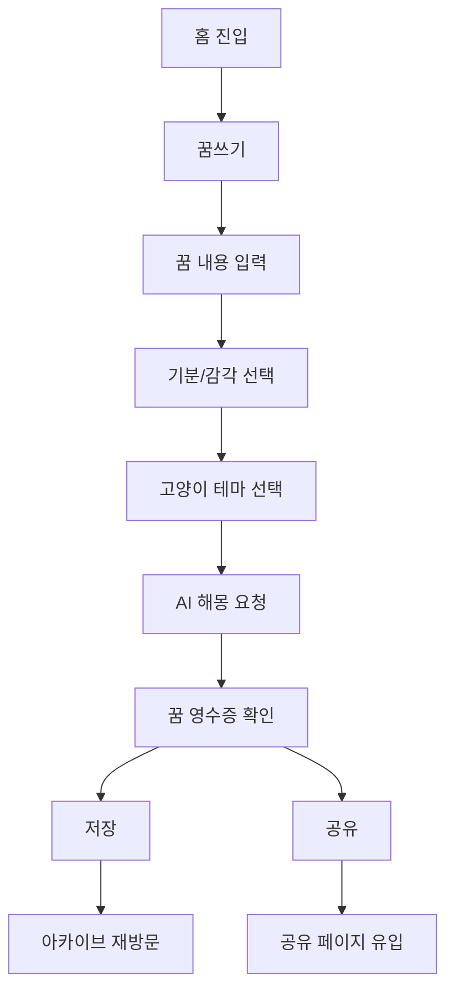
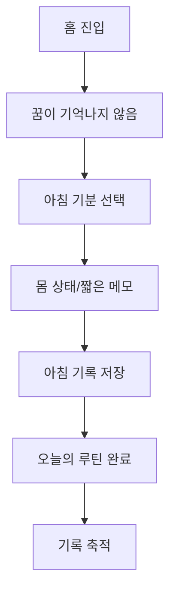

# Manyang Product Management Report

이 문서는 **마냥 꿈해몽(Manyang)** 프로젝트를 PM 관점에서 정리한 보고서다. 전체 프로젝트 설명은 [`manyang-project-report.md`](./manyang-project-report.md)에, AI 시스템 설계는 [`manyang-ai-engineering-report.md`](./manyang-ai-engineering-report.md)에 따로 정리되어 있다.

이 문서는 “무엇을 구현했는가”보다 **왜 이 문제를 선택했고, 어떤 사용자 가설을 세웠고, 어떤 범위를 MVP로 잘랐고, 어떤 지표로 성공을 판단할 것인가**에 초점을 둔다.

Manyang의 PM 관점 핵심 메시지는 다음이다.

> Manyang은 “AI 꿈해몽 기능”을 만든 프로젝트가 아니라, 꿈이라는 휘발성 경험을 입력, 해석, 저장, 공유, 재방문 루프로 바꾼 제품 실험이다.

- Live site: [https://manyang.vercel.app/](https://manyang.vercel.app/)
- 제품 기획서: [`manyang-dream-project-spec-updated.md`](./manyang-dream-project-spec-updated.md)
- 종합 보고서: [`manyang-project-report.md`](./manyang-project-report.md)
- AI 엔지니어링 보고서: [`manyang-ai-engineering-report.md`](./manyang-ai-engineering-report.md)

## 목차

1. [제품 개요](#1-제품-개요)
2. [문제 정의](#2-문제-정의)
3. [타깃 사용자](#3-타깃-사용자)
4. [제품 가설](#4-제품-가설)
5. [핵심 사용자 여정](#5-핵심-사용자-여정)
6. [MVP 범위 정의](#6-mvp-범위-정의)
7. [기능 우선순위](#7-기능-우선순위)
8. [제품 차별화 전략](#8-제품-차별화-전략)
9. [리텐션 전략](#9-리텐션-전략)
10. [성공 지표](#10-성공-지표)
11. [UX 의사결정](#11-ux-의사결정)
12. [수익화 가능성](#12-수익화-가능성)
13. [운영과 신뢰](#13-운영과-신뢰)
14. [출시 후 학습해야 할 것](#14-출시-후-학습해야-할-것)
15. [PM 관점의 주요 의사결정](#15-pm-관점의-주요-의사결정)
16. [현재 한계와 리스크](#16-현재-한계와-리스크)
17. [다음 제품 로드맵](#17-다음-제품-로드맵)
18. [PM 관점 회고](#18-pm-관점-회고)
19. [참고 문서](#19-참고-문서)

## 1. 제품 개요

### 1.1 Manyang이 어떤 서비스인가

Manyang은 사용자가 어젯밤 꿈을 입력하면, AI가 꿈속 상징을 찾아 해석하고 그 결과를 고양이 해몽사와 꿈 영수증 형태로 남겨주는 감성 꿈 기록 서비스다.

제품의 중심은 단순 해몽 결과가 아니라 **기록으로 남는 경험**이다. 사용자는 꿈을 입력하고, 결과를 읽고, 영수증이나 카드로 저장하고, 이후 아카이브에서 다시 볼 수 있다.

### 1.2 핵심 가치 제안

Manyang의 핵심 가치 제안은 다음과 같다.

| 가치 | 설명 |
| --- | --- |
| 꿈을 잊지 않게 한다 | 휘발되는 꿈을 카드, 영수증, 달력으로 저장한다. |
| 해석에 근거를 준다 | LLM 단독 해몽이 아니라 자체 꿈 상징 백과사전을 기반으로 읽는다. |
| 부담스럽지 않게 읽어준다 | 진단/예언이 아니라 감성적이고 부드러운 자기 성찰 톤을 유지한다. |
| 다시 보고 싶게 만든다 | 아카이브, 상징 히스토리, 월간 리포트 가능성으로 기록 자산을 만든다. |
| 공유하고 싶게 만든다 | 꿈 영수증과 카드형 결과물을 통해 저장/공유 욕구를 만든다. |

### 1.3 제품을 한 문장으로 설명하기

> 사라지는 꿈을 고양이 해몽사가 읽고, 상징과 꿈 영수증으로 남겨주는 감성 꿈 기록 서비스.

PM 관점에서는 이 문장이 중요하다. Manyang은 “AI 꿈해몽기”라고만 말하면 흔한 서비스처럼 보인다. 반대로 “꿈 기록 서비스”로 포지셔닝하면 꿈 입력, 해석, 저장, 재방문이 하나의 제품 루프로 묶인다.

### 1.4 현재 구현 범위 요약

현재 저장소 기준으로 Manyang은 다음 구현 범위를 가진다.

- 라이브 사이트 배포
- 꿈 입력과 해몽 결과
- 꿈 상징 백과사전
- 고양이 해몽사 테마
- 꿈 영수증
- 꿈 아카이브와 달력
- 아침 기록
- 밤 기록
- 데일리 타로와 질문형 타로
- 6개 상태와 30개 프리셋 질문을 가진 질문형 타로
- 직접 질문 입력 기반 타로 리딩
- 메이저/마이너를 포함한 78장 타로 덱
- 공유 링크
- Supabase 기록 저장
- 접근 정책과 관리자 실험실
- 157개 테스트 파일
- 13개 Supabase 마이그레이션
- 400개 이상 공개 UI 이미지 에셋

이 구현 범위는 단순 MVP를 넘어 제품화 가능성을 검증하기 위한 여러 실험이 함께 들어간 상태다.

## 2. 문제 정의

### 2.1 기존 꿈해몽 서비스의 문제

기존 꿈해몽 서비스는 주로 키워드 검색형이다. 사용자가 “이빨 빠지는 꿈”, “뱀 꿈”, “물 꿈”처럼 검색하면 정해진 풀이를 보여준다.

이 방식은 빠르지만 다음 문제가 있다.

| 문제 | 사용자 경험상 영향 |
| --- | --- |
| 너무 단정적임 | “흉몽”, “재물운”처럼 결과를 확정해 불안이나 거부감을 줄 수 있다. |
| 개인 맥락 부족 | 같은 상징이라도 꿈의 장면과 감정에 따라 다르게 읽어야 하는데 반영이 어렵다. |
| 오래된 운세 사이트 느낌 | 디자인과 문체가 낡게 느껴져 저장하거나 공유하고 싶지 않다. |
| 결과가 휘발됨 | 해몽을 보고 끝나며 사용자의 꿈 기록이 쌓이지 않는다. |
| AI 서비스와 차별화 약함 | ChatGPT에 직접 물어보는 것과 차이가 없어질 수 있다. |

Manyang은 이 문제를 “더 정확한 해몽”만으로 해결하려 하지 않았다. 대신 해몽 결과를 **저장 가능한 감성 기록물**로 바꾸는 방향을 택했다.

### 2.2 단순 AI 챗봇식 해몽의 한계

AI 챗봇은 꿈을 자연스럽게 해석해줄 수 있다. 하지만 제품으로 만들 때는 다음 한계가 있다.

- 결과가 대화 안에서 사라진다.
- 서비스만의 세계관과 저장 경험이 약하다.
- 해석 기준이 매번 달라질 수 있다.
- 사용자가 다시 방문할 이유가 약하다.
- 결과를 공유하거나 수집하는 구조가 없다.

PM 관점에서 보면, 단순 AI 해몽은 기능으로는 매력적일 수 있지만 제품 루프가 약하다. Manyang은 여기서 “AI 답변”을 “꿈 영수증과 아카이브”로 바꾸어 저장성과 재방문성을 만들고자 했다.

### 2.3 꿈 기록 서비스로 확장할 기회

꿈은 보통 잠에서 깬 뒤 빠르게 사라진다. 사용자는 꿈을 기억하고 싶지만, 긴 일기를 쓰기는 부담스러울 수 있다.

여기서 기회가 생긴다.

- 꿈은 짧게 입력해도 된다.
- 해몽 결과는 즉각적인 보상을 준다.
- 영수증/카드 결과물은 저장하고 싶게 만든다.
- 반복 상징은 시간이 지날수록 더 흥미로워진다.
- 꿈을 기억하지 못한 날도 아침 기분 기록으로 대체할 수 있다.

즉, Manyang의 기회는 “꿈을 맞히는 서비스”가 아니라, **꿈을 가볍게 기록하고 다시 꺼내보게 만드는 서비스**에 있다.

### 2.4 사용자가 실제로 느낄 pain point

제품이 해결하려는 사용자 pain point는 다음과 같다.

| 사용자 pain point | Manyang의 대응 |
| --- | --- |
| 꿈이 금방 잊힌다 | 꿈 영수증과 아카이브로 저장한다. |
| 꿈해몽은 궁금하지만 무섭거나 단정적인 해석은 싫다 | 안전하고 부드러운 감성 리딩으로 제공한다. |
| 일기는 부담스럽다 | 짧은 꿈 입력과 선택형 기분 기록으로 진입 장벽을 낮춘다. |
| 해몽 결과가 흔하고 재미없다 | 고양이 해몽사, 카드, 백과사전 세계관으로 차별화한다. |
| 내 꿈 패턴을 보고 싶다 | 상징 히스토리와 월간 리포트 가능성으로 확장한다. |

## 3. 타깃 사용자

### 3.1 1차 타깃

1차 타깃은 다음 사용자다.

- 꿈을 자주 기억하거나 꿈에 의미를 부여하는 사람
- 감성적인 기록 앱을 좋아하는 사람
- 타로, 운세, 심리테스트, 다이어리 앱을 가볍게 즐기는 사람
- 귀여운 캐릭터 기반 서비스를 좋아하는 사람
- 자기 감정과 반복 패턴을 부드럽게 돌아보고 싶은 사람

핵심은 “꿈해몽을 맹신하는 사용자”가 아니라, 꿈을 자기 성찰과 기록의 소재로 가볍게 소비하는 사용자다.

### 3.2 2차 타깃

2차 타깃은 다음 사용자다.

- AI 기반 감성 서비스를 좋아하는 사용자
- SNS에 예쁜 카드 결과를 공유하고 싶은 사용자
- 일기 앱은 부담스럽지만 짧은 기록은 남기고 싶은 사용자
- 고양이 캐릭터 IP를 좋아하는 사용자
- 타로/오늘의 리딩을 루틴처럼 소비하는 사용자

2차 타깃은 꿈 자체보다 결과물, 캐릭터, 공유성, 루틴성에 더 반응할 수 있다.

### 3.3 사용자 페르소나

#### Persona A: 꿈을 자주 기억하는 감성 기록 사용자

- 아침에 꿈을 자주 기억한다.
- 꿈이 무슨 뜻인지 가볍게 궁금해한다.
- 일기 앱은 가끔 쓰지만 꾸준히 쓰기는 어렵다.
- 예쁜 결과물이나 카드형 UI를 좋아한다.

이 사용자는 꿈 입력과 아카이브 기능의 핵심 사용자다.

#### Persona B: 타로/심리테스트를 즐기는 가벼운 리딩 사용자

- 타로, 운세, 심리테스트를 진지하게 믿기보다 재미로 본다.
- 오늘의 메시지나 작은 조언을 좋아한다.
- SNS 공유나 이미지 저장에 반응할 수 있다.

이 사용자는 꿈 영수증, 타로, 오늘의 작은 처방에 반응할 가능성이 높다.

#### Persona C: 캐릭터와 세계관에 끌리는 사용자

- 고양이, 달빛, 카드, 수정구슬 같은 콘셉트를 좋아한다.
- 기능보다 분위기와 몰입감에 반응한다.
- 고양이 테마를 고르고 바꾸는 행위 자체를 즐길 수 있다.

이 사용자는 고양이 해몽사 테마, 프리미엄 테마, 고급 영수증 템플릿의 잠재 고객이다.

### 3.4 사용자가 이 서비스를 쓰는 상황

Manyang의 사용 상황은 명확하다.

- 아침에 꿈이 기억났을 때
- 이상한 꿈을 꾸고 의미가 궁금할 때
- 꿈을 잊기 전에 짧게 남기고 싶을 때
- 꿈이 기억나지 않지만 아침 기분을 남기고 싶을 때
- 자기 전 하루의 감정과 몸 상태를 정리하고 싶을 때
- 가볍게 오늘의 타로 메시지를 보고 싶을 때
- 예쁜 결과물을 저장하거나 공유하고 싶을 때

이 중 PM 관점에서 가장 중요한 순간은 **아침 직후**다. 꿈은 시간이 지나면 빠르게 사라지기 때문에, 입력 진입이 빠르고 부담이 없어야 한다.

### 3.5 사용하지 않을 사용자

타깃을 명확히 하려면 비타깃도 정해야 한다.

Manyang이 우선 타깃하지 않는 사용자는 다음과 같다.

- 꿈해몽을 과학적/의학적 진단처럼 기대하는 사용자
- 아주 정확한 예언이나 운세 결과를 원하는 사용자
- 긴 일기와 정교한 감정 분석을 원하는 사용자
- 캐릭터/감성 UI를 유치하게 느끼는 사용자
- 기록보다 즉석 답변만 원하는 사용자

이 비타깃 정의는 제품 톤을 지키는 데 중요하다. Manyang은 전문 상담 앱도 아니고, 전통 운세 사이트도 아니고, 일반 챗봇도 아니다.

## 4. 제품 가설

### 4.1 핵심 가설

Manyang의 핵심 제품 가설은 다음이다.

> 사용자는 꿈을 단순히 해석받는 것보다, 해석 결과를 예쁘게 저장하고 다시 볼 수 있을 때 더 강한 가치를 느낀다.

이 가설은 기능 우선순위에도 영향을 준다. 해몽 엔진만 잘 만드는 것이 아니라, 결과 화면, 영수증, 카드, 저장, 아카이브가 함께 중요해진다.

### 4.2 가설 1: 사용자는 꿈을 입력할 의향이 있는가

꿈 입력은 제품의 가장 큰 진입 장벽이다. 사용자가 꿈을 입력하지 않으면 해몽, 저장, 아카이브 모두 시작되지 않는다.

검증 질문:

- 첫 방문 사용자가 꿈 입력을 시작하는가?
- 꿈 입력 폼에서 이탈하지 않는가?
- 꿈을 얼마나 길게 적는가?
- 꿈을 짧게 적어도 결과가 만족스러운가?

제품 대응:

- 짧아도 괜찮다는 안내
- 꿈 분위기/기분 선택으로 입력 보조
- 로딩 화면으로 분석 대기 경험 제공
- mock/LLM 결과 모두 UI 흐름 유지

### 4.3 가설 2: 해몽 결과를 저장하고 싶어 하는가

Manyang의 차별화는 결과 저장성에 있다. 사용자가 해몽을 읽고 끝내면 일반 AI 답변과 크게 다르지 않다.

검증 질문:

- 사용자가 결과 화면에서 저장 CTA를 누르는가?
- 꿈 영수증을 이미지로 저장하고 싶어 하는가?
- 아카이브에서 과거 결과를 다시 보는가?
- 저장된 결과가 다음 방문의 이유가 되는가?

제품 대응:

- 꿈 영수증
- 꿈 카드
- 저장 CTA
- 아카이브
- 기록 상세 페이지
- 공유 링크

### 4.4 가설 3: 꿈을 기억하지 못한 날에도 기록할 이유가 있는가

꿈 서비스의 큰 리스크는 사용자가 매일 꿈을 기억하지 못한다는 점이다. 이를 방치하면 재방문 루프가 약해진다.

검증 질문:

- 사용자는 꿈이 기억나지 않는 날에도 아침 기록을 남기는가?
- 아침 기분 기록이 부담 없이 완료되는가?
- 꿈 없음 상태도 기록으로 받아들여지는가?
- 아침 기록이 다음날 재방문에 영향을 주는가?

제품 대응:

- 아침 기분 기록
- 꿈을 기억하지 못함 플로우
- 발자국/루틴 기록
- 꿈 없음도 정상 기록으로 처리

### 4.5 가설 4: 고양이 캐릭터가 감성적 몰입을 높이는가

고양이 해몽사는 Manyang의 강한 브랜드 요소다. 하지만 캐릭터는 양날의 검이다. 매력적일 수도 있지만, 과하면 유치하게 느껴질 수 있다.

검증 질문:

- 사용자가 고양이 테마 선택을 즐기는가?
- 고양이 말투가 해몽 신뢰를 해치지 않는가?
- 사용자가 특정 고양이를 선호하는가?
- 프리미엄 고양이 테마에 관심이 있는가?

제품 대응:

- 검은냥, 하얀냥, 치즈냥 기본 테마
- 잿빛냥 프리미엄 테마
- 고양이별 배경/결과 테마
- 과한 말투보다 분위기 중심의 톤

### 4.6 가설 5: 꿈 영수증/카드가 공유 욕구를 만드는가

공유 기능은 제품 확산과 저장 욕구를 모두 검증한다.

검증 질문:

- 사용자가 공유 버튼을 누르는가?
- 공유 링크를 생성하는가?
- 이미지 저장 기능을 사용하는가?
- 공유된 결과 페이지가 신규 유입을 만드는가?

제품 대응:

- 공유 결과 API
- `/share/dream/[shareId]`
- `/share/tarot/[shareId]`
- 소셜 프리뷰 이미지
- 꿈 영수증 export

### 4.7 가설 6: 사용자는 직접 질문할 만큼 능동적으로 참여하는가

질문형 타로의 최근 확장은 사용자가 프리셋 질문만 고르는 것이 아니라, 직접 질문을 입력할 수 있게 한 점이다. PM 관점에서 이는 중요한 참여 가설이다.

검증 질문:

- 사용자가 6개 질문 상태 중 하나를 자연스럽게 선택하는가?
- 프리셋 질문과 직접 질문 중 어느 쪽을 더 많이 쓰는가?
- 직접 질문은 평균 몇 자 정도인가?
- 어떤 상태에서 직접 질문 비율이 높은가?
- 직접 질문 사용자가 결과 저장/공유/재방문에서 더 높은 행동을 보이는가?

제품 대응:

- 6개 상태 기반 질문 선택
- 상태별 5개 프리셋 질문
- 최대 80자 직접 질문 입력
- 질문 맥락을 포함한 `question_one_card` 리딩
- 질문 상태/질문 키 기반 사용량 측정 가능 구조

## 5. 핵심 사용자 여정

### 5.1 꿈을 기억하는 날



이 여정의 PM 포인트는 꿈 입력 완료율과 결과 저장률이다. 사용자가 입력까지 했지만 결과를 저장하지 않는다면, 결과물의 매력이 부족하다는 신호일 수 있다.

### 5.2 꿈을 기억하지 못한 날



이 여정은 꿈 입력 실패의 대체 경로다. PM 관점에서 매우 중요하다. 꿈이 기억나지 않는 날을 빈 상태로 두면 제품 재방문성이 약해진다. 반대로 이 날도 기록할 수 있으면 Manyang은 “꿈해몽 앱”에서 “아침 감성 기록 앱”으로 확장된다.

### 5.3 결과를 저장하는 흐름

결과 저장은 제품 가치가 사용자에게 전달되었는지를 보여준다.

저장 흐름:

```text
해몽 결과 확인
-> 꿈 영수증 확인
-> 저장 CTA
-> 로그인/게스트 상태 확인
-> 저장 완료
-> 아카이브 이동 가능
```

저장 CTA는 너무 이르면 부담스럽고, 너무 늦으면 사용자가 놓친다. 결과의 감정적 보상이 발생한 직후에 보여주는 것이 좋다.

### 5.4 공유하는 흐름

공유 흐름은 다음과 같다.

```text
결과 확인
-> 공유 버튼
-> share result 생성
-> public URL 발급
-> 공유 페이지 접근
```

PM 관점에서 공유 기능은 두 가지를 검증한다.

1. 결과물이 남에게 보여줄 만큼 매력적인가
2. 공유 페이지가 신규 사용자 유입 경로가 될 수 있는가

### 5.5 재방문하는 흐름

재방문은 해몽 결과 하나가 아니라 누적 기록에서 나온다.

재방문 계기는 다음이다.

- 다음날 꿈을 다시 기록하고 싶다.
- 어제 받은 작은 처방이 기억난다.
- 내 꿈 달력을 보고 싶다.
- 자주 등장한 상징이 궁금하다.
- 타로/오늘의 리딩을 확인하고 싶다.
- 월간 꿈 흐름을 보고 싶다.

Manyang은 “오늘 한 번 쓰고 끝”이 아니라, 기록이 쌓일수록 의미가 커지는 서비스로 설계되어야 한다.

## 6. MVP 범위 정의

### 6.1 MVP에서 반드시 검증해야 할 것

MVP에서 검증해야 할 질문은 다음이다.

1. 사용자가 꿈을 입력할 의향이 있는가?
2. AI 해몽 결과가 흥미로운가?
3. 꿈 카드나 꿈 영수증이 저장하고 싶을 만큼 매력적인가?
4. 백과사전 기반 해석이 신뢰감을 주는가?
5. 다음날 다시 접속할 이유가 생기는가?

이 질문들은 “기능을 만들었는가”가 아니라 “제품 루프가 작동하는가”를 본다.

### 6.2 1차 MVP에 포함한 기능

1차 MVP 필수 범위는 다음이었다.

| 우선순위 | 기능 | 이유 |
| --- | --- | --- |
| P0 | 홈 화면 | 꿈 입력과 기억 안 남 흐름으로 바로 진입해야 한다. |
| P0 | 꿈 입력 | 핵심 가치의 시작점이다. |
| P0 | 기억 안 남/아침 기분 기록 | 매일 꿈을 기억하지 못하는 문제를 보완한다. |
| P0 | LLM 구조화 분석 | 꿈 요약, 상징, 감정, 테마를 만들어야 한다. |
| P0 | 백과사전 기반 해몽 | 단순 AI 챗봇과 차별화되는 근거다. |
| P0 | 결과 화면 | 사용자가 가치를 체감하는 순간이다. |
| P0 | 꿈 카드/영수증 | 저장하고 공유할 결과물이다. |
| P0 | 기록/꿈 달력 | 재방문 루프의 기반이다. |
| P1 | 상징 백과 | 해석 근거와 탐색 경험을 제공한다. |
| P1 | 공유 이미지/링크 | 확산과 결과물 매력을 검증한다. |

### 6.3 1차 MVP에서 제외한 기능

MVP에서 제외한 기능은 다음이다.

- 이미지 생성 모델 기반 카드 생성
- 복잡한 카드 커스터마이징
- 커뮤니티
- 유료 결제
- 고급 리포트
- 많은 고양이 캐릭터
- 고양이방 고도화
- 월간 꿈 카드북 PDF

제외 기준은 명확하다. 핵심 루프 검증에 직접 필요하지 않거나, 운영 비용이 크거나, 사용자가 저장하고 싶어 하는지 검증되기 전에 만들기 이른 기능은 뒤로 미뤘다.

### 6.4 왜 이 범위가 적절했는가

Manyang의 MVP는 “예쁜 기능이 많은 앱”이 아니라, 다음 루프가 끊기지 않는 앱이어야 했다.

```text
홈 진입
-> 꿈 입력 또는 기억 안 남 선택
-> 해석 또는 아침 기록 생성
-> 꿈 카드/꿈 영수증 확인
-> 기록 화면에 저장
```

이 루프가 작동하지 않으면 프리미엄 테마, 월간 리포트, 커뮤니티, 고급 카드 템플릿은 의미가 없다.

### 6.5 범위를 줄인 기준

범위를 줄인 기준은 다음과 같다.

| 기준 | 판단 방식 |
| --- | --- |
| 핵심 루프에 필요한가 | 꿈 입력 -> 결과 -> 저장 -> 재방문에 직접 연결되는가 |
| 검증 전 비용이 큰가 | 이미지 생성, 결제, 커뮤니티처럼 운영 부담이 큰가 |
| 사용자 가치가 즉시 보이는가 | 첫 사용자가 바로 이해하고 쓸 수 있는가 |
| 나중에 붙여도 되는가 | MVP 이후에 추가해도 기존 루프를 깨지 않는가 |
| 제품 정체성에 맞는가 | 감성 기록 서비스라는 방향과 맞는가 |

## 7. 기능 우선순위

### 7.1 P0: 핵심 루프

P0 기능은 제품이 성립하기 위해 반드시 필요한 기능이다.

| 기능 | 사용자 가치 | PM 판단 |
| --- | --- | --- |
| 꿈 입력 | 꿈을 서비스에 전달한다. | 모든 루프의 시작점이다. |
| AI 해몽 결과 | 즉각적 보상을 준다. | 사용자가 계속 쓸지 결정하는 순간이다. |
| 꿈 영수증 | 결과를 저장 가능한 형태로 바꾼다. | 차별화의 핵심이다. |
| 저장/아카이브 | 기록 자산을 만든다. | 재방문 이유다. |
| 아침 기분 기록 | 꿈이 없는 날을 보완한다. | 리텐션 리스크 대응이다. |

### 7.2 P1: 리텐션 강화

P1 기능은 P0 루프를 더 자주 쓰게 만드는 기능이다.

| 기능 | 사용자 가치 | PM 판단 |
| --- | --- | --- |
| 꿈 달력 | 기록이 쌓이는 감각을 준다. | 재방문과 회고를 만든다. |
| 상징 백과 | 해석 근거와 탐색 재미를 준다. | 신뢰와 콘텐츠 자산이다. |
| 밤 기록 | 다음날 꿈 해몽 맥락을 만든다. | 아침 루프를 보강한다. |
| 고양이 테마 선택 | 개인 취향과 몰입을 만든다. | 캐릭터 자산 검증이다. |

### 7.3 P2: 공유/확장

P2 기능은 제품 확산과 확장성을 담당한다.

| 기능 | 사용자 가치 | PM 판단 |
| --- | --- | --- |
| 공유 링크 | 결과를 남에게 보여줄 수 있다. | 유입 채널 가능성이다. |
| 공유 이미지 저장 | 결과물을 소장할 수 있다. | 카드/영수증 매력 검증이다. |
| 데일리 타로 | 꿈이 없어도 오늘의 리딩을 볼 수 있다. | 보조 리텐션 장치다. |
| 질문형 타로 | 사용자의 능동적 질문을 받는다. | 감성 리딩 확장이다. |

### 7.4 P3: 유료화/고도화

P3 기능은 핵심 루프가 검증된 뒤 의미가 있다.

| 기능 | 사용자 가치 | PM 판단 |
| --- | --- | --- |
| Moon Pass | 기록과 테마를 깊게 확장한다. | 저장 가치 검증 후 추진해야 한다. |
| 프리미엄 고양이 | 소장성과 취향을 강화한다. | 캐릭터 선호 데이터가 필요하다. |
| 월간 꿈 리포트 | 누적 기록의 가치를 보여준다. | 충분한 기록 수가 필요하다. |
| 고급 영수증/PDF | 결과 보관 경험을 강화한다. | 공유/저장 의향 검증 후 적합하다. |

### 7.5 우선순위 판단 매트릭스

기능 우선순위는 다음 기준으로 판단할 수 있다.

| 기능 | 사용자 가치 | 구현 비용 | 학습 가치 | 우선순위 |
| --- | --- | --- | --- | --- |
| 꿈 입력 | 높음 | 중간 | 높음 | P0 |
| AI 해몽 | 높음 | 높음 | 높음 | P0 |
| 꿈 영수증 | 높음 | 중간 | 높음 | P0 |
| 아카이브 | 높음 | 중간 | 높음 | P0 |
| 아침 기록 | 중간 | 중간 | 높음 | P0 |
| 상징 백과 | 중간 | 중간 | 중간 | P1 |
| 공유 링크 | 중간 | 중간 | 중간 | P2 |
| 타로 | 중간 | 중간 | 중간 | P2 |
| 결제 | 불확실 | 높음 | 낮음 | P3 |
| 커뮤니티 | 불확실 | 높음 | 낮음 | 제외 |

PM 관점에서는 “만들고 싶은 기능”보다 “검증해야 할 학습 가치”가 우선이다.

## 8. 제품 차별화 전략

### 8.1 꿈 상징 백과사전

백과사전은 Manyang의 가장 중요한 차별화 요소다.

사용자 관점의 가치는 다음이다.

- AI가 아무렇게나 말하는 것 같지 않다.
- 해석 근거가 있는 서비스처럼 느껴진다.
- 꿈을 입력하지 않아도 상징을 탐색할 수 있다.
- 반복 상징 히스토리로 확장할 수 있다.

PM 관점에서 백과사전은 콘텐츠 자산이다. 시간이 지날수록 검색, SEO, 리텐션, 유료 리포트의 기반이 된다.

### 8.2 고양이 해몽사

고양이 해몽사는 브랜드 자산이다.

차별화 역할:

- AI 답변의 차가움을 줄인다.
- 꿈해몽의 무거움을 부드럽게 만든다.
- 테마 선택과 프리미엄 확장 여지를 만든다.
- 결과 화면의 감성적 기억점을 만든다.

단, 고양이 말투가 과하면 신뢰가 떨어질 수 있다. 그래서 PM 판단은 “고양이는 세계관과 톤을 만들되, 해석 품질을 가리지 않게 한다”에 가깝다.

### 8.3 꿈 영수증

꿈 영수증은 Manyang의 공유성과 저장성을 담당한다.

기존 해몽 서비스는 텍스트를 읽고 끝나는 경우가 많다. 꿈 영수증은 해몽 결과를 소장 가능한 결과물로 바꾼다.

제품 가치:

- 결과를 저장하고 싶게 만든다.
- SNS 공유에 적합하다.
- 하루의 꿈을 요약해준다.
- 꿈 카드보다 가볍고 실용적인 포맷이다.

### 8.4 꿈 아카이브

아카이브는 Manyang을 단발성 도구가 아니라 기록 서비스로 만든다.

차별화 역할:

- 꿈 기록이 누적된다.
- 달력 기반으로 회고할 수 있다.
- 반복 상징 분석으로 확장할 수 있다.
- 월간 리포트와 Moon Pass의 기반이 된다.

### 8.5 기억나지 않는 날의 기록

이 기능은 제품 리텐션 측면에서 매우 중요하다.

꿈을 기억하지 못하는 것은 예외가 아니라 매우 흔한 상태다. 이를 빈 화면으로 두면 제품 사용 빈도가 낮아진다. Manyang은 이를 “아침 기분 기록”으로 전환했다.

이 결정은 PM 관점에서 좋은 제품 판단이다. 사용자의 현실 행동을 인정하고, 대체 루프를 만든 것이다.

### 8.6 타로 기능과의 확장성

타로는 Manyang의 핵심 꿈해몽 루프와 별개지만, 감성 리딩이라는 상위 카테고리 안에서는 자연스럽게 확장된다.

타로의 역할:

- 꿈이 없는 날에도 오늘의 리딩을 제공한다.
- 데일리 루틴을 강화한다.
- 질문형 리딩으로 사용자 참여를 높인다.
- 프리미엄 리딩 확장 가능성을 만든다.

최근 질문형 타로는 단순히 “질문을 하나 고르는 기능”을 넘어, 사용자의 현재 관심사를 6개 상태로 나누어 받는 구조가 되었다.

| 상태 | PM 관점의 의미 |
| --- | --- |
| 내 마음이 궁금해 | 감정/자기이해 니즈 |
| 관계가 신경 쓰여 | 관계 상담형 니즈 |
| 일이 잘 안 풀려 | 업무/목표 해결 니즈 |
| 돈과 현실이 걱정돼 | 현실 불안/자원 점검 니즈 |
| 결정해야 할 일이 있어 | 선택/의사결정 니즈 |
| 오늘 하루가 궁금해 | 가벼운 데일리 루틴 니즈 |

이 분류는 PM 관점에서 중요하다. 사용자가 어떤 질문 상태를 많이 선택하는지 보면, Manyang 사용자들이 꿈 외에 어떤 감성 리딩 니즈를 갖고 있는지 알 수 있다. 예를 들어 관계 질문이 높으면 관계형 리딩/공유 콘텐츠를, 현실/돈 질문이 높으면 불안을 키우지 않는 자원 점검형 리딩을 더 다듬는 식으로 제품 방향을 잡을 수 있다.

또한 직접 질문 입력은 intent capture 기능이다. 최대 80자 안에서 사용자가 자기 말을 직접 적으면, 프리셋 질문만으로는 보이지 않는 실제 표현, 고민 유형, 질문 길이, 주제 빈도를 알 수 있다. 다만 직접 질문은 민감 정보가 섞일 수 있으므로 저장/분석/개인화에 활용할 때는 프라이버시와 안전 정책을 먼저 정해야 한다.

주의할 점은 타로가 꿈 기록의 핵심 정체성을 흐리지 않도록 하는 것이다. PM 관점에서는 타로를 메인 제품이 아니라 보조 리텐션/확장 기능으로 두는 것이 적절하다. 제품 메시지는 “꿈 기록을 중심으로 하고, 타로는 꿈이 없는 날이나 가볍게 마음을 보고 싶은 날의 보조 루틴”에 가깝게 유지하는 편이 좋다.

## 9. 리텐션 전략

### 9.1 리텐션의 핵심 관점

Manyang의 리텐션은 해몽 자체보다 **기록이 쌓이는 감각**에서 나온다.

한 번의 AI 해몽은 흥미로울 수 있다. 하지만 다시 돌아오게 만들려면 다음이 필요하다.

- 내 꿈이 저장된다.
- 어제와 오늘의 기록이 이어진다.
- 반복 상징을 볼 수 있다.
- 월간 흐름을 확인할 수 있다.
- 꿈이 없어도 기록할 수 있다.

### 9.2 아침 루프

아침 루프는 핵심 리텐션 루프다.

```text
꿈이 기억나는지 확인
-> 기억나면 꿈 입력
-> 기억나지 않으면 아침 기분 기록
-> 오늘의 작은 처방 확인
-> 꿈 카드 또는 사라진 꿈 카드 저장
```

아침 루프의 장점은 습관과 연결되기 쉽다는 점이다. 꿈은 잠에서 깬 직후 가장 선명하기 때문에, 제품 사용 타이밍이 자연스럽다.

### 9.3 밤 루프

밤 루프는 다음날 아침 루프를 보강한다.

```text
자기 전 접속
-> 오늘 하루의 기분과 몸 컨디션 선택
-> 한 줄 기록 남기기
-> 다음날 꿈 해몽에서 어젯밤의 맥락으로 참고
```

밤 루프는 꿈을 직접 만들지는 않지만, 다음날 꿈 해몽의 맥락을 풍부하게 한다. 또한 사용자가 하루를 마무리하는 감성 기록으로 Manyang을 사용할 수 있게 한다.

### 9.4 꿈을 기억하지 못한 날의 대체 루프

꿈 서비스의 리텐션 리스크는 “오늘 꿈이 기억나지 않는다”다.

Manyang의 해결 방식:

- 꿈 없음 상태를 실패로 보지 않는다.
- 아침 기분 기록으로 대체한다.
- 오늘의 기록으로 저장한다.
- 달력과 루틴에 반영한다.

이 대체 루프가 있어야 Manyang은 매일 사용할 가능성이 생긴다.

### 9.5 아카이브 재방문

아카이브는 사용자가 과거의 나를 다시 보는 공간이다.

재방문 유도 요소:

- 꿈 달력
- 기록 리스트
- 꿈 카드 다시 보기
- 상징 필터
- 월간 요약
- 공유 결과 재확인

아카이브가 매력적일수록 결과 저장의 가치도 올라간다.

### 9.6 상징 히스토리

상징 히스토리는 Manyang의 장기 리텐션 자산이다.

예시:

```text
최근 한 달간 자주 등장한 상징
1. 복도
2. 문
3. 물
4. 학교
5. 신발
```

사용자는 “내 꿈에 자주 나오는 것”에 흥미를 느낄 수 있다. 이 기능은 기록이 쌓일수록 가치가 커지므로, Moon Pass나 월간 리포트로도 확장 가능하다.

### 9.7 타로/오늘의 리딩

타로는 꿈이 없는 날의 보조 리텐션 장치다.

사용자가 꿈을 기억하지 못해도 다음 행동을 할 수 있다.

- 오늘의 타로 한 장 보기
- 질문형 타로 보기
- 타로 결과 공유하기
- 타로 기록 저장하기

질문형 타로는 여기에 한 단계 더해, 사용자가 오늘의 고민을 직접 고르거나 적는 루틴을 만든다.

```text
꿈이 기억나지 않음
-> 질문형 타로 진입
-> 지금 궁금한 상태 선택
-> 프리셋 질문 또는 직접 질문 입력
-> 카드 선택
-> 질문에 맞는 리딩 확인
-> 저장 또는 공유
```

이 루프의 장점은 “꿈이 없으면 아무것도 못 한다”는 문제를 줄인다는 점이다. 꿈 입력이 핵심 루프라면, 질문형 타로는 가벼운 보조 루프다. 특히 직접 질문은 사용자가 앱에 자기 맥락을 더 많이 넣는 행위이므로, 이후 꿈 기록이나 월간 리포트와 연결할 수 있다.

다만 타로가 너무 커지면 꿈 기록 제품의 정체성이 약해질 수 있다. 따라서 PM 관점에서는 “꿈 기록의 보조 루틴”으로 관리하는 것이 좋다. 홈에서 타로를 노출하더라도 꿈쓰기 CTA보다 강하게 밀지 않고, 꿈 없음/오늘의 마음 확인 같은 맥락에서 연결하는 편이 안전하다.

## 10. 성공 지표

### 10.1 North Star Metric 후보

Manyang의 North Star Metric 후보는 다음이다.

```text
주간 저장된 개인 기록 수
```

여기서 기록은 꿈 해몽, 아침 기분 기록, 밤 기록 등을 포함할 수 있다. 이유는 Manyang의 핵심 가치가 “AI 답변 생성”이 아니라 “기록이 쌓이는 경험”이기 때문이다.

대체 후보:

- 주간 완료된 꿈 해몽 수
- 주간 꿈 영수증 저장 수
- 7일 내 재방문 사용자 비율

### 10.2 Acquisition 지표

유입과 첫 경험 지표는 다음을 본다.

| 지표 | 의미 |
| --- | --- |
| 방문자 수 | 라이브 사이트 유입 규모 |
| 첫 화면 CTA 클릭률 | 사용자가 핵심 행동으로 진입하는가 |
| 꿈쓰기 시작률 | 꿈 입력 의향 |
| 공유 페이지 유입 수 | 공유 결과가 신규 유입을 만드는가 |

### 10.3 Activation 지표

Activation은 사용자가 첫 가치를 경험했는지 본다.

| 지표 | 의미 |
| --- | --- |
| 첫 방문 후 꿈 입력 완료율 | 핵심 행동 완료 여부 |
| 해몽 결과 도달률 | 입력 후 결과까지 도달하는가 |
| 결과 화면 체류 | 결과를 읽는가 |
| 첫 꿈 영수증 확인률 | 결과물의 첫 가치 경험 |

### 10.4 Retention 지표

Retention 지표는 Manyang의 핵심이다.

| 지표 | 의미 |
| --- | --- |
| 다음날 재방문율 | 아침 루프가 작동하는가 |
| 7일 내 재방문율 | 기록 습관으로 이어지는가 |
| 아침 기록 완료율 | 꿈 없음 대체 루프가 작동하는가 |
| 꿈 달력 재방문률 | 아카이브 가치가 있는가 |
| 기록 3개 이상 사용자 비율 | 누적 가치가 만들어지는가 |

### 10.5 Engagement 지표

Engagement는 결과와 기능의 매력을 본다.

| 지표 | 의미 |
| --- | --- |
| 결과 저장률 | 결과물이 저장하고 싶은가 |
| 공유 클릭률 | 결과물이 보여주고 싶은가 |
| 평균 꿈 입력 길이 | 사용자가 얼마나 맥락을 제공하는가 |
| 고양이 테마 변경률 | 테마 선택이 의미 있는가 |
| 상징 백과 클릭률 | 백과사전이 탐색 가치가 있는가 |
| 타로 사용률 | 보조 리텐션 기능이 작동하는가 |
| 질문형 타로 사용률 | 사용자가 능동적 질문 리딩에 반응하는가 |
| 직접 질문 입력률 | 프리셋을 넘어 자기 맥락을 입력하는가 |
| 질문 상태별 선택 비율 | 마음/관계/일/현실/선택/오늘 중 어떤 니즈가 강한가 |
| 타로 결과 저장/공유율 | 타로 결과도 기록물 가치가 있는가 |

### 10.6 Quality/Trust 지표

AI 기반 제품은 품질과 신뢰 지표가 필요하다.

| 지표 | 의미 |
| --- | --- |
| 해몽 unavailable 비율 | AI 결과 생성 안정성 |
| 상징 매칭 성공률 | RAG/백과사전 커버리지 |
| 안전 고지 발생률 | 민감 입력 비율 |
| 부정 피드백률 | 결과 품질 문제 |
| “상징이 꿈에 없었음” 피드백 | 근거 없는 해석 문제 |
| “무섭게 느껴짐” 피드백 | safety/tone 문제 |

### 10.7 정성 피드백 지표

정성 피드백 질문은 다음처럼 설계할 수 있다.

- 해몽 결과가 그럴듯했나요?
- 저장하고 싶은 결과였나요?
- 고양이 말투가 부담스럽지 않았나요?
- 운세 앱처럼 느껴졌나요, 기록 앱처럼 느껴졌나요?
- 다시 꿈을 기록하고 싶나요?
- 꿈을 기억하지 못한 날에도 아침 기록을 남길 것 같나요?
- 질문형 타로의 질문 분류가 지금 고민과 잘 맞았나요?
- 직접 질문을 입력하는 것이 부담스럽지 않았나요?

정성 피드백은 초기 MVP에서 특히 중요하다. 사용자 수가 적을 때는 숫자보다 왜 그렇게 느꼈는지가 더 가치 있다.

## 11. UX 의사결정

### 11.1 왜 고양이 캐릭터를 썼는가

고양이는 Manyang의 세계관을 만드는 핵심 장치다.

PM 관점의 목적:

- 해몽 결과를 덜 딱딱하게 만든다.
- 꿈, 밤, 달빛, 조용한 관찰이라는 분위기와 맞는다.
- 테마 선택과 프리미엄 확장 가능성을 만든다.
- 서비스 이름과 기억점을 강화한다.

다만 고양이 캐릭터는 기능을 가리면 안 된다. “귀엽지만 신뢰할 수 있는” 톤을 유지해야 한다.

### 11.2 왜 카드/영수증 형태를 썼는가

텍스트 답변은 읽고 사라지기 쉽다. 카드와 영수증은 결과를 저장 가능한 물건처럼 느끼게 한다.

카드/영수증의 PM 가치:

- 저장 욕구를 만든다.
- 공유하기 쉬운 단위가 된다.
- 결과 화면의 만족도를 높인다.
- 아카이브에서 다시 보기 좋다.
- 프리미엄 템플릿으로 확장 가능하다.

### 11.3 왜 모바일 중심으로 설계했는가

꿈 기록은 사용 타이밍상 모바일과 잘 맞는다.

- 잠에서 깬 직후
- 침대에서
- 출근 전 짧은 시간
- 자기 전

이 상황에서는 데스크톱보다 모바일 접근성이 중요하다. 따라서 하단 내비게이션, 짧은 입력, 빠른 CTA, 카드형 결과가 적합하다.

### 11.4 왜 “꿈을 기억하지 못함”을 정상 플로우로 봤는가

꿈을 기억하지 못하는 날은 예외가 아니라 일반적이다.

이를 실패 상태로 두면 다음 문제가 생긴다.

- 사용자가 앱을 닫는다.
- 재방문 루프가 끊긴다.
- 기록 달력에 빈 날이 많아진다.
- 제품이 “꿈을 꾼 날만 쓰는 앱”이 된다.

Manyang은 이를 아침 기분 기록으로 전환해 사용자의 현실 행동에 맞췄다.

### 11.5 왜 결과 실패 상태를 명시적으로 보여줬는가

AI 결과 생성은 실패할 수 있다. provider missing, timeout, invalid response, provider error가 발생할 수 있다.

PM 관점에서 실패를 숨기면 다음 문제가 생긴다.

- 사용자는 가짜 결과를 실제 결과로 믿을 수 있다.
- 기록 데이터가 오염된다.
- AI 품질 문제를 운영에서 파악하기 어렵다.
- 신뢰가 떨어진다.

따라서 Manyang은 unavailable 상태를 명시적으로 다룬다. 이는 단기 UX보다 장기 신뢰를 선택한 결정이다.

## 12. 수익화 가능성

### 12.1 수익화 원칙

Manyang의 수익화는 “해몽을 더 많이 팔기”보다 **기록을 더 깊고 예쁘게 보관하는 가치**에 초점을 둔다.

기본 해몽 자체를 너무 빨리 막으면 첫 경험이 약해진다. 따라서 무료 경험에서는 핵심 가치를 충분히 보여주고, 유료화는 누적 기록과 프리미엄 보관 경험에서 시작하는 것이 적절하다.

### 12.2 Guest

Guest는 비로그인 사용자다.

제공 가치:

- 하루 1회 기본 꿈 해몽
- 기본 꿈 영수증 확인
- 기본 고양이 테마
- 저장/공유 또는 다운로드 경험

제한:

- 서버 보관 제한
- 기록/달력/상징 히스토리 제한
- 다음날 이어서 보려면 로그인 유도

PM 목적:

- 첫 경험 마찰을 낮춘다.
- 검색/SNS 유입 사용자가 바로 가치를 경험하게 한다.
- “꿈 영수증이 저장하고 싶은가”를 빠르게 검증한다.

### 12.3 Free Account

Free Account는 로그인 무료 사용자다.

제공 가치:

- 매일 기본 꿈 해몽
- 꿈 영수증 보관
- 꿈 기록/달력
- 아침 기분 기록
- 밤 기록
- 기본 상징 백과
- 기본 고양이 테마

PM 목적:

- 매일 들어오는 습관을 만든다.
- 기록이 쌓인 뒤 프리미엄 전환 타이밍을 만든다.
- 무료에서도 제품의 핵심 루프를 완성한다.

### 12.4 Moon Pass

Moon Pass는 유료 사용자 플랜이다.

제공 후보:

- 상세 꿈 해몽
- 프리미엄 고양이 테마
- 타로 추가 리딩
- 질문형 타로 추가 이용권
- 세 장 타로 리딩
- 프리미엄 타로 카드 뒷면/공유 템플릿
- 월간 꿈 정산서
- 상징 히스토리 심화 보기
- 고급 꿈 영수증 템플릿
- PDF/고해상도 저장
- 검색/필터 고급 기능
- 프라이버시 잠금

PM 목적:

- “내 꿈 세계가 쌓였다”는 사용자에게 더 깊은 분석과 보관 경험을 제공한다.
- 프리미엄 고양이 테마를 감성적 전환 장치로 사용한다.
- 타로는 핵심 꿈 기록을 대체하지 않는 보조 혜택으로 제공한다.
- 월간 리포트로 반복 결제 이유를 만든다.

### 12.5 MVP에서 결제를 뒤로 미룬 이유

결제는 MVP에서 제외하는 것이 적절했다.

이유:

- 사용자가 꿈 입력을 하는지 먼저 검증해야 한다.
- 결과를 저장하고 싶어 하는지 먼저 봐야 한다.
- 기록이 충분히 쌓이지 않으면 유료 리포트 가치가 약하다.
- 결제 구현은 운영/CS/정책 비용이 크다.
- 초기에는 가격보다 핵심 루프의 매력 검증이 더 중요하다.

PM 관점에서 좋은 유료화는 기능을 먼저 잠그는 것이 아니라, 무료 경험에서 가치가 확인된 뒤 자연스럽게 확장되는 것이다.

### 12.6 유료 전환 타이밍

유료 제안은 사용자가 가치를 느낀 뒤에만 보여주는 것이 좋다.

| 순간 | 제안 |
| --- | --- |
| Guest 첫 영수증 확인 후 | 로그인하면 매일 기록 가능 |
| 로그인 후 첫 기록 저장 | 내 꿈 기록이 쌓이기 시작했다는 메시지 |
| 기록 3개 이상 | 상징 히스토리 미리보기 |
| 기록 7개 이상 | 주간 흐름 미리보기 |
| 월말 | 월간 꿈 정산서 제안 |
| 반복 상징 발견 | 심화 해석 또는 월간 리포트 제안 |
| 프리미엄 테마 클릭 | Moon Pass 안내 |
| 질문형 타로 일일 제한 도달 | 추가 질문 리딩 또는 Moon Pass 안내 |
| 세 장 타로 클릭 | Moon Pass로 상황/흐름/판단 기준 리딩 안내 |

## 13. 운영과 신뢰

### 13.1 안전 고지

Manyang은 꿈해몽을 오락과 자기 성찰의 영역으로 다룬다.

제품에서 유지해야 할 고지는 다음이다.

```text
마냥 꿈해몽의 해석은 오락과 자기 성찰을 위한 감성 리딩입니다.
의학적, 심리학적 진단이나 전문 상담을 대체하지 않습니다.
```

이 고지는 법적 방어만이 아니라 제품 톤을 정하는 장치다.

### 13.2 AI 결과의 신뢰성 표현

AI 결과는 너무 확정적으로 말하면 안 된다.

지양:

- “반드시”
- “무조건”
- “징조입니다”
- “병입니다”
- “나쁜 일이 생깁니다”

지향:

- “~와 연결되어 보일 수 있어요”
- “~로 읽을 수 있어요”
- “단정하기보다는”
- “오늘은 ~를 살펴보면 좋겠습니다”

PM 관점에서 이 톤은 브랜드 신뢰를 만든다.

### 13.3 관리자 접근 정책

관리자 권한은 테스트와 운영 편의를 위해 필요하지만, 클라이언트 값에 의존하면 안 된다.

Manyang의 정책:

- admin source of truth는 `manyang.profiles.role`
- request body, localStorage, user_metadata는 admin 권한 근거가 아님
- admin도 safety policy와 provider availability는 우회하지 않음
- admin은 반복 테스트를 위해 일부 사용량 제한만 우회 가능

이는 PM 관점에서도 중요하다. 실험 편의성을 위해 제품 신뢰와 보안 경계를 깨면 안 된다.

### 13.4 사용량 제한

사용량 제한은 비용 관리와 제품 전환을 동시에 담당한다.

기본 방향:

- Guest: 하루 1회 기본 해몽
- Free Account: 하루 1회 기본 해몽과 기록 보관
- Moon Pass: 상세 해몽, 프리미엄 테마, 리포트 확장
- Admin: 테스트 목적 일부 제한 우회

사용량 제한은 너무 공격적이면 첫 경험을 망친다. 초기에는 핵심 가치를 먼저 경험하게 하고, 기록 누적 이후 전환을 유도하는 것이 적절하다.

### 13.5 민감한 꿈 입력을 다루는 제품 원칙

꿈에는 민감한 내용이 들어올 수 있다.

제품 원칙:

- 꿈 하나로 현실 결과를 단정하지 않는다.
- 질병/심리 진단처럼 말하지 않는다.
- 자해/위기 신호를 가볍게 넘기지 않는다.
- 안전 고지는 서비스 분위기와 충돌하더라도 유지한다.
- AI 실패 시 가짜 결과를 보여주지 않는다.

이 원칙은 PM, AI 엔지니어, 디자인 모두가 공유해야 한다.

## 14. 출시 후 학습해야 할 것

### 14.1 어떤 사용자가 실제로 꿈을 입력하는가

초기에는 타깃 가설이 맞는지 확인해야 한다.

볼 것:

- 꿈 입력 시작률
- 꿈 입력 완료율
- 평균 입력 길이
- 입력 시간대
- 로그인/게스트별 차이
- 꿈 기억 여부 선택 비율

### 14.2 사용자는 결과를 저장하는가

결과 저장은 핵심 가치 검증이다.

볼 것:

- 결과 저장률
- 영수증 이미지 저장률
- 아카이브 이동률
- 저장 후 재방문율
- 저장하지 않은 사용자의 이탈 지점

### 14.3 어떤 상징이 자주 등장하는가

자주 등장하는 상징은 제품과 콘텐츠 운영에 모두 중요하다.

볼 것:

- 상위 상징
- 매칭 실패 상징
- sceneOnly로 자주 남는 표현
- 검색되는 백과사전 항목
- 특정 상징 후 저장률

이 데이터는 백과사전 확장 우선순위를 정하는 데도 쓰인다.

### 14.4 사용자는 고양이 테마를 바꾸는가

고양이 테마는 브랜드/유료화 가설과 연결된다.

볼 것:

- 기본 테마 유지율
- 테마 변경률
- 고양이별 결과 저장률
- 프리미엄 테마 클릭률
- 테마가 공유/저장에 미치는 영향

### 14.5 공유 기능을 쓰는가

공유는 결과물의 매력을 검증한다.

볼 것:

- 공유 버튼 클릭률
- 공유 링크 생성률
- 공유 페이지 방문 수
- 공유 페이지에서 신규 꿈 입력 전환
- 이미지 저장률

### 14.6 타로가 리텐션에 도움이 되는가

타로는 꿈이 없는 날의 보조 루프다.

볼 것:

- 타로 사용률
- 타로 사용자와 비사용자의 재방문 차이
- 타로 결과 저장/공유율
- 질문형 타로 사용률
- 프리셋 질문 선택률
- 직접 질문 입력률
- 질문 상태별 선택 비율
- 질문형 타로 일일 제한 도달률
- 타로가 꿈 기록으로 이어지는 비율

특히 직접 질문 입력률은 사용자의 능동적 참여를 보여준다. 프리셋 질문만 많이 쓰인다면 질문 구조가 편리한 것이고, 직접 질문이 많이 쓰인다면 사용자가 Manyang을 더 개인적인 감성 리딩 도구로 쓰고 있다는 신호다.

### 14.7 어떤 순간에 이탈하는가

이탈 지점은 PM의 우선순위를 정한다.

볼 것:

- 홈에서 꿈쓰기 진입 전 이탈
- 꿈 입력 중 이탈
- 로딩 중 이탈
- 결과 확인 후 저장 전 이탈
- 로그인 유도에서 이탈
- 아카이브 진입 후 이탈

각 이탈 지점은 다른 해결책을 요구한다.

## 15. PM 관점의 주요 의사결정

### 15.1 AI 해몽기가 아니라 기록 서비스로 포지셔닝한 결정

가장 중요한 PM 결정은 Manyang을 단순 AI 해몽기가 아니라 꿈 기록 서비스로 포지셔닝한 것이다.

이 결정의 효과:

- 저장/아카이브가 핵심 기능이 된다.
- 리텐션 루프를 설계할 수 있다.
- 월간 리포트와 유료화가 자연스러워진다.
- ChatGPT wrapper와 차별화된다.
- 결과물 디자인이 중요해진다.

### 15.2 꿈을 기억하지 못한 날도 제품 흐름에 포함한 결정

꿈을 기억하지 못하는 날을 정상 플로우로 둔 것은 좋은 제품 판단이다.

이 결정의 효과:

- 사용자가 앱을 닫지 않는다.
- 매일 기록 루프가 유지된다.
- 아침 기분 기록이라는 확장 기능이 생긴다.
- 꿈 없음도 데이터가 된다.
- 리텐션 리스크를 줄인다.

### 15.3 백과사전 기반 해석을 차별화 포인트로 삼은 결정

백과사전 기반 해석은 PM 관점에서도 강한 차별화다.

이 결정의 효과:

- AI 해몽의 근거가 생긴다.
- 상징 백과 페이지로 콘텐츠 자산이 된다.
- SEO/검색 확장 가능성이 생긴다.
- 상징 히스토리와 개인화로 확장된다.
- 유료 리포트의 기반 데이터가 된다.

### 15.4 유료화보다 핵심 루프 검증을 먼저 한 결정

결제를 MVP에서 제외한 것은 적절했다.

이 결정의 효과:

- 첫 경험 마찰이 줄어든다.
- 사용자가 저장 가치를 느끼는지 먼저 볼 수 있다.
- 결제 구현 비용을 미룰 수 있다.
- 유료화 포인트를 데이터로 찾을 수 있다.

### 15.5 캐릭터 IP와 감성 UI를 제품 자산으로 본 결정

고양이 해몽사는 단순 장식이 아니라 제품 자산이다.

이 결정의 효과:

- 제품 기억점이 생긴다.
- 테마 선택과 프리미엄 테마 확장이 가능하다.
- 결과 화면의 감성적 만족도가 올라간다.
- 공유 이미지의 차별성이 생긴다.

다만 캐릭터가 기능 신뢰를 해치지 않도록 톤 조절이 필요하다.

## 16. 현재 한계와 리스크

### 16.1 꿈 입력 자체의 진입 장벽

꿈 입력은 사용자의 노력이 필요하다.

리스크:

- 꿈을 기억하지 못하면 입력하지 않는다.
- 긴 텍스트 입력이 부담스러울 수 있다.
- 아침에는 시간이 부족하다.

대응:

- 짧아도 괜찮다는 안내
- 선택형 기분/감각 입력
- 꿈 없음 플로우
- 음성 입력 또는 키워드 입력 검토

### 16.2 해몽 결과 품질 편차

AI 결과 품질은 변동될 수 있다.

리스크:

- 결과가 너무 일반적이다.
- 사용자의 꿈과 맞지 않는다.
- 해몽이 무섭게 느껴진다.
- unavailable이 자주 발생한다.

대응:

- quality eval
- 사용자 피드백 수집
- 백과사전 확장
- prompt versioning
- unavailable UX 개선

### 16.3 캐릭터가 유치하게 느껴질 위험

고양이 캐릭터는 매력 요소이지만, 과하면 제품 신뢰를 해칠 수 있다.

대응:

- 말투를 과하게 쓰지 않는다.
- 해몽 본문은 차분하게 유지한다.
- 캐릭터는 테마와 안내 중심으로 활용한다.
- 사용자별 톤 선호를 학습할 수 있다.

### 16.4 꿈해몽/운세 서비스로 오해될 위험

Manyang은 감성 기록 서비스이지만, 외부에서는 운세 서비스로 오해할 수 있다.

대응:

- 안전 고지 유지
- “진단/예언 아님” 명확히 표현
- 백과사전 기반 자기 성찰 톤 유지
- 결과에 작은 처방과 기록 맥락을 강조

### 16.5 리텐션 검증 전 기능 확장 위험

타로, 프리미엄 테마, 공유 기능 등 확장 기능이 늘어나면 핵심 루프가 흐려질 수 있다.

대응:

- North Star Metric을 기록 저장/재방문으로 유지
- 타로는 보조 루프로 관리
- 기능별 지표를 분리
- 핵심 루프 개선을 우선

### 16.6 콘텐츠 운영 비용

상징 백과사전이 커질수록 운영 비용이 증가한다.

리스크:

- alias 충돌
- 안전하지 않은 표현
- 중복 상징
- 다국어 관리
- 콘텐츠 품질 편차

대응:

- 백과사전 검수 workflow
- 관리자 편집 도구
- missing symbol logging
- content QA checklist

## 17. 다음 제품 로드맵

### 17.1 단기: 핵심 루프 polish

단기 목표는 꿈 입력 -> 결과 -> 저장 -> 재방문 루프를 더 매끄럽게 만드는 것이다.

작업 후보:

- 꿈 입력 UX 개선
- 결과 화면 가독성 개선
- 저장 CTA 위치와 문구 개선
- unavailable 상태 UX 개선
- 아침 기록 완료 경험 강화
- 모바일 overflow와 UI polish
- 공유 이미지 안정화
- 질문형 타로 상태/질문 문구의 이해도 점검
- 직접 질문 입력 후 결과까지의 이탈률 확인

### 17.2 중기: 상징 히스토리와 월간 리포트

중기 목표는 누적 기록의 가치를 보여주는 것이다.

작업 후보:

- 자주 등장한 상징
- 월간 꿈 흐름 요약
- 감정 변화 요약
- 꿈 카드 컬렉션
- 상징별 과거 꿈 연결
- 월간 꿈 정산서 미리보기
- 질문형 타로에서 자주 고른 상태와 꿈 기록 감정 흐름 연결
- 타로 카드 컬렉션 또는 리딩 히스토리 미리보기

### 17.3 장기: Moon Pass와 개인화 리딩

장기 목표는 기록 자산을 기반으로 유료 가치를 만드는 것이다.

작업 후보:

- Moon Pass
- 프리미엄 고양이 테마
- 상세 해몽
- 월간 리포트
- PDF export
- 고급 검색/필터
- 개인 반복 상징 기반 리딩
- 꿈 기록과 질문형 타로를 연결한 개인화 리딩
- 세 장 타로와 프리미엄 카드 공유 템플릿
- 프라이버시 잠금

### 17.4 실험 백로그

검증할 실험은 다음과 같다.

| 실험 | 검증 질문 |
| --- | --- |
| 꿈 입력 placeholder 변경 | 입력 완료율이 오르는가 |
| 결과 저장 CTA 문구 변경 | 저장률이 오르는가 |
| 꿈 영수증 디자인 A/B | 공유/저장률이 달라지는가 |
| 고양이 테마 선택 노출 | 테마 선택이 몰입을 높이는가 |
| 아침 기록 기본 진입 | 꿈 없음 사용자의 재방문이 늘어나는가 |
| 타로 홈 노출 | 리텐션에 도움이 되는가 |
| 질문형 타로 상태 순서 변경 | 가장 많이 쓰는 질문까지의 선택 시간이 줄어드는가 |
| 직접 질문 입력 노출 강화 | 프리셋 대비 직접 질문 비율이 오르는가 |
| 세 장 타로 teaser | Moon Pass 관심 클릭이 생기는가 |
| 월간 리포트 teaser | 유료 관심 클릭이 생기는가 |

### 17.5 버려야 할 기능 후보

모든 기능을 유지할 필요는 없다.

버릴 수 있는 후보:

- 사용되지 않는 복잡한 카드 커스터마이징
- 핵심 루프를 흐리는 과한 타로 확장
- 커뮤니티 기능
- 너무 많은 고양이 캐릭터
- 사용 전부터 보이는 유료 결제 CTA
- 운영 비용 대비 사용률이 낮은 고급 필터

PM 관점에서는 “무엇을 만들지”만큼 “무엇을 버릴지”도 중요하다.

## 18. PM 관점 회고

### 18.1 제품 문제를 어떻게 정의했는가

Manyang의 문제 정의는 “꿈해몽을 더 잘해준다”가 아니라 “사라지는 꿈을 기록 가능한 경험으로 바꾼다”였다.

이 정의 덕분에 기능 우선순위가 명확해졌다.

- 해몽 결과만큼 저장 경험이 중요해졌다.
- 꿈 없음 플로우가 핵심 기능이 되었다.
- 아카이브가 단순 부가 기능이 아니라 재방문 기반이 되었다.
- 백과사전이 AI 품질뿐 아니라 제품 차별화 자산이 되었다.

### 18.2 MVP 범위를 어떻게 잘랐는가

MVP는 핵심 루프 중심으로 잘랐다.

포함:

- 꿈 입력
- AI 해몽
- 꿈 영수증
- 저장/아카이브
- 아침 기록

제외:

- 결제
- 커뮤니티
- 고급 리포트
- 복잡한 커스터마이징

이 판단은 PM 관점에서 중요하다. 사용자가 저장하고 싶어 하는지 검증되기 전에 고급 기능을 만드는 것은 위험하다.

### 18.3 기능보다 루프가 중요했다

Manyang은 기능 목록으로 보면 꿈해몽, 타로, 백과사전, 아카이브, 공유 등 여러 기능이 있다. 하지만 PM 관점에서는 이 기능들이 하나의 루프로 묶이는지가 중요하다.

핵심 루프:

```text
기록한다
-> 해석을 받는다
-> 저장한다
-> 다시 본다
-> 다음날 또 기록한다
```

이 루프가 작동하면 기능은 확장될 수 있다. 작동하지 않으면 기능이 많아도 제품은 약하다.

### 18.4 다음 프로젝트에 가져갈 제품 원칙

Manyang에서 얻은 PM 원칙은 다음이다.

1. 기능보다 사용 루프를 먼저 정의한다.
2. 사용자가 실패할 가능성이 높은 상황을 정상 플로우로 만든다.
3. 결과물을 저장 가능한 형태로 만들면 제품 가치가 커진다.
4. AI 기능은 결과 품질뿐 아니라 신뢰 표현 방식이 중요하다.
5. 캐릭터와 세계관은 제품 자산이 될 수 있지만, 기능 신뢰를 해치면 안 된다.
6. 유료화는 핵심 루프 검증 이후에 붙인다.
7. 지표는 “사용했는가”보다 “다시 쓰고 싶은가”를 봐야 한다.

## 19. 참고 문서

| 문서 | 설명 |
| --- | --- |
| [`manyang-project-report.md`](./manyang-project-report.md) | 프로젝트 종합 보고서 |
| [`manyang-ai-engineering-report.md`](./manyang-ai-engineering-report.md) | AI 엔지니어링 관점 보고서 |
| [`manyang-dream-project-spec-updated.md`](./manyang-dream-project-spec-updated.md) | 제품 기획서 |
| [`../vault/01-Core/MVP-Scope.md`](../vault/01-Core/MVP-Scope.md) | MVP 범위와 검증 질문 |
| [`../vault/01-Core/Product-Positioning.md`](../vault/01-Core/Product-Positioning.md) | 제품 포지셔닝 |
| [`../vault/01-Core/Target-Audience.md`](../vault/01-Core/Target-Audience.md) | 타깃 사용자 |
| [`../vault/06-Business/Retention-Loops.md`](../vault/06-Business/Retention-Loops.md) | 리텐션 루프 |
| [`../vault/06-Business/KPI-Gates.md`](../vault/06-Business/KPI-Gates.md) | KPI와 Gate 기준 |
| [`../vault/06-Business/Monetization-Roadmap.md`](../vault/06-Business/Monetization-Roadmap.md) | 수익화 로드맵 |
| [`../vault/06-Business/Access-Plan-Strategy.md`](../vault/06-Business/Access-Plan-Strategy.md) | 접근/플랜 전략 |
