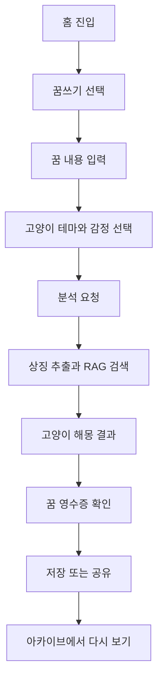
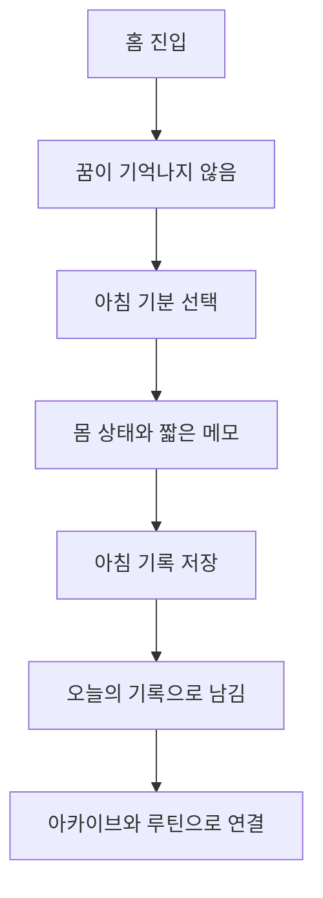
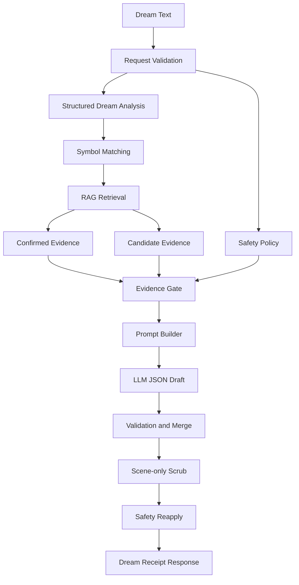

# Manyang 프로젝트 보고서

Manyang, 또는 **마냥 꿈해몽**은 사용자가 기록한 꿈을 AI가 해석하고, 그 결과를 고양이 해몽사와 꿈 영수증 형태로 남겨주는 감성 웹 서비스 프로젝트다.

이 보고서는 Gemini Notebook에 프로젝트 맥락을 넣기 위한 정리 문서다. README처럼 실행 방법만 빠르게 안내하는 문서가 아니라, 프로젝트가 어떤 문제의식에서 시작되었고, 어떤 제품 구조와 기술 구조를 갖게 되었으며, 구현 과정에서 어떤 판단을 했는지를 설명하는 데 목적이 있다.

- Live site: [https://manyang.vercel.app/](https://manyang.vercel.app/)
- 주요 코드 위치: `frontend/`, `backend/`, `services/korean-analyzer/`, `supabase/`
- 주요 기획 문서: [`docs/manyang-dream-project-spec-updated.md`](./manyang-dream-project-spec-updated.md)
- 주요 AI 시스템 문서: [`docs/dream-rag-system-overview.md`](./dream-rag-system-overview.md)

## 목차

1. [프로젝트 개요](#1-프로젝트-개요)
2. [문제 정의](#2-문제-정의)
3. [제품 컨셉](#3-제품-컨셉)
4. [주요 기능](#4-주요-기능)
5. [사용자 흐름](#5-사용자-흐름)
6. [시스템 구조](#6-시스템-구조)
7. [AI 해몽 시스템](#7-ai-해몽-시스템)
8. [데이터와 콘텐츠](#8-데이터와-콘텐츠)
9. [UI/UX 설계](#9-uiux-설계)
10. [기술 스택](#10-기술-스택)
11. [테스트와 품질 관리](#11-테스트와-품질-관리)
12. [배포와 운영](#12-배포와-운영)
13. [구현하면서 배운 점](#13-구현하면서-배운-점)
14. [아쉬운 점과 개선 방향](#14-아쉬운-점과-개선-방향)
15. [최종 회고](#15-최종-회고)
16. [참고 문서](#16-참고-문서)

## 1. 프로젝트 개요

### 1.1 프로젝트 이름

프로젝트의 이름은 **마냥 꿈해몽**이다. 사용자가 “마냥” 편하게 꿈을 적으면, 고양이 해몽사가 꿈속 상징을 찾아 부드럽게 읽어주는 서비스라는 의미를 담고 있다.

프로젝트 코드와 문서에서는 영문명으로 **Manyang**을 사용한다. 현재 라이브 사이트는 `manyang.vercel.app`에 배포되어 있다.

### 1.2 한 줄 소개

> 사라지는 꿈을 고양이가 읽고, 상징과 꿈 영수증으로 남겨주는 AI 기반 감성 꿈 리딩 서비스.

### 1.3 프로젝트의 핵심 아이디어

Manyang의 핵심 아이디어는 “꿈을 그냥 AI에게 해몽시키는 것”이 아니라, 사용자의 꿈을 다음 세 가지 요소로 재구성하는 것이다.

1. **꿈속 상징 추출**
   - 사용자가 적은 꿈에서 장소, 사물, 행동, 감정, 분위기 같은 단서를 찾는다.
   - 예를 들어 “학교 복도에서 신발을 잃어버리고 뛰어다닌 꿈”이라면 `학교`, `복도`, `신발`, `찾기`, `불안` 같은 단서를 후보로 본다.

2. **자체 꿈 상징 백과사전 기반 해석**
   - LLM이 즉흥적으로 아무 의미나 붙이지 않도록 자체 백과사전과 RAG 검색을 사용한다.
   - 백과사전은 “정답 사전”이 아니라 “해석 재료 라이브러리”에 가깝다.

3. **고양이 해몽사와 기록 경험**
   - 해석 결과를 딱딱한 분석문이 아니라 고양이 해몽사가 읽어주는 감성 리딩으로 제공한다.
   - 결과는 꿈 영수증, 꿈 카드, 아카이브, 달력, 공유 링크로 이어진다.

### 1.4 프로젝트 범위

처음의 핵심은 꿈 입력 -> 해몽 결과 -> 저장/기록 루프였지만, 현재 저장소에는 그 주변의 여러 확장 기능도 포함되어 있다.

- 꿈 입력 및 AI 해몽
- 꿈 상징 백과사전
- RAG 기반 근거 검색
- 고양이 해몽사 테마
- 꿈 영수증 및 공유 결과
- 꿈 아카이브와 달력
- 꿈을 기억하지 못한 날의 아침 기록
- 자기 전 루틴 기록
- 데일리 타로 및 질문형 타로
- Supabase 기반 사용자 기록
- 관리자 실험실
- 한국어 형태소 분석 보조 서비스

프로젝트를 한 문장으로 요약하면, **AI 해몽 기능을 중심으로 한 감성 기록 서비스 실험**이라고 볼 수 있다.

## 2. 문제 정의

### 2.1 기존 꿈해몽 서비스의 한계

기존 꿈해몽 서비스는 대부분 키워드 사전에 가깝다. 사용자가 “뱀 꿈”, “이빨 빠지는 꿈”, “물 꿈”처럼 검색하면 정해진 풀이를 보여준다. 이 방식은 빠르지만 다음과 같은 문제가 있다.

| 문제 | 설명 |
| --- | --- |
| 단정적인 해석 | “이 꿈은 흉몽이다”, “재물이 들어온다”처럼 현실 결과를 확정하듯 말하기 쉽다. |
| 개인 맥락 부족 | 같은 상징이라도 꿈의 장면, 감정, 상황에 따라 의미가 달라질 수 있는데 이를 반영하기 어렵다. |
| 낡은 서비스 인상 | 운세 사이트처럼 보이거나 광고성 콘텐츠처럼 느껴질 수 있다. |
| 기록 경험 부족 | 해몽을 보고 끝나는 경우가 많아, 사용자의 꿈 기록이 축적되지 않는다. |
| AI와의 차별화 부족 | 사용자가 ChatGPT에 직접 물어보는 것과 서비스 경험이 크게 다르지 않을 수 있다. |

Manyang은 이 문제를 “꿈 해몽 결과의 품질”만으로 해결하려 하지 않았다. 해석, 캐릭터, 저장, 공유, 재방문 루프가 함께 있어야 서비스로서 차별화된다고 보았다.

### 2.2 단순 AI 챗봇식 해몽의 문제

LLM은 자연스러운 문장을 잘 만들지만, 꿈해몽처럼 상징과 감정이 섞인 도메인에서는 그럴듯한 말을 너무 쉽게 만들어낼 수 있다.

단순히 사용자 꿈 원문을 LLM에게 보내면 다음 문제가 생길 수 있다.

- 꿈에 나온 작은 디테일에도 임의의 상징적 의미를 붙인다.
- 근거가 없는 예언, 징조, 운세식 표현을 생성할 수 있다.
- 민감한 꿈을 심리 진단처럼 해석할 위험이 있다.
- “이 꿈은 반드시 ~을 뜻합니다”처럼 사용자에게 불안을 줄 수 있다.
- 매번 해석 기준이 달라져 서비스의 일관성이 떨어진다.

따라서 Manyang은 LLM을 “해몽의 유일한 판단자”로 쓰지 않고, **문장을 만드는 엔진**에 더 가깝게 사용한다. 무엇을 근거로 말해도 되는지는 백과사전, RAG 검색, evidence gate, 안전 정책이 먼저 정한다.

### 2.3 Manyang이 해결하려는 지점

Manyang이 해결하려는 문제는 크게 세 가지다.

첫째, 꿈 해석을 너무 무겁거나 단정적으로 만들지 않는 것이다. 꿈은 오락과 자기 성찰 사이에 있는 경험이므로, 해석이 사용자를 몰아붙이면 안 된다. Manyang은 “~일 수 있다”, “~와 연결되어 보인다”, “오늘은 ~를 살펴보면 좋겠다”처럼 가능성과 관찰 중심의 문체를 지향한다.

둘째, AI 해석에 근거를 부여하는 것이다. 백과사전과 RAG를 통해 등록된 상징만 적극적으로 해석하고, 근거가 약한 요소는 scene-only로 남긴다. 이 구조는 LLM의 과도한 의미 부여를 줄인다.

셋째, 해몽을 기록 경험으로 확장하는 것이다. 사용자는 꿈을 한 번 읽고 잊는 것이 아니라, 꿈 영수증, 꿈 카드, 달력, 아카이브를 통해 자신의 꿈 패턴을 쌓아갈 수 있다.

## 3. 제품 컨셉

### 3.1 고양이 해몽사

Manyang의 가장 눈에 보이는 제품 콘셉트는 **고양이 해몽사**다. 고양이는 꿈, 밤, 조용한 관찰, 예민한 감각과 잘 어울리는 캐릭터다. 서비스는 사용자가 AI와 직접 대화한다는 느낌보다, 작은 꿈 해몽방에서 고양이가 꿈을 읽어준다는 느낌을 지향한다.

현재 프론트엔드에는 네 가지 고양이 테마가 정의되어 있다.

| ID | 이름 | 영문명 | 접근 | 분위기 |
| --- | --- | --- | --- | --- |
| `black_cat` | 검은냥 | Midnight | free | 깊은 밤하늘과 촛불 무드 |
| `white_cat` | 하얀냥 | Luna | free | 하얀 달빛과 포근한 밤 무드 |
| `cheese_cat` | 치즈냥 | Sol | free | 노란 별빛과 따뜻한 노을 무드 |
| `gray_cat` | 잿빛냥 | Ash | annual premium | 잿빛 달빛과 조용한 서재 무드 |

중요한 점은 고양이 테마가 해석의 정확도 차이를 뜻하지 않는다는 것이다. 백엔드의 고양이 페르소나 정책은 해석 근거를 동일하게 유지하고, 테마는 표현과 분위기 차이를 주는 방식에 가깝다. 즉, 검은냥이 더 정확하고 하얀냥이 덜 정확한 구조가 아니다.

### 3.2 꿈 상징 백과사전

Manyang의 중심 자산은 꿈 상징 백과사전이다. 현재 런타임 데이터는 `backend/src/data/symbol-encyclopedia.ts`를 중심으로 관리되며, 코드 기준 `symbolEntries`는 459개다.

백과사전은 단순히 “뱀 = 재물”, “이빨 = 흉몽” 같은 한 줄 풀이를 담는 것이 아니다. 각 상징은 다음 정보를 포함한다.

- 안정적인 ID
- 한국어/영어 label
- alias와 search text
- category, subcategory, facets
- light reading과 shadow reading
- scene modifier
- context question
- metaphor hook
- card title seed
- small prescription
- safe reading
- avoid expression
- safety level
- access tier
- related symbol

이 구조 덕분에 LLM은 전체 백과사전을 마음대로 읽는 것이 아니라, 검색과 검증을 통과한 일부 근거만 받아 해석한다.

### 3.3 꿈 카드와 꿈 영수증

Manyang은 해몽 결과를 텍스트 답변으로만 보여주지 않고, 사용자가 다시 보고 공유할 수 있는 결과물로 만든다.

대표 결과 형식은 두 가지다.

| 형식 | 역할 | 성격 |
| --- | --- | --- |
| 꿈 카드 | 저장과 수집 | 카드형 결과물, 고양이 테마와 상징을 강조 |
| 꿈 영수증 | 요약과 공유 | 세로형 요약 결과, 날짜/상징/처방을 간결하게 표시 |

꿈 영수증은 “오늘의 꿈을 짧게 정리해 남기는 출력물”에 가깝다. 꿈 카드가 컬렉션이라면, 꿈 영수증은 하루의 기록표에 가깝다.

### 3.4 꿈 아카이브

꿈은 한 번 해석하고 끝나는 것이 아니라, 시간이 지나면 개인의 반복 패턴이 된다. Manyang은 꿈을 날짜별로 저장하고, 아카이브와 달력에서 다시 볼 수 있게 설계되었다.

아카이브는 다음 역할을 한다.

- 사용자가 과거의 꿈을 다시 확인할 수 있다.
- 꿈이 기억나지 않은 날도 기록의 일부로 남길 수 있다.
- 특정 상징이나 감정이 반복되는지 볼 수 있다.
- 공유 결과와 저장 결과를 분리해서 관리할 수 있다.

### 3.5 아침 기록 루프

꿈 서비스의 중요한 현실은 사용자가 매일 꿈을 기억하지 못한다는 점이다. Manyang은 이를 실패 상태로 보지 않고, “꿈을 기억하지 못한 날의 기록”이라는 별도 루프로 처리한다.

사용자가 꿈을 기억하지 못하면 다음 정보를 남길 수 있다.

- 아침 기분
- 몸 상태
- 떠오르는 감각
- 짧은 메모
- 사라진 꿈의 발자국 같은 대체 기록

이 설계는 꿈 입력이 없는 날에도 앱을 열 이유를 만든다. 즉, 핵심 리텐션은 “꿈을 기억했는가”가 아니라 “아침에 나를 짧게 돌아보았는가”에 맞춰진다.

## 4. 주요 기능

### 4.1 꿈 입력

꿈 입력은 Manyang의 핵심 진입점이다. 사용자는 자유 텍스트로 꿈을 적고, 선택적으로 기분이나 밤의 맥락을 함께 전달할 수 있다.

현재 꿈 분석 API는 `frontend/src/app/api/dreams/analyze/route.ts`에 구현되어 있으며, 요청 검증에서 다음 요소를 확인한다.

- 꿈 텍스트 길이 제한
- locale 검증
- 고양이 테마 검증
- 선택 감정 개수와 길이 제한
- 밤 기록 맥락의 길이 제한
- guest/user 접근 정책
- admin 권한 여부
- provider 설정 여부
- timeout 설정 범위

이 입력 검증은 비용 폭주, 잘못된 요청, 프롬프트 인젝션 표면, 저장 정책 혼선을 줄이기 위한 기본 방어선이다.

### 4.2 AI 꿈 해몽

AI 해몽은 mock 모드와 LLM 모드로 나뉜다.

- `MANYANG_ANALYSIS_MODE=mock`
  - OpenAI API 없이 deterministic mock 결과를 사용한다.
  - 로컬 개발과 UI 확인에 유용하다.

- `MANYANG_ANALYSIS_MODE=llm`
  - OpenAI provider를 사용해 실제 해몽 문장을 생성한다.
  - 백과사전, RAG, evidence gate, 안전 정책을 함께 사용한다.

프로덕션 성격의 LLM 경로에서는 provider가 없거나 timeout, invalid response, provider error가 발생하면 가짜 해몽을 반환하지 않고 `unavailable` 상태를 반환한다. 이는 “실패했지만 그럴듯한 결과를 보여주는 것”보다 “해몽을 생성하지 못했다고 정직하게 말하는 것”이 더 안전하다는 판단이다.

### 4.3 상징 추출

상징 추출은 `backend/src/services/structured-dream-analysis.ts`와 `backend/src/services/symbol-matcher.ts`를 중심으로 동작한다.

꿈 원문에서 다음 신호를 찾는다.

- literal query
- scene query
- theme query
- modifier query
- 감정 신호
- 테마 신호
- 상징 후보
- reading tone
- reading certainty

예를 들어 “엘리베이터가 갑자기 떨어지고 이빨이 흔들렸다”는 꿈은 `elevator`, `falling`, `teeth` 같은 후보와 함께 “갑자기”, “떨어짐”, “흔들림” 같은 scene modifier로 나뉜다. 하지만 후보로 잡혔다고 해서 모두 사용자에게 상징적으로 해석되지는 않는다. 이후 RAG와 evidence gate를 통과해야 한다.

### 4.4 백과사전 기반 해석

백과사전 기반 해석은 Manyang의 차별점이다. 각 상징은 light/shadow, modifier, avoid expression, safe reading 등을 포함하고 있으므로, LLM은 단순히 “꿈을 자유롭게 풀이하는 것”이 아니라, 서비스가 정한 해석 범위 안에서 문장을 만든다.

예를 들어 “문”은 단순히 기회나 막힘을 뜻한다고 고정하지 않는다. 문이 열려 있었는지, 잠겨 있었는지, 사용자가 문 앞에서 망설였는지에 따라 해석 방향이 달라진다. 이 차이를 scene modifier가 담당한다.

### 4.5 결과 저장

로그인 사용자의 완료된 꿈 해몽은 Supabase의 Manyang 스키마에 저장된다. 초기 핵심 테이블은 다음과 같다.

- `manyang.profiles`
- `manyang.dream_entries`
- `manyang.dream_readings`
- `manyang.dream_cards`
- `manyang.user_symbol_history`

이후 기능이 확장되며 다음 테이블도 추가되었다.

- `manyang.pawprints`
- `manyang.dream_seeds`
- `manyang.guest_reading_usage`
- `manyang.night_checkins`
- `manyang.tarot_readings`
- `manyang.morning_checkins`
- `manyang.reading_usage`
- `manyang.subscriptions`
- `manyang.audit_events`
- `manyang.feedback_events`
- `manyang.shared_results`

비로그인 사용자는 일부 기능을 경험할 수 있지만, 영구 아카이브와 기록 관리는 로그인 사용자 중심으로 설계되어 있다.

### 4.6 꿈 달력과 아카이브

아카이브 화면은 사용자의 기록을 날짜 중심으로 보여준다. 단순 리스트보다 달력/월별 구조를 둔 이유는 꿈 기록이 “하루 단위의 감정과 기억”에 가깝기 때문이다.

프론트엔드에는 아카이브와 관련된 여러 모듈이 있다.

- `frontend/src/app/archive/page.tsx`
- `frontend/src/app/archive/records/page.tsx`
- `frontend/src/app/archive/records/[recordId]/page.tsx`
- `frontend/src/components/archive-calendar.tsx`
- `frontend/src/components/archive-records-client.tsx`
- `frontend/src/lib/archive-records.ts`
- `frontend/src/lib/archive-month.ts`
- `frontend/src/lib/archive-calendar-layout.ts`

### 4.7 데일리 타로와 질문형 타로

프로젝트 후반에는 타로 기능도 추가되었다. 타로는 꿈해몽과 같은 “감성 리딩” 계열 기능으로, 사용자가 하루의 흐름이나 질문에 대한 카드를 확인하는 경험을 제공한다.

관련 구현은 다음 위치에 있다.

- `frontend/src/app/tarot/page.tsx`
- `frontend/src/app/tarot/question/page.tsx`
- `frontend/src/app/api/tarot/readings/route.ts`
- `frontend/src/lib/daily-tarot.ts`
- `frontend/src/lib/tarot-cards.ts`
- `frontend/src/lib/tarot-major-cards.ts`
- `frontend/src/lib/tarot-minor-cards.ts`
- `backend/src/services/llm-tarot-reading.ts`
- `backend/src/services/tarot-reading-prompt.ts`

타로 리딩도 JSON 스키마 기반 출력을 사용한다. `daily_one_card`, `question_one_card`, `daily_three_card` 같은 spread를 구분하고, 카드 의미를 안정적인 UI 데이터로 매핑할 수 있게 설계되어 있다.

최근 구현에서는 질문형 타로가 더 구체화되었다. 사용자는 먼저 “지금 어떤 질문을 하고 싶은지”에 가까운 상태를 고르고, 그 안에서 추천 질문을 선택하거나 직접 질문을 입력할 수 있다. 현재 질문 상태는 다음 6개로 나뉜다.

| 상태 키 | 사용자-facing 라벨 | 대표 질문 |
| --- | --- | --- |
| `mind_complex` | 내 마음이 궁금해 | 지금 내 마음에 제일 크게 남아 있는 건 뭐야? |
| `relationship_concern` | 관계가 신경 쓰여 | 지금 이 관계에서 내가 봐야 할 마음은 뭐야? |
| `work_blocked` | 일이 잘 안 풀려 | 지금 이 일에서 뭐가 제일 막혀 있을까? |
| `reality_anxiety` | 돈과 현실이 걱정돼 | 지금 현실적으로 먼저 확인할 건 뭐야? |
| `decision_point` | 결정해야 할 일이 있어 | 이 선택에서 먼저 봐야 할 건 뭐야? |
| `daily_signal` | 오늘 하루가 궁금해 | 오늘 내가 놓치지 말아야 할 건 뭐야? |

각 상태에는 5개의 프리셋 질문이 있어 총 30개의 추천 질문이 제공된다. 또한 사용자가 직접 질문을 입력할 수 있도록 최대 80자 자유 질문을 지원한다. 직접 질문은 공백을 정규화하고 안정적인 hash 기반 `custom_...` key를 만들어, 같은 질문은 같은 질문 ID로 다룰 수 있게 했다.

타로 카드 데이터도 메이저 아르카나 22장에 마이너 아르카나 56장을 더해 총 78장 덱으로 확장되었다. 각 카드는 정방향/역방향 의미, 키워드, 시각 상징, 상징 의미, 카드 이미지 경로, 카드 key를 가진다. 마이너 카드는 완드, 컵, 소드, 펜타클 4개 suit와 14개 rank를 조합해 생성하며, `minor:wands:01` 같은 안정적인 card key를 사용한다. 카드 이미지는 `frontend/public/manyang/tarot/major`, `frontend/public/manyang/tarot/minor`, `frontend/public/manyang/tarot/minor-cutout` 아래에 배치되어 있다.

질문형 타로의 중요한 설계 포인트는 모든 질문을 같은 톤으로 읽지 않는다는 점이다. 예를 들어 관계 질문은 “상대의 마음을 확정”하지 않고 관계 안의 감정과 거리감으로 읽고, 현실/돈 질문은 불안을 키우는 예고가 아니라 돈, 시간, 체력, 도움, 남아 있는 기반을 먼저 보도록 prompt가 설계되어 있다. 이 구조 덕분에 질문형 타로는 단순한 카드 랜덤 뽑기가 아니라, 사용자의 질문 의도에 맞는 감성 리딩으로 동작한다.

### 4.8 공유 결과

꿈과 타로 결과는 공유 링크로 확장된다. `manyang.shared_results` 테이블과 `/api/share-results` API를 통해 public ID를 생성하고, `/share/dream/[shareId]`, `/share/tarot/[shareId]` 페이지에서 결과를 볼 수 있다.

공유 기능의 핵심은 다음과 같다.

- 결과 payload를 서버에 저장한다.
- 공개 ID는 `randomBytes(12).toString("base64url")` 방식으로 생성한다.
- 공유 결과는 public select policy를 가진다.
- 게스트 또는 로그인 사용자 모두 공유 결과를 만들 수 있다.
- 공유 URL은 현재 origin을 기준으로 생성된다.

## 5. 사용자 흐름

### 5.1 꿈을 기억하는 날

꿈을 기억하는 날의 기본 흐름은 다음과 같다.



이 흐름에서 중요한 경험은 사용자가 꿈을 완벽하게 정리해 적지 않아도 된다는 점이다. 꿈은 보통 파편적이고 뒤죽박죽이다. Manyang은 사용자가 짧게 적어도, 그 안에서 상징과 감정을 찾아 결과를 구성하도록 설계되었다.

### 5.2 꿈을 기억하지 못한 날

꿈을 기억하지 못한 날의 흐름은 다음과 같다.



이 흐름은 리텐션 측면에서 중요하다. 꿈을 기억하지 못하는 날도 기록할 수 있어야 서비스가 “꿈을 꾼 날만 쓰는 앱”이 되지 않는다.

### 5.3 결과 확인 및 저장

결과 화면은 꿈 해몽의 종착점이자 다음 행동의 시작점이다.

결과 화면에서 사용자는 다음을 확인한다.

- 꿈 요약
- 주요 상징
- 고양이 해몽
- 오늘의 작은 처방
- 꿈 카드 또는 꿈 영수증
- 저장 CTA
- 공유 CTA

프론트엔드에는 결과와 관련된 컴포넌트가 분리되어 있다.

- `dream-result-page-client.tsx`
- `dream-result-receipt.tsx`
- `receipt-save-cta.tsx`
- `dream-unavailable-result.tsx`

특히 `dream-unavailable-result`가 있다는 점은 중요하다. AI 결과 생성 실패도 사용자 경험 안에서 처리해야 하는 정상 상태로 본 것이다.

### 5.4 재방문 루프

Manyang의 재방문 루프는 세 갈래다.

1. **아침 루프**
   - 꿈을 기억하면 꿈을 입력한다.
   - 기억하지 못하면 아침 기분을 기록한다.

2. **밤 루프**
   - 자기 전 상태나 꿈 씨앗을 남긴다.
   - 다음날 아침의 기록으로 이어진다.

3. **기록 루프**
   - 과거 꿈을 아카이브에서 다시 본다.
   - 반복되는 상징이나 감정을 확인한다.

이 구조는 Manyang을 단발성 해몽 도구가 아니라, 가벼운 감정 기록 서비스로 확장한다.

## 6. 시스템 구조

### 6.1 전체 구조

프로젝트는 크게 다섯 영역으로 나뉜다.

```text
manyang/
├─ frontend/                 # Next.js 웹앱
├─ backend/                  # 꿈 분석, RAG, LLM, 백과사전 로직
├─ services/korean-analyzer/ # Kiwi 기반 한국어 형태소 분석 HTTP 서비스
├─ supabase/                 # DB 마이그레이션
├─ docs/                     # 기획/설계/운영 문서
└─ vault/                    # 제품/콘텐츠/아키텍처 지식 베이스
```

프론트엔드는 Next.js App Router 기반이며, 서버 라우트가 백엔드 패키지 `@manyang/backend`를 직접 import한다. 백엔드는 별도 HTTP 서버라기보다, 서비스 로직을 담은 TypeScript 패키지에 가깝다.

### 6.2 프론트엔드

프론트엔드는 `frontend/` 아래에 있다.

주요 역할은 다음과 같다.

- 사용자 화면 렌더링
- 꿈 입력 폼
- 결과 화면
- 아카이브와 달력
- 백과사전 탐색
- 로그인/인증 흐름
- Supabase client/server 연동
- API route 제공
- 공유 페이지
- 타로 페이지
- 관리자 실험실

하단 내비게이션은 다음 다섯 축으로 구성되어 있다.

| 키 | 라벨 | 경로 | 역할 |
| --- | --- | --- | --- |
| `today` | 오늘 | `/` | 홈, 아침/밤 루틴 |
| `write` | 꿈쓰기 | `/write` | 꿈 입력, 로딩, 결과 |
| `archive` | 기록 | `/archive` | 꿈 기록과 달력 |
| `encyclopedia` | 백과 | `/encyclopedia` | 상징 백과 탐색 |
| `profile` | 내방 | `/profile` | 계정, 기록 관리, 설정 |

### 6.3 백엔드

백엔드는 `backend/` 아래에 있으며, npm 패키지 이름은 `@manyang/backend`다.

주요 역할은 다음과 같다.

- mock dream analysis
- LLM dream analysis orchestration
- dream safety policy
- structured dream analysis
- symbol matching
- RAG chunk generation
- RAG retrieval
- vector index loading/building
- evidence gate
- prompt construction
- quality eval
- tarot reading prompt and LLM orchestration

백엔드는 UI를 모르는 순수 로직 계층으로 유지하려는 구조다. 프론트엔드의 API route가 이 패키지를 import해서 사용한다.

### 6.4 Supabase

Supabase는 인증, 데이터 저장, RLS 정책의 중심이다. 마이그레이션은 `supabase/migrations/` 아래에 있으며, 현재 SQL 마이그레이션 파일은 13개다.

핵심 설계 방향은 다음과 같다.

- 스키마 이름은 `manyang`이다.
- 사용자별 데이터는 RLS로 보호한다.
- 관리자 권한은 클라이언트 state나 metadata가 아니라 `manyang.profiles.role`을 source of truth로 둔다.
- 게스트 사용량은 별도 테이블로 관리한다.
- 공유 결과는 public select가 가능하되 만료 조건을 둔다.

### 6.5 한국어 분석 서비스

`services/korean-analyzer/`는 Kiwi NLP 기반의 별도 HTTP 서비스다.

이 서비스를 분리한 이유는 Kiwi 모델이 수십 MB 수준으로 크고, 매 요청마다 로드하면 serverless 경로에서 비효율적이기 때문이다. 별도 warm Node 서비스로 두면 한 번 모델을 로드하고 여러 요청에서 재사용할 수 있다.

제공 API는 다음과 같다.

```text
POST /lemmatize
GET /health
```

예를 들어 `올라갔어` 같은 표현을 `올라가`로 정규화하면, 한국어 꿈 입력에서 alias 매칭 품질이 좋아진다. 다만 이 서비스가 꺼져 있어도 앱은 기본 lexical matching으로 fallback한다.

### 6.6 RAG 구조

RAG 구조는 Manyang의 AI 안정성을 지탱하는 핵심 계층이다.



이 구조의 핵심은 LLM이 해석하기 전에 “해석해도 되는 것”과 “장면으로만 언급해야 하는 것”을 나눈다는 점이다.

## 7. AI 해몽 시스템

### 7.1 LLM 단독 해몽을 피한 이유

Manyang의 AI 해몽 시스템은 LLM 단독 생성에 의존하지 않는다.

그 이유는 세 가지다.

첫째, 꿈해몽은 원래 모호한 영역이기 때문에 LLM이 과도하게 자신 있는 문장을 만들기 쉽다. “이 꿈은 반드시 나쁜 일이 생길 징조입니다” 같은 문장은 서비스 안전성과 맞지 않는다.

둘째, 사용자 꿈에는 민감한 내용이 포함될 수 있다. 죽음, 사고, 질병, 가족, 불안, 자해 신호 같은 내용이 들어올 수 있으므로, 결과는 진단이나 예언처럼 보이면 안 된다.

셋째, 서비스의 일관성이 필요하다. 매번 LLM이 다른 기준으로 해석하면 백과사전 기반 서비스라는 정체성이 약해진다.

따라서 Manyang은 LLM을 다음 위치에 둔다.

- LLM은 최종 문장 생성기다.
- 해석 가능한 상징의 범위는 RAG와 evidence gate가 정한다.
- 안전 정책은 LLM보다 우선한다.
- 응답은 JSON 스키마로 받아 검증한다.

### 7.2 상징 백과사전 구조

상징 백과사전의 역할은 “꿈에서 나온 단어의 뜻을 찾는 것”만이 아니다. 더 중요한 역할은 해석의 경계선을 만드는 것이다.

예를 들어 `snake`라는 상징이 있다면 다음 정보를 함께 가진다.

- 어떤 표현을 snake로 볼 것인가
- 어떤 장면에서 snake의 의미가 달라지는가
- 밝은 방향의 해석은 무엇인가
- 부담이나 긴장 방향의 해석은 무엇인가
- 어떤 표현을 피해야 하는가
- 사용자에게 안전하게 말하려면 어떻게 변환해야 하는가
- 관련 상징은 무엇인가

이 구조는 LLM prompt의 재료가 된다.

### 7.3 RAG 검색 흐름

RAG 검색은 크게 네 종류의 근거를 사용한다.

| 검색 방식 | 역할 |
| --- | --- |
| explicit match | 사용자가 직접 쓴 표현이나 alias를 찾는다. |
| supporting chunk match | 백과사전 chunk가 명시 상징을 보강한다. |
| candidate chunk match | 의미적으로 관련 있어 보이지만 확정하기 어려운 후보를 찾는다. |
| vector match | embedding index가 있을 때 의미적으로 가까운 상징 chunk를 찾는다. |

중요한 점은 vector match만으로 confirmed evidence가 되지 않는다는 것이다. 벡터 검색은 유사성을 잘 찾지만, 꿈해몽에서는 엉뚱한 상징을 그럴듯하게 끌고 올 위험도 있다. 그래서 Manyang은 semantic/vector agreement, safety level, confidence threshold 등을 함께 본다.

### 7.4 Confirmed Evidence와 Candidate Evidence

Manyang은 검색 결과를 두 그룹으로 나눈다.

| 구분 | 의미 | LLM 사용 가능 범위 |
| --- | --- | --- |
| confirmed evidence | 상징적으로 해석해도 되는 근거 | `symbolReadings`에서 적극 해석 가능 |
| candidate evidence | 참고 가능하지만 아직 확정되지 않은 후보 | 장면 이해 보조로만 사용 |

confirmed evidence는 보통 사용자의 원문에 명시된 alias가 있거나, 의미 검색과 벡터 검색이 같은 safe symbol을 강하게 지지할 때 만들어진다.

candidate evidence는 관련성이 있어 보이지만 근거가 충분하지 않은 경우다. LLM은 이를 사용자에게 확정 상징처럼 말하면 안 된다.

### 7.5 Evidence Gate

Evidence gate는 최종적으로 두 목록을 만든다.

```text
canInterpretSymbolically
sceneOnly
```

`canInterpretSymbolically`에 있는 항목은 LLM이 상징적으로 해석할 수 있다.

`sceneOnly`에 있는 항목은 꿈 장면으로 언급할 수는 있지만, 의미를 붙이면 안 된다. 예를 들어 꿈에 “파란 가방”이 나왔지만 백과사전에 없거나 근거가 약하면, “꿈에 파란 가방이 함께 등장했다”라고 말할 수는 있어도 “파란 가방은 재물의 신호”라고 말하면 안 된다.

이 장치가 없으면 LLM은 사용자의 작은 디테일에도 의미를 붙이려 한다. Evidence gate는 그 경향을 코드 레벨에서 막는다.

### 7.6 안전 정책

안전 정책은 `backend/src/services/dream-safety-policy.ts`에 구현되어 있다.

제한하는 표현은 다음과 같다.

- 질병 진단처럼 들리는 표현
- 자해 또는 위기 상황을 가볍게 넘기는 표현
- 재물, 임신, 사고 등을 확정적으로 예언하는 표현
- 사용자의 결정을 강하게 지시하는 표현
- 꿈 하나로 현실 결과를 보장하는 표현

권장하는 표현은 가능성과 관찰 중심이다.

```text
~와 연결되어 보일 수 있어요.
이 장면은 ~한 마음을 비유적으로 보여주는 듯합니다.
단정하기보다는 오늘은 ~를 살펴보면 좋겠습니다.
```

이 안전 정책은 prompt에만 들어가는 것이 아니라, 최종 응답 후처리에서도 다시 적용된다.

### 7.7 고양이 페르소나

고양이 페르소나는 “무엇을 해석할지”를 정하지 않는다. 그것은 RAG와 evidence gate의 역할이다.

고양이 페르소나는 “어떤 목소리와 분위기로 전달할지”를 정한다.

백엔드의 공통 고양이 페르소나는 다음 우선순위를 가진다.

- symbol evidence
- scene specificity
- selected feelings
- safe reflection

그리고 다음 톤을 지향한다.

- calm
- warm
- specific
- non-alarming

이는 모든 고양이가 같은 근거 정책을 공유하고, 테마는 UI/문체의 차이로만 작동해야 한다는 판단이다.

## 8. 데이터와 콘텐츠

### 8.1 꿈 상징 백과사전

현재 상징 데이터는 TypeScript seed 구조로 관리된다. 코드 기준으로 `symbolEntries`는 459개다. 이는 초기 기획 문서의 30개 수준을 넘어, 실제 서비스에서 다양한 꿈 입력을 처리하기 위한 확장 단계에 들어갔다는 뜻이다.

상징 카테고리는 다음과 같은 범위를 가진다.

- place
- person
- animal
- nature
- object
- body
- action
- event
- food
- emotion
- abstract

카테고리는 UI 필터와 검색, 통계, 향후 개인화 리포트의 기준이 된다.

### 8.2 상징 항목의 작성 원칙

좋은 상징 항목은 다음 조건을 만족해야 한다.

- 실제 사용자가 입력할 법한 alias를 가진다.
- core meaning이 너무 추상적이지 않다.
- light reading과 shadow reading이 모두 있다.
- scene modifier가 장면 차이를 설명한다.
- safe reading이 진단/예언처럼 들리지 않는다.
- avoid expression이 구체적이다.
- 관련 상징과 연결된다.
- 한국어와 영어 입력을 모두 고려한다.

특히 alias는 recall을 높이는 동시에 오탐을 만들 수 있다. 너무 넓은 alias는 거의 모든 꿈에 매칭될 수 있으므로, alias 충돌 관리가 중요하다.

### 8.3 해몽 문체

Manyang의 해몽 문체는 다음 원칙을 따른다.

- 단정하지 않는다.
- 불길한 예언처럼 말하지 않는다.
- 꿈의 장면과 사용자가 선택한 감정을 연결한다.
- 오늘 해볼 수 있는 작은 행동으로 마무리한다.
- 내부 구현 용어를 사용자에게 노출하지 않는다.

사용자에게 `RAG`, `evidence`, `candidate`, `sceneModifier` 같은 말을 보여주면 서비스 경험이 깨진다. 내부적으로는 엄격한 구조를 쓰되, 사용자에게는 자연스러운 해몽 문장으로 전달해야 한다.

### 8.4 금지 표현과 권장 표현

금지해야 하는 표현은 다음과 같다.

- “반드시 나쁜 일이 생깁니다.”
- “가족에게 문제가 생길 징조입니다.”
- “당신은 우울증입니다.”
- “이 꿈은 질병의 신호입니다.”
- “이 선택을 반드시 해야 합니다.”

권장 표현은 다음과 같다.

- “이 장면은 부담감과 연결되어 보일 수 있어요.”
- “단정하기보다는, 오늘은 이 감각을 살펴보면 좋겠습니다.”
- “불길한 의미로 보기보다 마음이 보내는 은근한 장면으로 읽을 수 있습니다.”
- “오늘은 가장 작게 정리할 수 있는 일 하나만 골라보세요.”

### 8.5 콘텐츠 확장 방식

상징 백과사전은 한 번에 완성되는 데이터가 아니다. 실제 사용자 입력, 검색 실패, 품질 평가, alias 충돌, 오탐 사례를 보면서 계속 확장해야 한다.

확장 프로세스는 다음과 같다.

1. 자주 등장하지만 등록되지 않은 상징 후보를 찾는다.
2. 기존 상징의 modifier로 충분한지 확인한다.
3. 별도 상징으로 필요하면 category와 facets를 정한다.
4. 한국어/영어 label과 aliases를 작성한다.
5. safe reading과 avoid expression을 먼저 확정한다.
6. scene modifier와 related symbol을 연결한다.
7. 테스트 꿈으로 매칭 품질을 확인한다.

이 과정은 일반적인 콘텐츠 작성보다 검색/안전/프롬프트 품질까지 함께 고려해야 한다.

### 8.6 타로 질문과 카드 데이터

타로 기능은 꿈 상징 백과사전과 별개의 콘텐츠 데이터지만, Manyang의 감성 리딩 경험을 넓히는 보조 자산이다. 데이터는 크게 질문 프롬프트, 카드 사전, 카드 이미지로 나뉜다.

질문 프롬프트는 `frontend/src/lib/tarot-question-prompts.ts`에 정의되어 있다. 사용자는 마음, 관계, 일, 현실/돈, 선택, 오늘 하루라는 6개 상태 중 하나를 먼저 고르고, 그 상태에 맞는 질문을 선택한다. 각 질문은 `stateKey`와 `questionKey`로 식별되며, LLM 요청에는 `stateLabel`, `questionText`까지 함께 전달된다. 이 구조는 “어떤 카드를 뽑았는가”뿐 아니라 “무슨 관점으로 카드를 읽어야 하는가”를 모델에게 전달하기 위한 장치다.

카드 사전은 `frontend/src/lib/tarot-major-cards.ts`, `frontend/src/lib/tarot-minor-cards.ts`, `frontend/src/lib/tarot-cards.ts`로 나뉜다. 메이저 카드는 개별 정의를 갖고, 마이너 카드는 suit/rank 조합으로 생성된다. 특히 마이너 카드에는 suit의 원소와 테마, rank의 단계, 카드별 시각 앵커가 함께 들어간다. 예를 들어 펜타클 9번 카드는 “스스로 가꾼 정원과 손에 든 펜타클” 같은 visual anchor를 통해 단순 키워드가 아니라 카드 그림의 근거를 리딩에 사용할 수 있게 한다.

이 데이터 구조는 다음 장점을 만든다.

- 78장 전체 덱을 안정적인 ID와 card key로 다룰 수 있다.
- 정방향/역방향 의미를 UI와 LLM prompt가 같은 데이터에서 참조한다.
- 카드 이미지, 키워드, 시각 상징, 상징 해석이 한 카드 객체 안에 묶인다.
- 질문형 리딩에서 질문 의도와 카드 상징을 함께 전달할 수 있다.
- 테스트에서 카드 수, card key, 이미지 경로, 질문 개수, 직접 질문 생성 규칙을 검증할 수 있다.

## 9. UI/UX 설계

### 9.1 전체 분위기

Manyang의 UI는 기능적 SaaS 대시보드보다, 작은 꿈 해몽방에 들어온 느낌을 지향한다.

키워드는 다음과 같다.

- 달빛
- 밤
- 꿈
- 고양이
- 카드
- 백과사전
- 수정구슬
- 조용한 아카이브

실제 에셋도 고양이, 배경, 타로 카드, 버튼 프레임, 페이지 아이콘, 키워드 아이콘 등으로 구성되어 있으며, `frontend/public/manyang` 아래 이미지 에셋은 400개 이상이다.

### 9.2 주요 화면

현재 프로젝트의 주요 화면은 다음과 같다.

| 화면 | 경로 | 역할 |
| --- | --- | --- |
| 홈 | `/` | 오늘의 진입점 |
| 꿈쓰기 | `/write` | 꿈 입력 |
| 로딩 | `/loading` | 분석 중 상태 |
| 결과 | `/result` | 꿈 해몽 결과 |
| 백과 | `/encyclopedia` | 상징 탐색 |
| 백과 상세 | `/encyclopedia/[slug]` | 상징 상세 |
| 기록 | `/archive` | 꿈 기록 |
| 기록 상세 | `/archive/records/[recordId]` | 개별 기록 |
| 아침 기록 | `/morning` | 꿈을 기억하지 못한 날 |
| 밤 기록 | `/night` | 자기 전 기록 |
| 타로 | `/tarot` | 데일리 타로 |
| 질문형 타로 | `/tarot/question` | 질문 기반 타로 |
| 프로필 | `/profile` | 계정과 기록 관리 |
| 관리자 실험실 | `/admin/lab` | 테스트/운영 실험 |
| 공유 꿈 | `/share/dream/[shareId]` | 공개 꿈 결과 |
| 공유 타로 | `/share/tarot/[shareId]` | 공개 타로 결과 |

### 9.3 모바일 중심 설계

꿈 기록은 데스크톱보다 모바일에서 자연스럽다. 사용자는 잠에서 깬 직후나 자기 전 침대에서 짧게 입력할 가능성이 높다. 그래서 UI는 모바일 폭에서 자연스럽게 작동해야 한다.

프론트엔드에는 모바일 레이아웃, 하단 내비게이션, 가로 overflow 방지, 버튼/카드 크기 안정성 관련 테스트와 유틸이 포함되어 있다.

관련 파일 예시는 다음과 같다.

- `frontend/src/lib/mobile-layout.ts`
- `frontend/src/components/bottom-nav.tsx`
- `frontend/src/components/horizontal-overflow.test.ts`
- `frontend/src/components/app-shell.tsx`

### 9.4 꿈 카드와 영수증 디자인

꿈 카드와 영수증은 단순 UI 컴포넌트가 아니라, 서비스의 기억 장치다.

꿈 영수증에는 다음 정보가 들어간다.

- 날짜
- 꿈 요약
- 주요 상징
- 감정
- 고양이 해몽
- 오늘의 작은 처방
- 고양이 테마

공유 이미지 저장을 위해 `html2canvas`와 관련 export 로직도 포함되어 있다. 이는 사용자가 결과를 단순히 읽는 데서 그치지 않고, 저장하거나 공유하는 행동으로 이어지게 만든다.

### 9.5 고양이 캐릭터 활용

고양이는 단순 장식이 아니라 서비스의 인터페이스 언어다.

고양이 캐릭터는 다음 역할을 한다.

- 해몽 결과를 덜 무겁게 만든다.
- 사용자에게 직접적인 판단 대신 부드러운 관찰을 전달한다.
- 테마 선택의 즐거움을 만든다.
- 꿈, 밤, 카드, 수정구슬 같은 시각 요소를 묶는다.

다만 고양이가 과하게 유치해지면 꿈 기록 서비스의 신뢰감이 떨어질 수 있다. 그래서 프로젝트는 “귀엽지만 조용하고 신비로운” 방향을 유지하려고 한다.

## 10. 기술 스택

### 10.1 프론트엔드

`frontend/package.json` 기준 주요 기술은 다음과 같다.

| 기술 | 역할 |
| --- | --- |
| Next.js | App Router 기반 웹앱과 API route |
| React | UI 컴포넌트 |
| TypeScript | 타입 안정성 |
| Supabase SSR | 서버/클라이언트 인증 연동 |
| Supabase JS | DB와 Auth 연동 |
| Tailwind CSS | 스타일링 |
| lucide-react | 아이콘 |
| html2canvas | 공유 이미지 export |
| Vitest | 테스트 |

### 10.2 백엔드

`backend/package.json` 기준 백엔드는 TypeScript와 Vitest 중심이다.

| 기술 | 역할 |
| --- | --- |
| TypeScript | 서비스 로직 구현 |
| tsx | 스크립트 실행 |
| Vitest | 백엔드 테스트 |
| OpenAI provider | LLM 해몽과 embedding |
| 자체 RAG 로직 | 상징 검색과 근거 분리 |

백엔드가 별도 서버 프레임워크를 쓰지 않는 점도 특징이다. Next.js API route가 백엔드 패키지를 import해서 사용하는 구조라, 도메인 로직을 프론트엔드 화면과 분리하면서도 배포 복잡도를 줄인다.

### 10.3 데이터베이스와 인증

Supabase는 다음 역할을 맡는다.

- 사용자 인증
- 프로필 관리
- 꿈 기록 저장
- 꿈 해몽 결과 저장
- 타로 결과 저장
- 사용량 제한
- 구독/접근 권한
- 감사 이벤트
- 피드백 이벤트
- 공유 결과

RLS를 사용해 사용자별 데이터를 보호하고, server-only key는 브라우저에 노출하지 않도록 `.env.example`에서도 명확히 구분되어 있다.

### 10.4 AI와 NLP

AI/NLP 계층은 다음으로 구성된다.

- OpenAI Responses provider
- OpenAI Embeddings provider
- deterministic mock analyzer
- dream reading prompt builder
- tarot reading prompt builder
- Kiwi NLP 기반 한국어 형태소 분석 서비스
- 영어 lemmatizer
- Korean HTTP lemmatizer fallback

이 구조는 LLM 호출이 없어도 개발 가능하고, LLM이 있을 때는 더 풍부한 결과를 만들 수 있게 한다.

### 10.5 배포

웹앱은 Vercel에 배포되어 있으며, 라이브 사이트는 다음 주소다.

```text
https://manyang.vercel.app/
```

한국어 분석 서비스는 별도 warm Node host에 올릴 수 있도록 설계되어 있다. README에서는 Fly.io, Render, Railway, container 같은 호스트를 언급하고 있으며, 모델은 build time에 받거나 이미지에 포함하는 방향이 적합하다.

## 11. 테스트와 품질 관리

### 11.1 테스트 규모

현재 저장소 기준 테스트 파일은 총 157개다.

- `backend/tests`: 33개
- `frontend/src`: 123개
- `backend/src/services`: 1개

이 숫자는 단순 UI 실험 이상의 품질 관리가 들어갔다는 점을 보여준다. 특히 백엔드는 RAG, safety, prompt, vector index, evidence gate, quality eval까지 테스트 범위가 넓다.

### 11.2 프론트엔드 테스트

프론트엔드 테스트는 다음 영역을 포함한다.

- 컴포넌트 렌더링
- 결과 영수증
- 꿈 입력 폼
- 로딩 화면
- 아카이브 달력
- 프로필/기록 관리
- 인증 리다이렉트
- Supabase env 검증
- 공유 링크
- 타로 카드
- 타로 질문 프롬프트와 직접 질문 입력
- 모바일 레이아웃
- API route
- client boundary

프론트엔드 기능이 늘어나면서 단순 화면 테스트뿐 아니라, 데이터 변환과 접근 정책 테스트도 함께 늘어났다.

### 11.3 백엔드 테스트

백엔드 테스트는 Manyang의 핵심 신뢰도를 담당한다.

대표 테스트 영역은 다음과 같다.

- symbol encyclopedia contract
- runtime symbol matcher
- structured dream analysis
- retrieval scoring
- RAG retriever
- RAG chunks
- RAG ingestion
- vector index
- evidence gate
- dream safety policy
- dream reading prompt
- dream reading quality eval
- golden test
- OpenAI provider
- Korean/English lemmatizer
- cat reader personas
- tarot LLM reading
- tarot question lens and frame prompt
- tarot internal field leak prevention

특히 RAG와 안전 정책은 테스트 없이는 유지하기 어려운 영역이다. alias 하나가 추가되어도 오탐이 생길 수 있고, prompt 변경 하나가 safety boundary를 깨뜨릴 수 있기 때문이다.

### 11.4 RAG 검색 평가

RAG 검색 평가는 단순히 “관련 결과가 나왔는가”가 아니라 다음 기준을 함께 본다.

- 기대 상징이 confirmed evidence에 들어갔는가
- 금지 상징이 symbolReadings에 들어가지 않았는가
- candidate-only 상징을 확정처럼 말하지 않는가
- sceneOnly 요소에 의미를 붙이지 않는가
- 안전 고지가 필요한 경우 유지되는가
- 결과가 너무 일반적이지 않은가

관련 스크립트는 다음과 같다.

```text
npm run eval:retrieval
npm run eval:coverage
npm run eval:retrieval:vector
npm run quality:live
npm run rubric:check
```

### 11.5 프롬프트 품질 점검

LLM 프롬프트 품질은 기능 테스트와 다른 종류의 검증이 필요하다.

Manyang에서는 다음을 확인해야 한다.

- JSON 스키마를 지키는가
- 내부 용어를 노출하지 않는가
- 근거 없는 상징을 추가하지 않는가
- safe reading 톤을 유지하는가
- 고양이 말투가 과하지 않은가
- 작은 처방이 실행 가능한 수준인가
- 예언이나 진단처럼 들리지 않는가

이 때문에 prompt, rubric, live quality check 관련 스크립트가 별도로 있다.

## 12. 배포와 운영

### 12.1 Vercel 배포

Manyang의 라이브 사이트는 Vercel에 배포되어 있다.

```text
https://manyang.vercel.app/
```

Next.js 앱이므로 Vercel 배포와 잘 맞는다. API route도 같은 앱 안에서 동작하고, 서버 route에서 backend 패키지와 Supabase server client를 사용한다.

### 12.2 Supabase 운영

Supabase 운영에서 중요한 점은 보안 경계다.

`.env.example`에서도 다음 구분이 명확하다.

- `NEXT_PUBLIC_SUPABASE_URL`: 브라우저에 공개 가능
- `NEXT_PUBLIC_SUPABASE_PUBLISHABLE_KEY`: 브라우저에 공개 가능
- `SUPABASE_SECRET_KEY`: 서버 전용
- `SUPABASE_DB_URL`: 로컬 migration/admin 용도
- `SUPABASE_DB_DIRECT_URL`: 직접 연결 가능 환경용

서버 전용 키를 `NEXT_PUBLIC`으로 노출하지 않는 것이 중요하다.

### 12.3 관리자 접근 정책

관리자 권한은 `docs/admin-access.md`에 정리되어 있다.

핵심 원칙은 다음과 같다.

- Admin source of truth는 `manyang.profiles.role`이다.
- request body, localStorage, Supabase user_metadata, client state는 admin 권한의 근거가 아니다.
- admin은 테스트를 위해 일부 사용량 제한을 우회할 수 있다.
- admin도 안전 정책, dream text validation, provider availability는 우회하지 않는다.

이 설계는 테스트 편의성과 보안 경계를 함께 잡기 위한 것이다.

### 12.4 사용량 제한과 접근 정책

Manyang은 guest, free user, premium user, admin을 구분한다.

예를 들어 잿빛냥은 `annual_premium` 접근으로 정의되어 있고, tarot event access는 환경 변수로 열고 닫을 수 있다.

```env
NEXT_PUBLIC_TAROT_THREE_CARD_FREE_EVENT=1
```

이런 구조는 토이 프로젝트라도 제품화 가능성을 염두에 둔 설계다. 유료화가 당장 목표가 아니더라도, 접근 정책이 코드 안에서 분리되어 있어야 기능 확장이 쉽다.

## 13. 구현하면서 배운 점

### 13.1 제품 기획 측면

이 프로젝트에서 중요한 배움은 기능보다 루프가 먼저라는 점이다.

처음에는 “꿈을 해몽한다”가 핵심 기능처럼 보인다. 하지만 실제 서비스 경험으로 만들려면 다음 질문이 더 중요하다.

- 사용자가 왜 꿈을 적는가
- 꿈을 기억하지 못하면 무엇을 할 수 있는가
- 해몽 결과를 보고 나서 무엇을 하는가
- 다시 앱을 열 이유는 무엇인가
- 결과가 저장하고 공유할 만큼 매력적인가

Manyang은 이 질문에 대해 꿈 영수증, 아침 기록, 아카이브, 고양이 테마, 공유 링크로 답을 만들었다.

### 13.2 AI/RAG 설계 측면

LLM을 제품에 넣을 때 가장 중요한 것은 “무엇을 만들 수 있는가”보다 “무엇을 만들면 안 되는가”다.

Manyang에서는 LLM이 할 수 없는 일을 명확히 정했다.

- 근거 없는 상징 해석 금지
- candidate evidence 확정 금지
- sceneOnly 의미 부여 금지
- 질병/사고/재물/임신 예언 금지
- 내부 구현 용어 노출 금지

이 제한이 있어야 LLM 결과가 서비스 경험 안에서 안정적으로 작동한다.

### 13.3 프론트엔드 구현 측면

프론트엔드에서는 감성적인 UI와 안정적인 상태 처리를 동시에 다뤄야 했다.

감성 서비스는 화면 분위기가 중요하지만, 사용자의 기록을 다루는 앱이기도 하므로 다음 상태도 신경 써야 한다.

- 로그인 여부
- 게스트 여부
- 저장 가능 여부
- 접근 권한
- LLM unavailable
- 공유 생성 실패
- 로딩 상태
- 빈 기록 상태
- 모바일 overflow

즉, 예쁜 화면만으로는 부족하고, 실패 상태와 권한 상태까지 경험 안에 들어와야 한다.

### 13.4 데이터 모델링 측면

꿈 기록은 단순 텍스트 저장이 아니다.

하나의 꿈에는 다음 데이터가 연결된다.

- 원문
- 날짜
- 해몽 결과
- 상징
- 감정
- 카드
- 영수증
- 고양이 테마
- 안전 고지
- 공유 여부
- 사용자 또는 게스트 상태

이 데이터를 나누어 저장해야 아카이브, 상징 히스토리, 사용량 제한, 공유 결과, 향후 리포트로 확장할 수 있다.

### 13.5 테스트 작성 측면

AI 기능의 테스트는 일반적인 deterministic 테스트보다 어렵다. 하지만 Manyang에서는 테스트 가능한 경계를 잘라냈다.

테스트 가능한 영역은 다음과 같다.

- 백과사전 contract
- symbol matcher
- evidence gate
- safety policy
- prompt 생성 규칙
- mock response
- JSON schema validation
- route validation
- 저장 payload 변환
- access policy

LLM의 문장 자체를 완전히 고정하기보다, LLM이 지켜야 하는 경계와 데이터 구조를 테스트하는 방식이 더 현실적이다.

## 14. 아쉬운 점과 개선 방향

### 14.1 현재 한계

현재 프로젝트의 한계는 다음과 같다.

첫째, 백과사전이 커질수록 TypeScript seed 파일 중심 관리가 무거워진다. 현재 459개 상징까지 확장되었기 때문에, 장기적으로는 DB 기반 관리와 관리자 편집 UI가 필요하다.

둘째, alias 품질이 검색 품질에 직접 영향을 준다. alias가 부족하면 중요한 상징을 놓치고, alias가 넓으면 오탐이 생긴다.

셋째, vector index가 optional 구조이기 때문에 운영 환경에서 embedding index를 어떻게 생성하고 갱신할지 더 명확한 파이프라인이 필요하다.

넷째, 고양이 테마가 많아질수록 UI 에셋과 접근 정책이 복잡해진다.

다섯째, 유료화 구조의 일부는 코드에 들어와 있지만, 실제 결제/구독 운영까지는 완성된 상태가 아니다.

### 14.2 단기 개선

단기적으로 개선할 수 있는 작업은 다음과 같다.

- README와 프로젝트 보고서의 최신 상태 유지
- 백과사전 alias 충돌 테스트 강화
- 상징 누락 로그 수집
- LLM unavailable UX 개선
- 공유 이미지 저장 안정화
- 모바일 레이아웃 polish
- 타로 기능과 꿈해몽 기능의 정보 구조 정리
- 질문형 타로의 프리셋 질문/직접 질문 사용 데이터를 보고 질문 카테고리 재정렬
- 타로 카드 시각 앵커와 마이너 카드 이미지 품질 점검
- 관리자 실험실에서 테스트 결과를 더 쉽게 비교

### 14.3 중기 개선

중기적으로는 데이터와 운영 구조를 정리하는 것이 중요하다.

- 백과사전을 Supabase/Postgres 테이블로 분리
- pgvector 기반 hybrid search 도입
- 상징별 편집/검수 워크플로우 구축
- 사용자 반복 상징 분석
- 월간 꿈 리포트
- Moon Pass용 깊은 해석 레이어
- 구독/접근 정책과 UI 연결

### 14.4 장기 확장 아이디어

장기적으로는 Manyang을 개인 꿈 아카이브로 확장할 수 있다.

- 월간 꿈 카드북 PDF
- 반복 상징 지도
- 감정 흐름 리포트
- 익명 꿈 전시관
- 모바일 앱 또는 PWA
- 다국어 꿈해몽 백과
- 개인별 상징 히스토리 기반 리딩
- 타로와 꿈 기록을 연결한 주간 리포트

핵심은 기능을 많이 붙이는 것이 아니라, “내 꿈이 쌓인다”는 감각을 유지하는 것이다.

## 15. 최종 회고

### 15.1 이 프로젝트를 통해 만든 것

Manyang은 단순한 토이 프로젝트를 넘어, 하나의 작은 제품 시스템에 가깝게 확장되었다.

만든 것은 다음과 같다.

- AI 꿈해몽 웹앱
- 고양이 테마 기반 감성 UI
- 꿈 상징 백과사전
- RAG 기반 해석 근거 검색
- evidence gate
- 안전 정책
- 꿈 영수증과 공유 결과
- 꿈 아카이브
- 아침/밤 루틴 기록
- 타로 리딩
- Supabase 기록 저장
- 관리자 실험실
- 테스트와 품질 평가 체계

### 15.2 가장 어려웠던 부분

가장 어려운 부분은 LLM을 “그럴듯하게 말하게 하는 것”이 아니라, “말하지 말아야 할 것을 말하지 않게 하는 것”이었다.

꿈해몽은 본질적으로 모호하고 감정적인 영역이다. 그래서 LLM이 그럴듯한 상징 해석을 만들어내기 쉽다. 하지만 서비스로 만들려면, 재미보다 안전과 일관성이 먼저다. Manyang의 RAG, evidence gate, safety policy는 이 문제를 해결하기 위한 장치다.

### 15.3 가장 의미 있었던 결정

가장 의미 있었던 결정은 “꿈해몽 백과사전 기반”으로 방향을 잡은 것이다.

만약 Manyang이 단순히 LLM wrapper였다면, 사용자가 ChatGPT에 직접 물어보는 것과 큰 차이가 없었을 것이다. 하지만 백과사전, 고양이 해몽사, 꿈 영수증, 아카이브를 결합하면서 제품의 정체성이 생겼다.

즉, Manyang의 차별점은 AI 모델 자체가 아니라, AI를 둘러싼 제품 구조다.

### 15.4 다음 프로젝트에 가져갈 배움

다음 프로젝트에 가져갈 배움은 다음과 같다.

- AI 기능은 prompt보다 데이터 구조와 검증 경계가 더 중요하다.
- 감성 서비스도 실패 상태, 권한 상태, 저장 정책이 탄탄해야 한다.
- 콘텐츠 데이터는 처음부터 검수와 확장 방식을 생각해야 한다.
- 토이 프로젝트라도 README, 운영 문서, 테스트가 있으면 프로젝트 설명력이 크게 올라간다.
- “예쁜 결과”보다 “다시 보고 싶은 기록”이 리텐션에 더 중요하다.

## 16. 참고 문서

프로젝트 안에서 함께 읽으면 좋은 문서는 다음과 같다.

| 문서 | 설명 |
| --- | --- |
| [`README.md`](../README.md) | 프로젝트 소개와 로컬 실행 안내 |
| [`docs/manyang-dream-project-spec-updated.md`](./manyang-dream-project-spec-updated.md) | 전체 제품 기획서 |
| [`docs/dream-rag-system-overview.md`](./dream-rag-system-overview.md) | 꿈해몽 RAG 시스템 개요 |
| [`docs/dream-rag-operation-flow.md`](./dream-rag-operation-flow.md) | RAG 운영 흐름 상세 |
| [`docs/dream-encyclopedia-guide.md`](./dream-encyclopedia-guide.md) | 꿈 상징 백과사전 작성/운영 가이드 |
| [`docs/dream-encyclopedia-style-guide.md`](./dream-encyclopedia-style-guide.md) | 백과사전 문체 가이드 |
| [`docs/admin-access.md`](./admin-access.md) | 관리자 접근 정책 |
| [`services/korean-analyzer/README.md`](../services/korean-analyzer/README.md) | 한국어 형태소 분석 서비스 설명 |
| [`vault/02-Architecture/System-Architecture.md`](../vault/02-Architecture/System-Architecture.md) | 시스템 아키텍처 메모 |
| [`vault/07-Operations/Safety-&-Compliance.md`](../vault/07-Operations/Safety-&-Compliance.md) | 안전성과 표현 원칙 |
