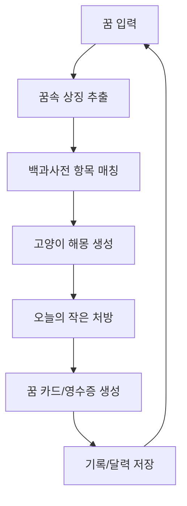

# Project Vision

> 사라지는 꿈을 고양이가 읽고, 상징과 카드로 남겨준다.

---

## 제품 정의

**마냥 꿈해몽**은 사용자가 어젯밤 꿈을 편하게 적으면, 꿈속 상징을 자체 백과사전에 연결하고 고양이 해몽사가 감성적으로 읽어주는 AI 꿈 리딩 서비스다.

이 서비스는 다음 세 가지를 결합한다.

| 축 | 의미 |
| --- | --- |
| AI 꿈 리딩 | LLM이 꿈을 요약하고 상징, 감정, 테마를 구조화한다. |
| 꿈 해몽 백과사전 | 즉흥적인 해석 대신 자체 상징 DB를 근거로 사용한다. |
| 감성 아카이브 | 꿈 카드, 꿈 영수증, 달력으로 꿈을 다시 볼 이유를 만든다. |

## 핵심 제품 루프

## 차별화

- 기존 꿈해몽 서비스처럼 “정답”을 말하지 않는다.
- ChatGPT 대화처럼 휘발되지 않고 기록으로 쌓인다.
- 백과사전 기반이라 해석의 근거가 보인다.
- 고양이 해몽사 캐릭터가 결과를 부드럽게 전달한다.
- 사용자는 꿈 카드와 상징 히스토리를 수집한다.

## 제품 원칙

- 꿈 해석은 오락과 자기 성찰을 위한 감성 리딩이다.
- 의학적, 심리학적 진단처럼 말하지 않는다.
- 불길한 예언, 가족 사고, 질병 신호 같은 단정 표현을 금지한다.
- MVP에서는 예쁜 부가 기능보다 핵심 루프 완성도를 우선한다.

## Related

- [[Target-Audience]] — 누구를 위해 만드는가
- [[Product-Positioning]] — 시장에서 어떻게 보일 것인가
- [[MVP-Scope]] — 처음 어디까지 만들 것인가

## See Also

- [[LLM-Pipeline]] — 비전을 구현하는 AI 흐름 (04-AI-System)
- [[Visual-Direction]] — 비전을 시각화하는 UI 방향 (08-Design)

