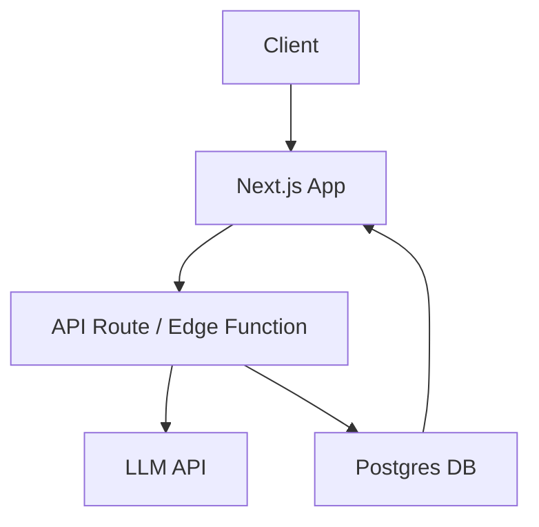
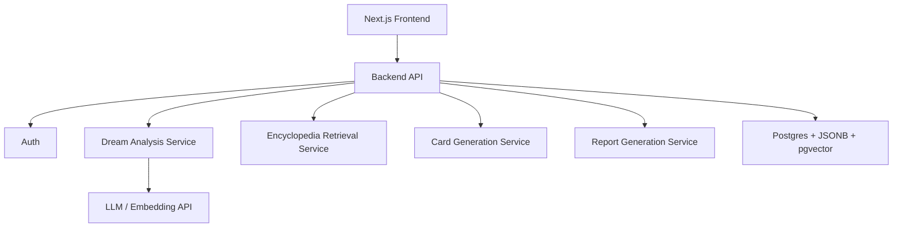

# System Architecture

> Next.js 앱에서 시작하고, Supabase와 LLM API를 붙여 웹 MVP를 만든다.

> [!IMPORTANT]
> 이 문서는 웹 MVP의 현재 구조를 설명한다. 확장 제품의 웹·모바일 구조는 [[Web-Mobile-Shared-Architecture]]를 우선한다.

---

## MVP 기술 스택

| 영역 | 선택 |
| --- | --- |
| Frontend | Next.js, React, TypeScript |
| Styling | Tailwind CSS, 필요 시 shadcn/ui |
| Motion | Framer Motion optional |
| Backend | Next.js API Routes 또는 Supabase Edge Functions |
| DB/Auth | Supabase, Postgres, Supabase Auth |
| Storage | Supabase Storage |
| AI | LLM API, 추후 Embedding API |

## 권장 시작 방식

코드는 루트가 아니라 `frontend/`에 둔다. 루트에는 `docs`, `vault`, `ref`를 유지해 기획/참고 자료와 앱 코드를 분리한다.

초기 개발 속도를 위해 두 단계로 나눈다.

| 단계 | 설명 |
| --- | --- |
| Prototype Mode | 로컬 seed JSON, mock analysis, localStorage 저장으로 UI 루프 검증 |
| MVP Mode | Supabase, 실제 LLM API, DB 저장, Auth 연결 |

Prototype Mode를 두는 이유는 UI와 결과 구조를 먼저 검증하기 위해서다. 꿈 해몽 서비스는 API보다 **결과가 저장하고 싶게 보이는지**가 먼저다.

## MVP 흐름

## 확장 흐름

## 초기 아키텍처 결정

- AI 호출은 클라이언트에서 직접 하지 않는다.
- 꿈 원문, 분석 결과, 카드 데이터는 같은 트랜잭션 흐름으로 저장한다.
- 백과사전 seed는 처음에는 코드/JSON으로 두고, Supabase 도입 시 table로 이전한다.
- 이미지 생성은 1차 MVP에서 제외하고 영수증 템플릿 렌더링으로 대체한다.

## Related

- [[Database-Schema]]
- [[API-Contract]]
- [[Tech-Decisions]]
- [[Web-Mobile-Shared-Architecture]]

## See Also

- [[LLM-Pipeline]] — AI 처리 흐름 (04-AI-System)
- [[Implementation-Plan]] — 실행 계약 (09-Implementation)
